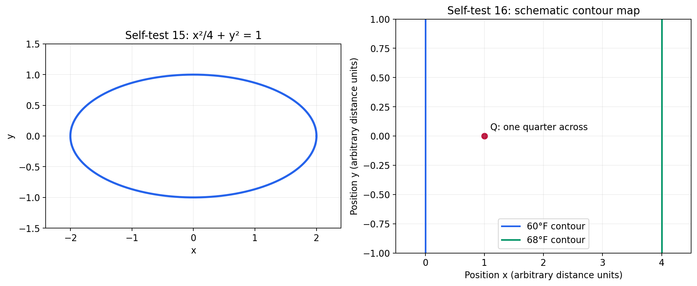
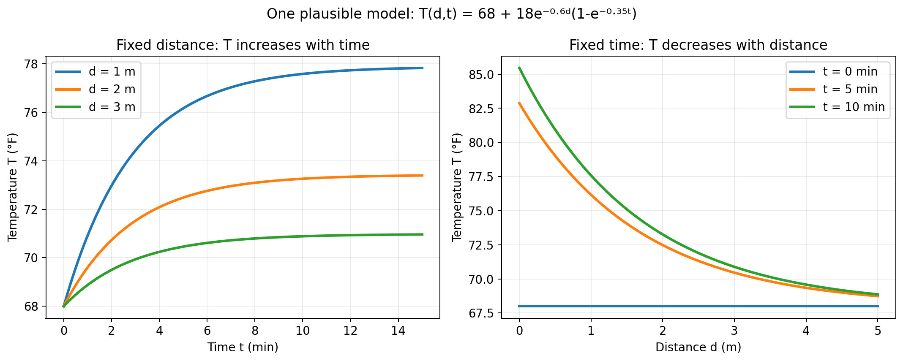
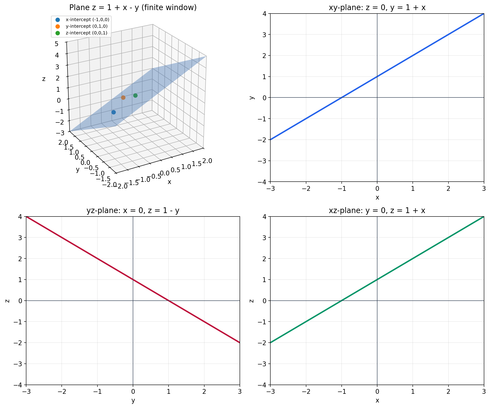
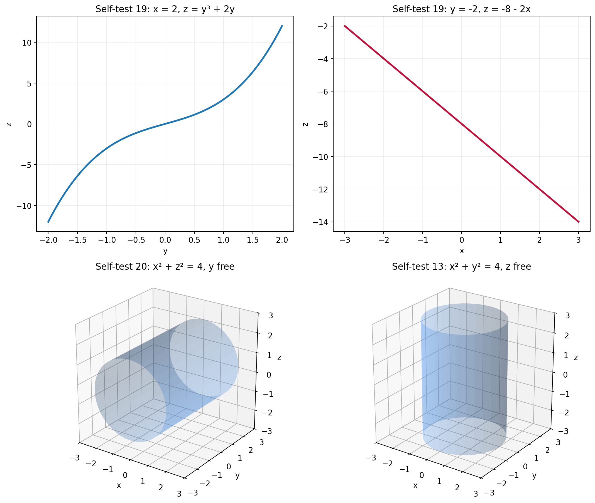

# Week 1 - Practice and Self-Test

Use this after reading [Study Notes](./Study-Notes.md). The self-test questions below are original study questions, not reproductions of the textbook exercises.

## Recommended textbook exercises

Section 12.1, 8th edition; printed pages 699-701.

| Problems | Skill | Knowledge section |
|---|---|---|
| 1, 3 | Compare distances | [Distance](./Study-Notes.md#7-distance-in-3-space) |
| 5 | Movement and coordinates | [Coordinates](./Study-Notes.md#5-coordinates-axes-and-planes-in-3-space) |
| 9, 11 | Membership in a graph | [Equations as sets](./Study-Notes.md#6-equations-and-inequalities-as-sets-of-points) |
| 13, 15, 19 | Planes and lines | [Fixed coordinates](./Study-Notes.md#6-equations-and-inequalities-as-sets-of-points) |
| 17 | Sphere equation | [Spheres](./Study-Notes.md#8-spheres-balls-and-intersections) |
| 23, 25 | BMI table | [BMI table](./Study-Notes.md#23-bmi-table-from-the-textbook) |
| 29, 31 | Trends in a table | [Beef table](./Study-Notes.md#25-beef-consumption-table-for-exercises-29-and-31) |
| 37 | Verbal model | [Formula construction](./Study-Notes.md#problem-type-construct-a-formula-from-words) |

Suggested order: **23, 25, 29, 31, 37 → 5, 9, 11, 13, 15, 19 → 1, 3, 17**. This follows functions and tables, spatial descriptions, then distance and spheres.

## Self-test - try before reading the answers

### A. Functions and representations

1. Let `V=f(r,h)=π r²h`. Evaluate `f(2,5)` and explain its meaning when lengths are in metres. Does `f(5,2)` have the same value?
2. A service earns 12 dollars per subscriber per month plus 3 dollars per rental. Let `s` be subscriber count and `m` total rentals during that month. Write monthly revenue `R=f(s,m)` and interpret `f(80,50)`.
3. The following table gives a quantity `F(a,b)`:

   | `a` ↓ / `b` → | 0 | 1 | 2 |
   |---|---:|---:|---:|
   | 1 | 2 | 5 | 8 |
   | 2 | 4 | 7 | 10 |
   | 3 | 6 | 9 | 12 |

   Find `F(2,1)`. At fixed `a=2`, how does the output change as `b` increases by one? At fixed `b=1`, how does it change as `a` increases by one? State only what the listed entries support.
4. For `V=π r²h`, write the single-variable rules obtained by fixing `r=3` and by fixing `h=3`. Identify each graph's shape for nonnegative inputs.

### B. Three-dimensional geometry

5. For `P=(2,−3,4)`, find its distance to each coordinate plane.
6. Describe each set: (a) `x=−2`; (b) `x=−2,z=1`; (c) `x=−2,y=0,z=1`; (d) `z<0`.
7. Does `(2,−1,−1)` satisfy `x+y+z=0`? Does `(2,2,7)` satisfy `x−y=0`? Explain why the second equation allows any value of `z`.
8. Write equations for all points in the `xz`-plane that are three units above the `xy`-plane. Is this a point, line, or plane?

### C. Distance and spheres

9. Find the distance between `P=(1,−2,3)` and `Q=(4,2,3)`.
10. Which is closer to the origin: `A=(1,2,2)` or `B=(0,0,4)`?
11. Write the equation of the sphere with centre `(2,−1,3)` and radius `4`. Then write an inequality for the solid ball including its boundary.
12. Find and describe the intersection of `x²+y²+z²=9` with `z=1`. Include its location, centre, and radius.

### D. Supplementary graph interpretation

13. Why does `x²+y²=4` describe a cylinder surface in 3D rather than just a circle?
14. For `z=y³+xy`, find the section at `x=1` and the section at `y=−1`. State the plane containing each section.

### E. Full-coverage challenge

15. An ellipse is described by `x²/4+y²=1`. Can it be the graph of `y=f(x)`? Explain using an appropriate test.
16. A location lies one quarter of the way from a `60°F` isotherm toward a nearby `68°F` isotherm. Estimate its temperature and state the assumption behind the estimate.
17. For room temperature `T=f(d,t)` after a heater is switched on, describe plausible graph families when (a) `d=1,2,3` is fixed and `t` varies, and (b) `t=0,5,10` is fixed and `d` varies. State your physical assumptions.
18. Completely describe and sketch `z=1+x−y`: identify the surface, all three axis intercepts, change in the positive `x` and `y` directions, and coordinate-plane cross-sections.
19. For `z=y³+xy`, find and describe the cross-sections at `x=2` and `y=−2`, including each containing plane.
20. Describe `x²+z²=4` in 3-space. State its radius, axis, extent, and the role of the missing variable.

**Question figures for 15 and 16:** The left panel supplies the ellipse; the right panel supplies the schematic temperature contours and marked location `Q`. The contours are temperatures in °F, with arbitrary position units.

### F. Area and supplementary extensions

21. A closed cylinder has radius 2 cm and height 5 cm. Find its total surface area. Explain which parts of the cylinder each term counts.
22. Find the midpoint between `(2,4,-1)` and `(6,-2,5)`.
23. Use `B=W/H²`, with weight `W` in kg and height `H` in metres. At `H=1.8`, find (a) weight for `B=22` and (b) the weight interval for the stipulated condition `20≤B≤25`.

### Knowledge links for each question

| Questions | Detailed explanation |
|---|---|
| 1 | [Function evaluation](./Study-Notes.md#problem-type-evaluate-and-interpret-a-two-variable-function) |
| 2 | [Verbal model](./Study-Notes.md#problem-type-construct-a-formula-from-words) |
| 3 | [Table reading](./Study-Notes.md#problem-type-read-invert-or-estimate-from-a-table) and [fixed-input trends](./Study-Notes.md#problem-type-describe-a-table-trend-with-one-input-fixed) |
| 4 | [Fixed-input formula graphs](./Study-Notes.md#24-fixing-one-variable-in-a-formula-or-graph) |
| 5 | [Coordinate-plane distances](./Study-Notes.md#problem-type-identify-coordinate-plane-distances-and-axis-membership) |
| 6, 8 | [Sets of points](./Study-Notes.md#6-equations-and-inequalities-as-sets-of-points) |
| 7 | [Equation membership](./Study-Notes.md#problem-type-test-a-point-in-an-equation) |
| 9, 10 | [Distance](./Study-Notes.md#7-distance-in-3-space) |
| 11 | [Sphere and ball](./Study-Notes.md#problem-type-write-or-read-a-sphere-equation) |
| 12 | [Sphere-plane intersection](./Study-Notes.md#problem-type-sphere-plane-intersection) |
| 13, 20 | [Cylinder](./Study-Notes.md#10-circular-cylinder-graph) |
| 14, 19 | [Coordinate cross-sections](./Study-Notes.md#11-coordinate-cross-sections) |
| 15 | [Function test](./Study-Notes.md#problem-type-decide-whether-a-graph-represents-a-function) |
| 16 | [Contour estimates](./Study-Notes.md#3-contour-maps) |
| 17 | [Temperature graph families](./Study-Notes.md#4-room-temperature-cross-sections) |
| 18 | [Plane description](./Study-Notes.md#9-plane-graph) |
| 21 | [Closed-cylinder area](./Study-Notes.md#13-closed-cylinder-formulas-from-the-lecture) |
| 22 | [Midpoint](./Study-Notes.md#71-supplementary-midpoint-skill) |
| 23 | [Inverse BMI condition](./Study-Notes.md#26-supplementary-bmi-formulas-and-inverse-questions) |

---

## Answers and explanations

1. `f(2,5)=20π` cubic metres: radius `2` m and height `5` m. `f(5,2)=50π` cubic metres, which is different.
2. `R=12s+3m`; `f(80,50)=12(80)+3(50)=1110` dollars in monthly revenue from 80 subscribers and 50 total rentals. The rental count is already the total across subscribers.
3. `F(2,1)=7`. Along the listed row `a=2`, outputs increase by `3` per unit of `b`. Along the listed column `b=1`, outputs increase by `2` per unit of `a`. The table alone does not establish behaviour outside its entries.
4. At `r=3`, `V=9π h`: a straight ray from the origin for `h≥0`. At `h=3`, `V=3π r²`: the nonnegative-radius part of an upward-opening parabola.
5. Distance to the `xy`-plane is `4`; to the `xz`-plane is `3`; to the `yz`-plane is `2`.
6. (a) A plane parallel to the `yz`-plane. (b) A line parallel to the `y`-axis. (c) A single point `(−2,0,1)`. (d) The open half-space below the `xy`-plane, excluding the plane itself.
7. Yes: `2−1−1=0`. Yes: `2−2=0`. Since `z` does not appear in the second equation, changing `z` cannot affect whether it holds.
8. `y=0,z=3`. This is the line `(x,0,3)`, parallel to the `x`-axis.
9. `d=√(3²+4²+0²)=5`.
10. `A` is closer: its squared distance is `9`, while `B` has squared distance `16`.
11. Sphere: `(x−2)²+(y+1)²+(z−3)²=16`. Solid ball: replace `=` with `≤`.
12. Substitution gives `x²+y²=8`, with `z=1`. The intersection is a circle centred at `(0,0,1)` with radius `√8=2√2` in the plane `z=1`.
13. `z` is unrestricted, so the radius-2 circle occurs at every height. The surface extends indefinitely along the `z` direction.
14. At `x=1`: `z=y³+y` in the plane `x=1`. At `y=−1`: `z=−1−x` in the plane `y=−1`.
15. No. For `−2<x<2`, most vertical lines meet the ellipse twice, so one `x` corresponds to two `y` values. It fails the vertical-line test for `y=f(x)`.
16. Assuming approximately linear variation between nearby contours, `60+(1/4)(68−60)=62°F`. This is an estimate: contour spacing does not prove the temperature varies linearly.
17. Assume an initially uniform room and a continuously operating heater. At fixed `d`, each temperature-time curve rises and may level off; `d=1` lies highest, then `d=2`, then `d=3`. At `t=0`, temperature may be constant in `d`; at `t=5` and `10`, temperature decreases as `d` increases, and the later-time curve is generally higher. A complete sketch labels axes, units, fixed values, and assumptions. See the [room-temperature figure](./Study-Notes.md#4-room-temperature-cross-sections).
18. It is the infinite plane `x−y−z=−1`. Its intercepts are `(−1,0,0)`, `(0,1,0)`, and `(0,0,1)`. At fixed `y`, `z` increases by 1 as `x` increases by 1; at fixed `x`, `z` decreases by 1 as `y` increases by 1. Its coordinate-plane sections are `y=1+x` at `z=0`, `z=1−y` at `x=0`, and `z=1+x` at `y=0`. See the [labelled plane graph](./Study-Notes.md#9-plane-graph).
19. At `x=2`, the section is `z=y³+2y` in the plane `x=2`, an increasing cubic. At `y=−2`, the section is `z=−8−2x` in the plane `y=−2`, a line of slope `−2` in an `x`-`z` view.
20. The missing variable `y` is free, so the circle `x²+z²=4` occurs in every plane `y=k`. The surface is an infinite circular cylinder of radius 2 about the `y`-axis, extending to `y=±∞`. It is a surface, not a solid cylinder.
21. `A=2π(2)²+2π(2)(5)=28π cm²`. The `8π` counts two disks; `20π` counts the curved side.
22. `M=((2+6)/2,(4-2)/2,(-1+5)/2)=(4,1,2)`.
23. `H²=3.24`. (a) `W=22(3.24)=71.28 kg`. (b) Multiply the inequality by 3.24: `64.8 kg≤W≤81 kg`.

### Labelled answer graphs

**Answer 17:** The left family fixes distance and plots temperature against time; the right family fixes time and plots temperature against distance. The initial-temperature curve is flat under the uniform-room assumption.

**Answer 18:** The first panel shows the plane and its intercepts; the other panels show each coordinate-plane trace. The plane extends infinitely beyond the window.

**Answers 13, 19, and 20:** The top panels show the cubic in `x=2` and line in `y=-2`. The lower-left cylinder has free `y`; the lower-right cylinder has free `z`. Both radius-2 cylinders extend infinitely along their respective axes.

## Use your mistakes to guide revision

| If you missed… | Revisit in the study notes |
|---|---|
| 1-2 | Function notation, input order, and verbal models |
| 3-4 | Tables and holding one input constant |
| 5-8 | Coordinate planes and equations as sets of points |
| 9-10 | Three-dimensional distance |
| 11-12 | Spheres and plane intersections |
| 13-14 | Supplementary surfaces and cross-sections |
| 15-16 | Function test and contour estimation |
| 17-20 | Qualitative slices and complete surface descriptions |
| 21-23 | Closed-cylinder area, midpoint, and inverse BMI algebra |
