# MAT235 Week 1 Study Notes

## Functions of Two Variables and the Geometry of 3-Space

These notes combine every mathematical page of the Week 1 slide deck, handwritten lecture notes, worksheet prompts, and textbook Section 12.1 (8th edition, printed pages 694-701). They are intended to stand on their own as a primary study resource.

### Status labels

- **Core:** explicitly listed as a Week 1 learning outcome or taught in the completed slides.
- **Supplementary:** present in the handwritten lecture/worksheet and therefore included for study.
- **Preview:** shown in the Week 1 files but identified by the main slide deck as material developed later.
- **Course preview:** mentioned only as part of the semester overview; no Week 1 technique is expected yet.

The semester overview names multivariable functions, vector fields, partial derivatives, gradient, divergence, curl, critical points, and optimization. Only multivariable functions begin this week. The remaining topics are **course previews**, not Week 1 calculation skills.

### Study route

1. [Functions and notation](#1-functions-from-one-input-to-several-inputs)
2. [Numerical tables and fixed inputs](#2-numerical-tables-and-fixed-variable-trends)
3. [Contour maps](#3-contour-maps) and [qualitative temperature graphs](#4-room-temperature-cross-sections)
4. [Coordinates](#5-coordinates-axes-and-planes-in-3-space) and [equations as sets](#6-equations-and-inequalities-as-sets-of-points)
5. [Distance](#7-distance-in-3-space) and [spheres](#8-spheres-balls-and-intersections)
6. [Planes](#9-plane-graph), [cylinders](#10-circular-cylinder-graph), and [cross-sections](#11-coordinate-cross-sections)
7. [Assigned questions and concise answers](#12-complete-assigned-textbook-exercises)

Original instructional questions are labelled **Teaching example**. Actual source questions are identified separately. Detailed methods appear in the knowledge sections; assigned exercises contain the question, necessary work, and answer.

---

## 1. Functions: From One Input to Several Inputs

> **Status: Core material**

### 1.1 Four representations

A function can be described verbally (in words), numerically (by a table), algebraically (by a formula), or graphically (by a graph, chart, map, or contour diagram). This is true for one-variable and multivariable functions; what changes is the number of inputs.

The handwritten introduction (PDF page 2) illustrates a one-variable numerical representation:

| Input `x` | 1 | 2 | 3.14 | … |
|---|---:|---:|---:|---|
| Output `f(x)` | 1 | 0 | 2 | … |

Read vertically within each column: `f(1)=1`, `f(2)=0`, `f(3.14)=2`. The ellipses indicate further entries, not known values from which a formula can be inferred. A function can be defined by measurements or a table even when no formula is available.

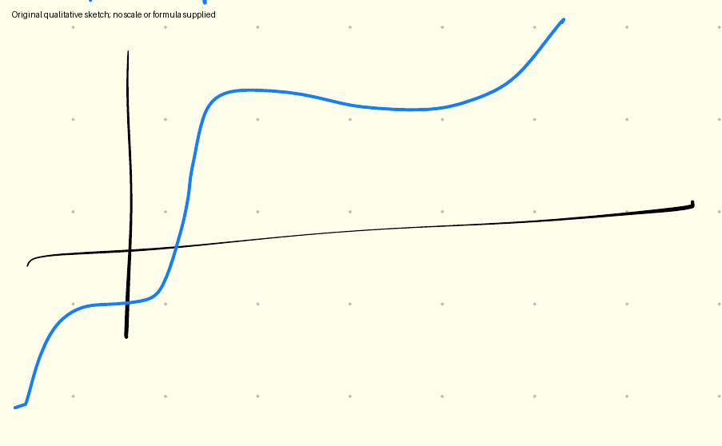

**How to read the source sketch:** The horizontal direction represents input and the vertical direction represents output in this introductory context. The curve rises, flattens, decreases slightly, and then rises again. No numerical ticks, units, or formula are supplied, so this sketch supports qualitative reading only; it cannot supply exact values or be identified with the table's entries.

### 1.2 What makes a relation a function?

A real-valued function assigns **exactly one real output** to each allowed input.

- For `y=f(x)`, each allowed `x` has exactly one `y`.
- For `z=f(x,y)`, each allowed ordered pair `(x,y)` has exactly one `z`.

Here `x` and `y` are **independent variables** (inputs); `z` is the **dependent variable** (output). The symbol `f` names the function, not another input. `f(a,b)` means the output at the ordered pair `(a,b)`; it is not multiplication. Input order matters: `f(a,b)` need not equal `f(b,a)`.

The **domain** is the set of allowed input pairs, normally a region of the `xy`-plane. The **range** is the set of resulting output values. A physical model may restrict inputs: cylinder radius and height cannot be negative; subscriber counts are nonnegative integers. A graph of `z=f(x,y)` contains points `(x,y,f(x,y))` in 3-space. Its domain is the input region underneath the surface, rather than the surface itself. These definitions clarify Week 1 notation; systematic domain and surface analysis is developed later.

For a surface to represent `z=f(x,y)`, each vertical line parallel to the `z`-axis can meet it at most once. The line holds both inputs fixed while checking how many outputs occur.

### Problem type: decide whether a graph represents a function

**Recognize it:** You must decide whether each allowed input has a unique output.

**Method:** Use a vertical-line test for `y=f(x)` or a line parallel to the `z`-axis for `z=f(x,y)`. One input with two outputs disproves the function property.

**Actual lecture question - slide PDF page 15**

**Question:** Is `C` the graph of a function `y=f(x)`? Why or why not?

In the figure below, the right-panel ellipse recreates the lecture curve `C`; its equation is an illustrative choice for the recreation, not a formula supplied by the slide. The left panel gives a comparison function.

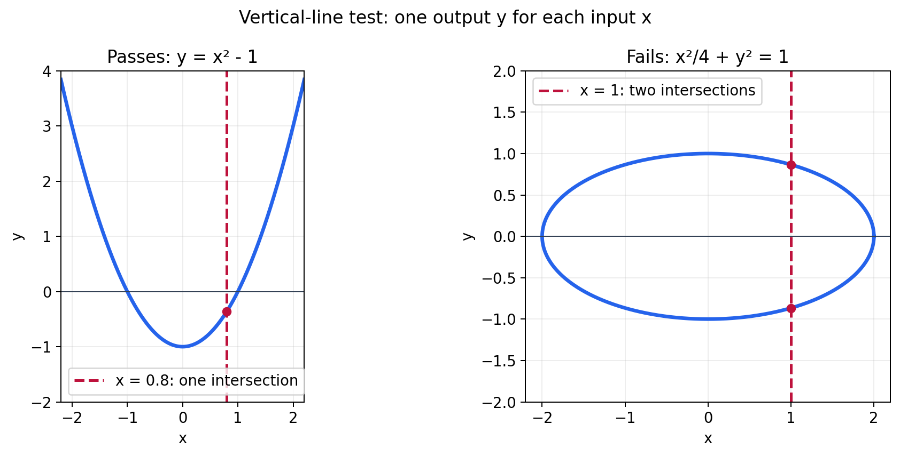

**How to read the figure:** The dashed red line represents one fixed input `x`. On the parabola it reaches one blue-curve point, so that input has one output. On the ellipse it reaches two points, so the same input would require two outputs. One counterexample vertical line is enough to show that a graph does not represent `y=f(x)`.

**Worked solution:** The right-panel vertical line crosses the ellipse twice, giving two different heights at the same `x`. Thus the uniqueness requirement fails.

**Answer:** No. Curve `C` is not a graph of `y=f(x)` because some inputs have two outputs.

**Common mistakes:** Checking only one successful input; assuming any smooth curve is a function; testing uniqueness of `x` for a fixed `y` instead of uniqueness of `y` for a fixed `x`.

### 1.3 Closed-cylinder formulas from the lecture

**Actual lecture questions - slide PDF pages 19-20**

**Question:** A cylinder with closed ends has radius `r` and height `h`. Its volume is `V` and its surface area is `A`. Find formulas for `V=f(r,h)` and `A=g(r,h)`.

**Additional question:** Which variables are independent variables? Which are dependent variables?

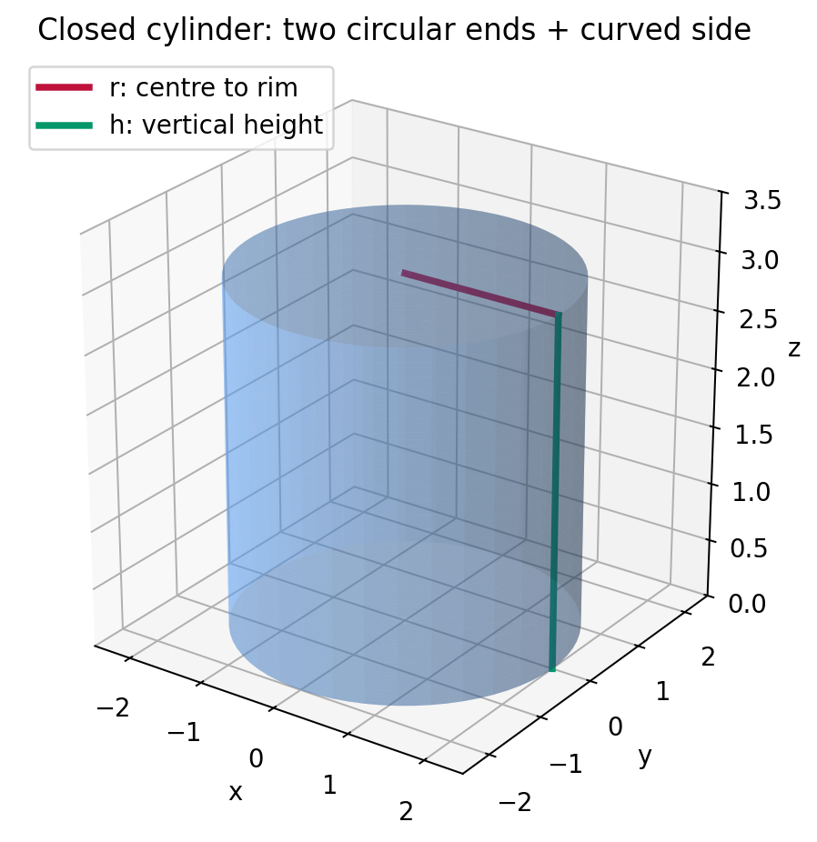

**Worked solution:** Volume is base area times height, `πr²h`. The curved side unrolls to a rectangle with width equal to circumference `2πr` and height `h`. Add the two circular ends to obtain area `2πrh+2πr²`.

**Answer:** `V=f(r,h)=πr²h`; `A=g(r,h)=2πr²+2πrh`. The independent variables are `r,h`. The dependent variable is `V` for `f`, or `A` for `g`. Volume has cubic length units; area has square length units.

### Problem type: evaluate and interpret a two-variable function

**Recognize it:** A rule `f(x,y)` is given and you are asked for `f(a,b)` or its meaning.

**Method:** identify the ordered inputs and units; substitute `a` into the first position and `b` into the second; simplify; interpret the output with units.

**Teaching example**

**Question:** A closed cylinder has radius `r` cm and height `h` cm. Its volume and total surface area are given below. (a) Find and interpret `f(2,3)` and `g(2,3)`. (b) Is `f(3,2)` equal to `f(2,3)`?

```text
V = f(r, h) = πr²h,     A = g(r, h) = 2πr² + 2πrh
```

**Worked solution:** Substitute into the ordered positions. Volume is `f(2,3)=π(2)²(3)=12π`. Total area is `g(2,3)=2π(2)²+2π(2)(3)=8π+12π=20π`. The two `πr²` terms cover the circular ends; `2πrh` covers the curved side. Swapping the inputs gives `f(3,2)=π(3)²(2)=18π`, a different cylinder.

**Answer:** (a) The radius-2 cm, height-3 cm cylinder has volume `12π cm³` and total surface area `20π cm²`. (b) No: `f(3,2)=18π cm³`, whereas `f(2,3)=12π cm³`.

**Complete answer requirement:** Preserve input order, identify the measured quantity, and include its correct units.

**Common mistakes:** reversing inputs; omitting `r²`; using square units for volume; giving a number without interpreting it.

### Problem type: construct a formula from words

**Recognize it:** The output is described as a combination of charges, quantities, geometric measurements, or rates.

**Method:** define inputs/output; translate each contribution into a term; combine the terms; check units; interpret a sample value.

**Teaching example**

**Question:** A service charges 12 dollars per subscriber per month and 3 dollars per rental. Let `s` be the number of subscribers and `m` the total rentals by all subscribers that month. (a) Write monthly revenue `R=f(s,m)` in dollars. (b) Evaluate and interpret `f(100,40)`.

**Worked solution:** Subscription income is `12s`; rental income is `3m`. Both terms are dollars earned during one month, so add them:

```text
R = f(s, m) = 12s + 3m
```

Thus `f(100,40)=12(100)+3(40)=1200+120=1320`.

**Answer:** (a) `R=f(s,m)=12s+3m`. (b) Revenue is 1320 dollars that month from 100 subscribers and 40 total rentals.

**Complete answer requirement:** Define inputs and output, give the formula, and interpret the evaluation. The actual cable-company question appears separately in [Exercise 37](#exercise-37).

**Common mistakes:** multiplying `m` by `s` when `m` already counts all views; forgetting a per-unit charge; omitting units.

### Additional textbook formula

If `B` dollars earn 1.2% annual compound interest for `t` years, then

```text
M = f(B, t) = B(1.012)ᵗ
```

The inputs are initial balance and time; the output is account value. The exponent belongs only to the annual growth factor.

For example, `f(1000,2)=1000(1.012)²=1024.144` dollars, or 1024.14 dollars to the nearest cent. The textbook also gives monthly car-loan payment `m=f(L,r)`: loan amount `L` and annual interest rate `r` are inputs; payment `m` is the output, with other loan terms held fixed. Notation alone does not supply a formula.

The handwritten notes also use `x+y` and `xy` as two-input rules: at `(2,3)`, addition gives 5 and multiplication gives 6. Each pair still determines one output, although the surface shapes differ.

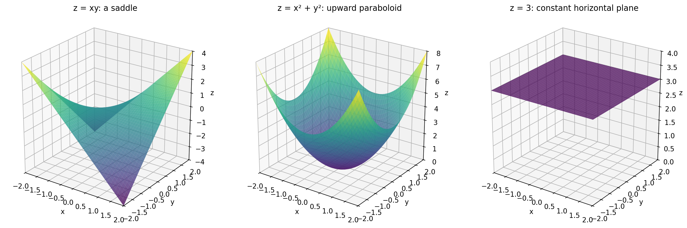

**How to read the figure:** Every plotted input pair has one height. The saddle `z=xy` is positive when inputs have the same sign and negative when they have opposite signs. The paraboloid `z=x²+y²` opens upward from `(0,0,0)` and has circular horizontal sections. The constant function is a horizontal plane. These surface illustrations support the handwritten examples; systematic surface classification is preview material.

---

## 2. Numerical Tables and Fixed-Variable Trends

> **Status: Core material**

### 2.1 Wind-chill table from the lecture

**Actual worksheet question - September 10 notes, PDF page 7, Example 3; also slide PDF pages 21-26**

**Question:** Windchill temperature is a temperature which tells you how cold it feels as a result of the combination of wind and temperature. Let `C=f(w,T)`, where `C` is the windchill temperature (in degrees Fahrenheit) that is associated with a wind speed of `w` miles per hour and a temperature of `T` degrees Fahrenheit. A table of values for the function `f` is given below:

- (a) Evaluate and interpret `f(20,5)`.
- (b) How fast does the wind need to blow for it to feel like `-10°F` when the air temperature is really `5°F`?

| Wind speed `w` (mph) ↓ / actual temperature `T` (°F) → | 35 | 30 | 25 | 20 | 15 | 10 | 5 | 0 |
|---:|---:|---:|---:|---:|---:|---:|---:|---:|
| 5  | 31 | 25 | 19 | 13 | 7  | 1  | -5  | -11 |
| 10 | 27 | 21 | 15 | 9  | 3  | -4 | -10 | -16 |
| 15 | 25 | 19 | 13 | 6  | 0  | -7 | -13 | -19 |
| 20 | 24 | 17 | 11 | 4  | -2 | -9 | -15 | -22 |
| 25 | 23 | 16 | 9  | 3  | -4 | -11 | -17 | -24 |

**Worked single-cell lookup:** For `f(20, 5)`, use the row `w=20` and column `T=5`. Their intersection is `-15`:

```text
f(20, 5) = -15
```

This means wind speed 20 mph and actual temperature `5°F` produce a perceived temperature of `-15°F`. If `T = 5°F` and the perceived temperature is `-10°F`, the table gives approximately 10 mph.

**Row interpretation:** Fixing `w=20` gives the row `24, 17, 11, 4, -2, -9, -15, -22`. Read left to right, wind speed stays 20 mph while actual temperature decreases from 35°F to 0°F; perceived temperature also decreases.

**Column interpretation:** Fixing `T=5°F` gives the column `-5, -10, -13, -15, -17`. Moving downward, actual temperature stays 5°F while wind speed increases from 5 to 25 mph; perceived temperature decreases.

**Inverse lookup:** To find the wind speed producing a perceived temperature of `-10°F` when `T=5°F`, stay in the `T=5` column and locate `-10`. It lies in the `w=10` row, so the answer is 10 mph.

**Answer:** (a) `f(20,5)=-15`: it feels like `-15°F` with wind speed 20 mph and air temperature `5°F`. (b) 10 mph, using the listed table value.

### 2.2 Small value table from the handwritten notes

**Actual worksheet question - September 10 notes, PDF page 6, Example 2**

**Question:** Consider the functions `f(x,y)=x²+y²` and `g(x,y)=3`. Evaluate `f` at several values of `x` and `y`, and sketch a graph of `g`.

The completed handwritten table uses `y` for rows and `x` for columns, in the order `0,1,-1`. Input order in `f(x,y)` still remains `x` first:

| `y` ↓ / `x` → | 0 | 1 | -1 |
|---:|---:|---:|---:|
| 0 | 0 | 1 | 1 |
| 1 | 1 | 2 | 2 |
| -1 | 1 | 2 | 2 |

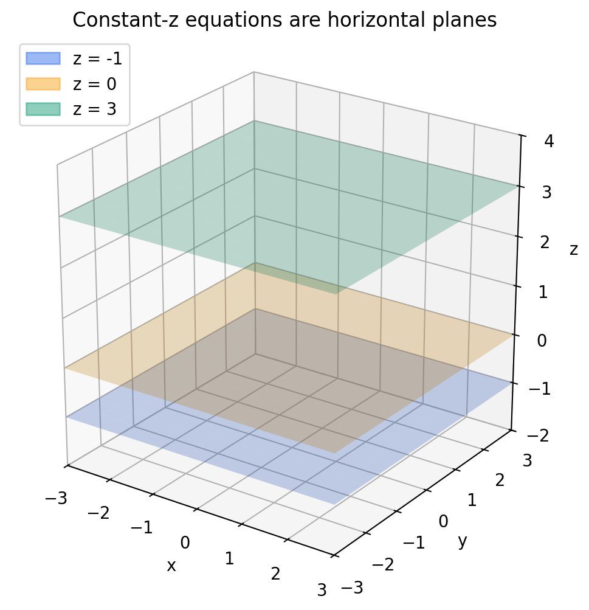

**Worked solution:** Row `y=1`, column `x=-1` gives `f(-1,1)=(-1)²+1²=2`; row `y=0`, column `x=0` gives zero. Reading across row `y=1` gives `1,2,2` as `x=0,1,-1`; reading down column `x=0` gives `0,1,1` as `y=0,1,-1`. For `g`, every input pair produces the height 3.

**Answer:** The completed table is above. The graph of `g` is the infinite horizontal plane `z=3`, parallel to the `xy`-plane, crossing the `z`-axis at `(0,0,3)`; `x,y` are free.

### 2.3 BMI table from the textbook

The table represents `B=f(h,w)`, where height `h` is in inches, weight `w` is in pounds, and each entry is BMI.

| Height `h` (in) ↓ / weight `w` (lb) → | 120 | 140 | 160 | 180 | 200 |
|---:|---:|---:|---:|---:|---:|
| 60 | 23.4 | 27.3 | 31.2 | 35.2 | 39.1 |
| 63 | 21.3 | 24.8 | 28.3 | 31.9 | 35.4 |
| 66 | 19.4 | 22.6 | 25.8 | 29.0 | 32.3 |
| 69 | 17.7 | 20.7 | 23.6 | 26.6 | 29.5 |
| 72 | 16.3 | 19.0 | 21.7 | 24.4 | 27.1 |
| 75 | 15.0 | 17.5 | 20.0 | 22.5 | 25.0 |

**Worked lookup:** Row `h=66` and column `w=140` give `B(66,140)=22.6`.

**Fixed-row interpretation:** The row `h=60` holds height fixed. As weight increases from 120 to 200 lb, BMI rises from 23.4 to 39.1. This is exactly the row needed for Exercise 23.

**Fixed-column interpretation:** The column `w=140` gives `27.3,24.8,22.6,20.7,19.0,17.5` as listed height rises from 60 to 75 inches. Weight is fixed and BMI decreases with height over these entries.

**Unit-conversion lookup:** For 90 kg and 1.9 m, first convert:

```text
90 kg × 2.205 lb/kg ≈ 198 lb
1.9 m × 39.37 in/m ≈ 74.8 in
```

The nearest listed inputs are 200 lb and 75 in, giving an estimated BMI of about 25.0. Because the converted values are not exactly the tabulated inputs, the final answer should say “approximately.” This is the method required for Exercise 25.

### Problem type: read, invert, or estimate from a table

**Recognize it:** Two variables label rows and columns; the body contains function values.

**Method:** identify row/column variables; check and convert units; find the correct intersection; for an inverse-style question, fix the known input and scan for the requested output; label interpolation as an estimate.

**Teaching example**

**Question:** Using the labelled BMI table below, where `B=f(h,w)`, `h` is height in inches and `w` is weight in pounds: (a) Find `B(66,140)`. (b) Among the listed heights, which height gives BMI 22.6 at weight 140 lb? (c) Estimate BMI for a person 74.8 inches tall and weighing 198 lb.

| Height `h` (in) ↓ / weight `w` (lb) → | 120 | 140 | 160 | 180 | 200 |
|---:|---:|---:|---:|---:|---:|
| 60 | 23.4 | 27.3 | 31.2 | 35.2 | 39.1 |
| 63 | 21.3 | 24.8 | 28.3 | 31.9 | 35.4 |
| 66 | 19.4 | 22.6 | 25.8 | 29.0 | 32.3 |
| 69 | 17.7 | 20.7 | 23.6 | 26.6 | 29.5 |
| 72 | 16.3 | 19.0 | 21.7 | 24.4 | 27.1 |
| 75 | 15.0 | 17.5 | 20.0 | 22.5 | 25.0 |

**Worked solution:** (a) Row 66, column 140 gives 22.6. (b) Fix column 140 and find entry 22.6; its row label is 66. (c) Use the nearest listed pair `(75,200)` and read 25.0. The rounded lookup is approximate, not an exact evaluation at `(74.8,198)`.

**Answer:** (a) `B(66,140)=22.6`. (b) 66 inches. (c) Approximately 25.0 using the nearest table entry.

**Complete answer requirement:** Identify the appropriate input pair, retain units for inputs, and mark estimates as approximate.

**Common mistakes:** reversing height/weight; entering metres and kilograms directly; confusing an input with the output; claiming an exact interpolated value.

### 2.4 Fixing one variable in a formula or graph

Holding one input constant makes a one-variable slice. For `V=π r²h`:

**Teaching example**

**Question:** Let `V=f(r,h)=πr²h`, with radius `r≥0` and height `h≥0` measured in cm. (a) Find and sketch volume as a function of height when `r=2`. (b) Find and sketch volume as a function of radius when `h=2`. Explain the difference in shape.

- Fix `r=2`: `V=4π h`, linear in `h`.
- Fix `h=2`: `V=2π r²`, quadratic in `r`.

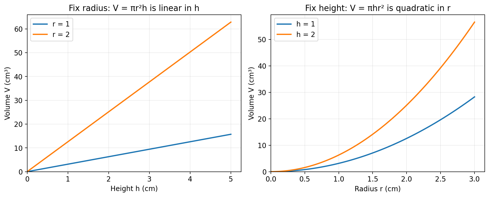

**How to read the figure:** At fixed radius, doubling height doubles volume, so each left-panel graph is a line. At fixed height, doubling radius multiplies volume by four, so each right-panel graph curves upward. Each legend identifies the value held constant.

**Worked solution:** (a) Substitute `r=2` to get `V=π(2)²h=4πh`, a linear rule through the origin. (b) Substitute `h=2` to get `V=2πr²`, a quadratic rule. Restrict the horizontal inputs to nonnegative lengths.

**Answer:** (a) `V=4πh`, `h≥0`: a straight ray in the left graph. (b) `V=2πr²`, `r≥0`: the nonnegative-radius branch of an upward-opening parabola in the right graph. Volume is in `cm³`.

The handwritten notes introduce geometric slices with two simple examples. For `z=x+y`, fixing `x=0` gives `z=y`, a line in the plane `x=0`. For `z=x²+y²`, fixing `x=0` gives `z=y²`, a parabola in the plane `x=0`. These are the same substitution procedure used for the more detailed worksheet in Section 11.

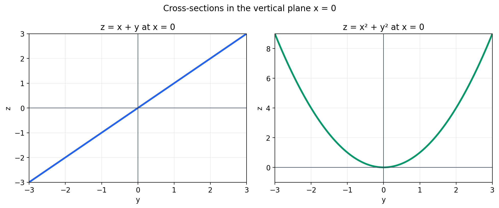

**How to read the figure:** Both curves live in the vertical plane `x=0`, so the horizontal plotting coordinate is the remaining input `y` and the vertical coordinate is `z`. Substitution determines the actual curve: linear for `z=y`, quadratic for `z=y²`. These curves are slices of surfaces, not the complete surfaces themselves.

**Definition (slice / cross-section / trace):** Given any set `S ⊂ ℝ³` (for example a solid region, a 2D surface such as the graph `z = f(x, y)`, a 1D space curve, or even a finite set of points) and a plane `P` specified by a single linear equation (for example `x = c`, `y = c`, or `Ax + By + Cz = D`), the slice of `S` by `P` is the intersection  
`S ∩ P = { (x, y, z) ∈ ℝ³ : (x, y, z) ∈ S and (x, y, z) ∈ P }`.  
This intersection keeps the points already belonging to both the set and the slicing plane. It does not move points onto the plane. Typical transverse slices have one fewer dimension:

- If `S` is a solid (3D), `S ∩ P` is typically a 2D region (e.g., a solid ball `x²+y²+z²≤4` cut by `z=0` gives the disk `x²+y²≤4`).  
- If `S` is a surface (2D), `S ∩ P` is typically a 1D curve (e.g., the sphere `x²+y²+z²=4` cut by `z=0` gives the circle `x²+y²=4`).  
- If `S` is a space curve (1D), `S ∩ P` is typically a finite set of points (0D) or empty.  
Degenerate cases can occur (e.g., the plane is tangent so the intersection shrinks to a point, or the plane lies entirely in `S`).

**Equivalences: fixing a variable = slicing with a coordinate plane**

- Fix `x = 0`: slice with the `yz`-plane (`x = 0`); the section lies in that plane and has equation `z = f(0, y)`.
- Fix `x = c`: slice with the plane `x = c` (parallel to the `yz`-plane); section `z = f(c, y)`.
- Fix `y = 0`: slice with the `xz`-plane (`y = 0`); section `z = f(x, 0)`.
- Fix `y = c`: slice with the plane `y = c` (parallel to the `xz`-plane); section `z = f(x, c)`.
- Fix `z = c`: horizontal slice (level set) with plane `z = c`; section described implicitly by `f(x, y) = c` (a contour/level curve).

### 2.5 Beef-consumption table for Exercises 29 and 31

The table represents `C=f(I,p)`, where `I` is household income in thousands of dollars per year, `p` is beef price in dollars per pound, and `C` is pounds of beef bought per household per week.

The actual assigned questions appear in [Exercise 29](#exercise-29) and [Exercise 31](#exercise-31). The following original example teaches their shared method without repeating the assigned questions.

### Problem type: describe a table trend with one input fixed

**Recognize it:** The wording says “as a function of” one variable while another is fixed, or asks for a row/column table.

**Method:** Fix the named variable; read one row or column; record ordered pairs; describe only the observed trend. A row fixes the input shown down the left; a column fixes the input shown across the top.

**Teaching example**

**Question:** The table below gives `C=f(I,p)`, measured in pounds of beef per household per week. Income `I` is in thousands of dollars per year; price `p` is in dollars per pound. (a) Give the consumption values as income varies at fixed price `p=3.00`. (b) Give the values as price varies at fixed income `I=40`. (c) Describe both trends and say whether the table proves a linear relationship.

| Income `I` (thousands of dollars/year) ↓ / price `p` (dollars/lb) → | 3.00 | 3.50 | 4.00 | 4.50 |
|---:|---:|---:|---:|---:|
| 20  | 2.65 | 2.59 | 2.51 | 2.43 |
| 40  | 4.14 | 4.05 | 3.94 | 3.88 |
| 60  | 5.11 | 5.00 | 4.97 | 4.84 |
| 80  | 5.35 | 5.29 | 5.19 | 5.07 |
| 100 | 5.79 | 5.77 | 5.60 | 5.53 |

**Worked solution:** (a) Fix `p=3.00` and read down the first data column. The pairs `(I,C)` are `(20,2.65)`, `(40,4.14)`, `(60,5.11)`, `(80,5.35)`, `(100,5.79)`. Consumption rises as income rises over these entries.

(b) Fix `I=40` and read across its row. The pairs `(p,C)` are `(3.00,4.14)`, `(3.50,4.05)`, `(4.00,3.94)`, `(4.50,3.88)`. Consumption falls as price rises over these entries.

(c) Equal input increments do not produce equal output increments. The table therefore shows the stated monotonic trends at listed values, rather than a linear relationship or proven behaviour beyond the data.

**Answer:** (a) At `p=3.00`, the listed consumptions are `2.65,4.14,5.11,5.35,5.79` as `I=20,40,60,80,100`. (b) At `I=40`, they are `4.14,4.05,3.94,3.88` as `p=3.00,3.50,4.00,4.50`. (c) Consumption increases with income at fixed price and decreases with price at fixed income; the data do not establish linearity.

**Complete final answer:** Give the requested mini-table or ordered pairs, name the fixed input, include units, and then state the observed trend. Example: “At fixed price `p = 3.00 dollars/lb`, weekly household beef consumption increases from 2.65 lb to 5.79 lb as listed household income rises from 20,000 dollars to 100,000 dollars.”

**Common mistakes:** following a diagonal; changing both inputs; making claims beyond the table.

### 2.6 Supplementary BMI formulas and inverse questions

> **Status: Supplementary skills appearing in unassigned Section 12.1 exercises; not additional assigned work**

Exercises 33-35 on printed page 701 provide BMI formulas. With weight `W` in kg and height `H` in metres, `B=W/H²`; with `w` in pounds and `h` in inches, `B=703w/h²`. Physical height must be positive. Do not mix units between formulas. These formulas explain the table trends: at fixed height, BMI is proportional to weight; at fixed weight, it decreases as height increases.

### Problem type: solve an inverse BMI condition

**Recognize it:** BMI or a BMI interval is given and an input such as weight is unknown.

**Method:** Choose the formula matching the units, substitute the known height, and solve for weight. Multiplication by positive squared height preserves inequality direction.

**Teaching example**

**Question:** Use the mathematical formula `B=W/H²`, where `W` is weight in kg and `H` is height in metres. For `H=2 m`, (a) find the weight giving `B=24`; (b) find all weights satisfying the stipulated mathematical interval `20≤B≤25`.

**Worked solution:** (a) `24=W/4`, so `W=96`. (b) `20≤W/4≤25`; multiplying by 4 gives `80≤W≤100`.

**Answer:** (a) 96 kg. (b) `80 kg≤W≤100 kg`, with both endpoints included.

**Common mistakes:** Using centimetres in the metres formula; forgetting to square height; excluding endpoints in a non-strict inequality; reporting a single weight for an interval question.

---

## 3. Contour Maps

> **Status: Core introduction; developed in detail later**

A weather map represents temperature by `T=f(x,y)`. An **isotherm** connects locations with the same temperature. More generally, a contour line is where `f(x,y)=c`.

**Definition (contour map):** For a scalar function `f: ℝ² → ℝ` on a region of the plane, a contour map is a top-down diagram consisting of multiple level curves (contours) given by `f(x, y) = c` for selected constant values `c`. Each contour is typically labelled by its `c`-value (the contour level); regularly spaced levels define a contour interval. Closer contour spacing indicates a steeper change in `f`, while wider spacing indicates a gentler change. For a surface `z = f(x, y)`, these contours are exactly the intersections with the horizontal planes `z = c`, viewed in the `xy`-plane.

### Textbook Example 1: Estimate Temperatures from a Weather Map

> **Full question:** Estimate the predicted value of `T` in Boise, Idaho; Topeka, Kansas; and Buffalo, New York.

**Variables and source graph:** `T` is the predicted daily high temperature in degrees Fahrenheit. Its two inputs are geographic position: east-west location and north-south location. The blue isotherms are boundaries on which the temperature is an exact multiple of 10°F; labels such as “70s” identify the region between consecutive isotherms.

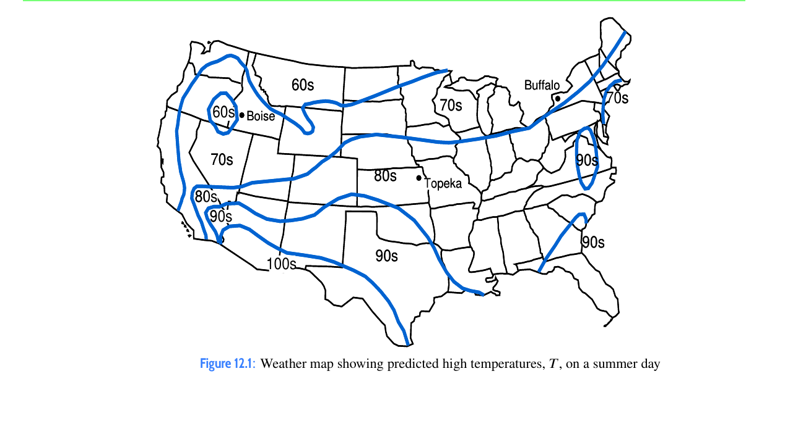

**How to read the source graph:** First identify the temperature region containing each city. Then judge how close the city is to the region’s lower and upper boundary. Boise lies in the 70s and close to the 70°F isotherm; Buffalo lies in the 70s but close to the 80°F isotherm; Topeka lies in the 80s about halfway between the 80°F and 90°F isotherms.

**Step-by-step solution:**

1. **Boise:** It is between the 70°F and 80°F boundaries, very close to 70°F. Estimate a low-70s temperature, such as about 72°F.
2. **Topeka:** It is between 80°F and 90°F and roughly halfway between them. Estimate a mid-80s temperature, about 85°F.
3. **Buffalo:** It is between 70°F and 80°F and close to 80°F. Estimate a high-70s temperature, such as about 78°F.
4. These are map estimates, so nearby numerical choices with the same justification are reasonable. The textbook reports that the actual highs that day were 71°F in Boise, 86°F in Topeka, and 79°F in Buffalo; those observed values are a comparison, not values determined exactly by the contour map.

**Complete final answer:** “Boise is in the low 70s (about 72°F), Topeka is in the mid-80s (about 85°F), and Buffalo is in the high 70s (about 78°F). Each estimate is based on the city’s position between the two nearest isotherms.”

**Common mistakes:** giving the region label alone without refining the estimate; reversing the city order; reporting the actual observed temperatures as exact readings from the map; treating distance between curves as proof of perfectly linear temperature variation.

### Problem type: estimate from a contour map

**Recognize it:** Curves are labelled by function values and a point lies on or between them.

**Method:** locate the point; find the nearest surrounding contours; give a range; interpolate from relative position if a single estimate is useful.

**Teaching example**

**Question:** The schematic map below shows temperature `T=f(x,y)` in °F, where `x` and `y` represent east-west and north-south position. At the marked location `P`, (a) give the interval between the surrounding isotherms and (b) estimate `T(P)` from the relative position.

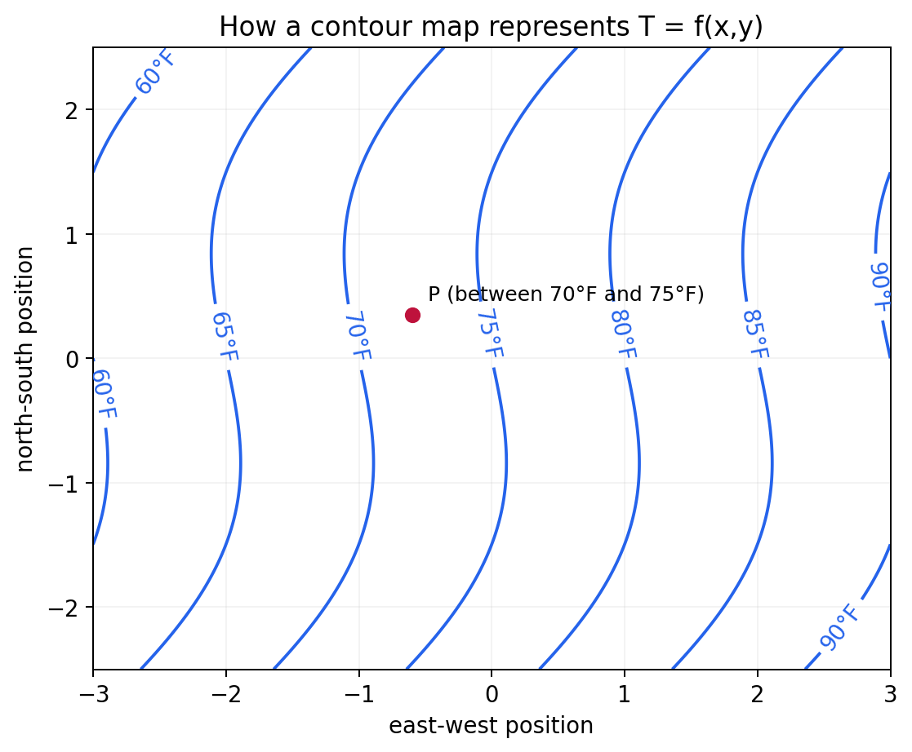

**How to read the practice figure:** Every blue curve consists of locations with the labelled temperature. Crossing from a lower-labelled curve to a higher-labelled curve indicates warming. The marked point is not on a contour, so its value must be estimated from the two surrounding curves.

**Worked solution:** The marked point lies between `70°F` and `75°F`, somewhat nearer `70°F`, so about `72°F` is reasonable.

**Answer:** (a) `70°F < T(P) < 75°F`. (b) The diagram suggests `T(P) ≈ 72°F`.

**Complete answer requirement:** State a justified interval, an approximate value when requested, and temperature units.

**Common mistakes:** averaging without checking relative position; confusing contour spacing with temperature change alone. The textbook develops contours in Section 12.3.

---

## 4. Room-Temperature Cross-Sections

> **Status: Core graphical example**

The worksheet defines `T=f(d,t)` as room temperature `t` minutes after a heater is turned on, at distance `d` metres from it. Under natural idealized assumptions, `T` increases with `t` at fixed `d`, decreases with `d` at fixed `t>0`, and may begin from a uniform temperature at `t=0`.


**How to read the figure:** In the left panel, each curve fixes distance and lets time vary; closer points become warmer. In the right panel, each curve fixes time and lets distance vary; temperature falls farther from the heater. The `t=0` curve is flat because the model assumes a uniform initial temperature.

This is one illustrative model, not a formula supplied by the worksheet. Other sketches can be valid if their assumptions are stated.

### Problem type: sketch plausible qualitative cross-sections

**Recognize it:** No exact formula/data are supplied; the prompt asks for a possible sketch and explanation.

**Method:** state assumptions; fix the requested variable; put the changing variable on the horizontal axis; decide the trend; compare curves; label axes, units, fixed values, and starting/limiting behaviour.

**Actual worksheet question - September 10 notes, PDF page 10, Exercise 1**

**Question:** Let `T=f(d,t)`, where `T` is the temperature, in degrees Fahrenheit, of a room `t` minutes after a heater is turned on, at a distance of `d` meters from the heater.

- (a) Is `T` an increasing or a decreasing function of `t`? Explain. Sketch possible cross sections of `f` for `d=1,2,3` meters.
- (b) Is `T` an increasing or a decreasing function of `d`? Explain. Sketch possible cross sections of `f` for `t=0,5,10` minutes.

**Modelling assumptions for the solution:** An initially uniform room and a continuously operating heater. The worksheet supplies no exact formula.


**Worked solution:** (a) Hold each distance fixed and place time on the horizontal axis. All curves can begin at the same initial temperature; the `d=1` curve rises fastest/highest, followed by `d=2` and `d=3`. Levelling off models approach to thermal equilibrium. (b) Hold each time fixed and place distance on the horizontal axis. The `t=0` curve is constant; later curves decrease away from the heater, with the `t=10` curve generally above the `t=5` curve. The drawing shows one plausible model, not uniquely determined data.

**Answer:** The labelled graph families above satisfy the assumptions: temperature rises over time at fixed distance and decreases with distance at fixed positive time. The initially uniform temperature is constant with distance.

**Complete answer requirement:** Include both graph families, axis labels, fixed values, units, and modelling assumptions.

**Common mistakes:** drawing one curve instead of a family; failing to label the fixed variable; presenting a speculative formula as uniquely determined.

---

## 5. Coordinates, Axes, and Planes in 3-Space

> **Status: Core material**

A point is `(x,y,z)` in a right-handed coordinate system. Start at the origin and move by the signed displacement along each axis; the order does not affect the final point. Thus `(1,2,3)` is reached by moving 1 in `x`, 2 in `y`, and 3 upward; `(0,0,-1)` lies on the negative `z`-axis.

The handwritten worksheet asks for `P=(0,0,2)`, `Q=(3,4,0)`, `R=(0,4,5)`, and `S=(3,4,5)`. Hence `P` lies on the `z`-axis, `Q` in the `xy`-plane, `R` in the `yz`-plane, and `S` in no coordinate plane.

**Actual worksheet question - September 10 notes, PDF page 5, Example 1**

**Question:** Plot the points `P=(0,0,2)`, `Q=(3,4,0)`, `R=(0,4,5)`, and `S=(3,4,5)` on the coordinate axes to the right.

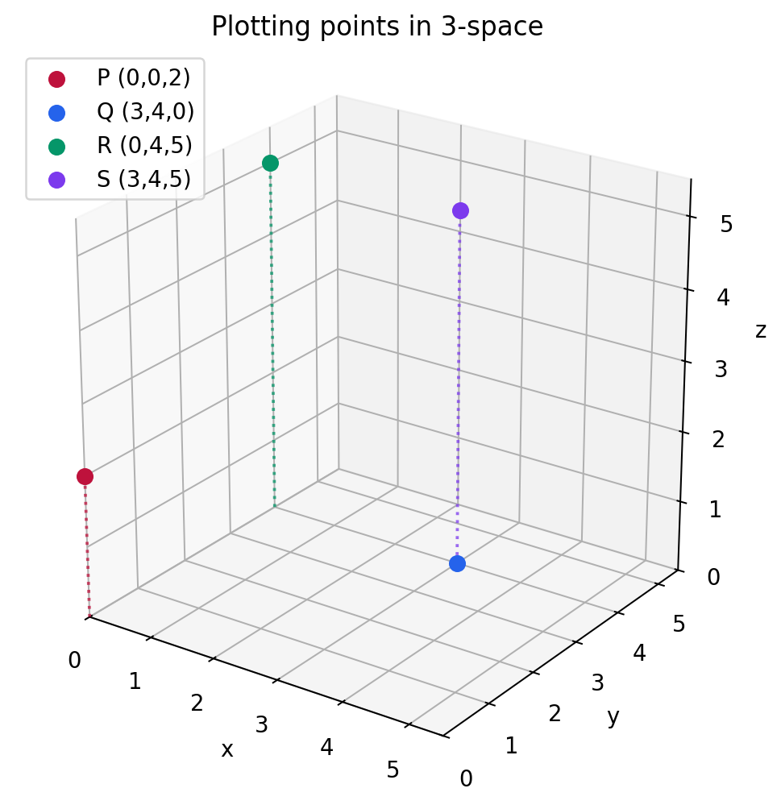

**How to read the figure:** The dotted vertical segments show each point’s height above the `xy`-plane. Point `P` has `x=y=0`, so it lies on the `z`-axis. Point `Q` has `z=0`, so it lies directly in the `xy`-plane. Points `R` and `S` share `y=4` and `z=5`, but differ in `x`; this makes their horizontal separation easier to see. The displayed axes show only a finite window of 3-space.

**Necessary work:** Locate `(x,y,0)` in the horizontal plane, then add the signed vertical displacement `z`.

**Answer:** The four labelled points are plotted above, with their plane/axis membership described before the question.

| Set | Equations | Distance from `(x,y,z)` |
|---|---|---|
| `xy`-plane | `z=0` | `abs(z)` |
| `xz`-plane | `y=0` | `abs(y)` |
| `yz`-plane | `x=0` | `abs(x)` |
| `x`-axis | `y=z=0` | - |
| `y`-axis | `x=z=0` | - |
| `z`-axis | `x=y=0` | - |

One zero coordinate puts a point in a coordinate plane; two put it on an axis. A coordinate can be negative, but a distance cannot.

### Problem type: identify coordinate-plane distances and axis membership

**Recognize it:** A question asks which point is closest to a coordinate plane, or which lies on an axis.

**Method:** Use the absolute value of the coordinate perpendicular to a plane. For axis membership, the other two coordinates must both be zero. Drawing is optional for the calculation, but useful for interpreting it.

**Actual worksheet question - September 10 notes, PDF page 8, Example 7; slide PDF pages 35-36**

**Question:** Which of the points `A=(1,-1,0)`, `B=(0,3,4)`, `C=(2,2,1)`, and `D=(0,-4,0)` lies closest to the `xz`-plane? Which point lies on the `y`-axis?

**Additional slide questions:** Can you figure out the answers without drawing the points in 3-space? How to quickly determine if a point lies in a coordinate plane or a coordinate axis?

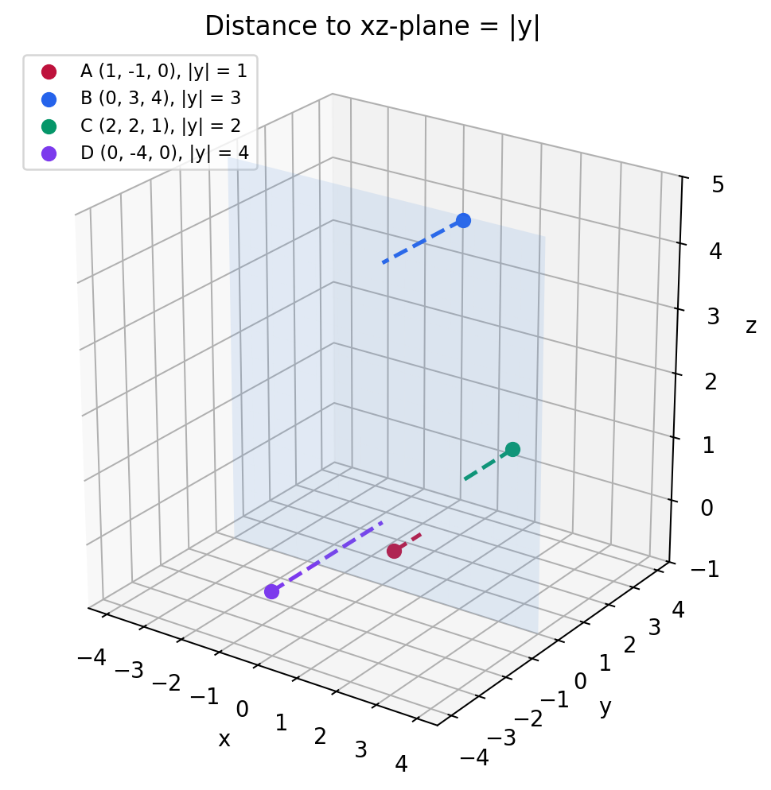

**Worked solution:** The `xz`-plane is `y=0`, so compare `abs(y)`:

| Point | Distance to `xz`-plane | On `y`-axis (`x=z=0`)? |
|---|---:|:---:|
| `A=(1,-1,0)` | 1 | No |
| `B=(0,3,4)` | 3 | No |
| `C=(2,2,1)` | 2 | No |
| `D=(0,-4,0)` | 4 | Yes |

**Answer:** `A` is closest to the `xz`-plane; `D` lies on the `y`-axis. Both answers follow directly from coordinates without drawing. A coordinate plane requires its perpendicular coordinate to be zero; an axis requires the other two coordinates to be zero.

**Common mistakes:** Comparing full origin distances instead of plane distances; using signed distances; checking only `x=0` for `y`-axis membership.

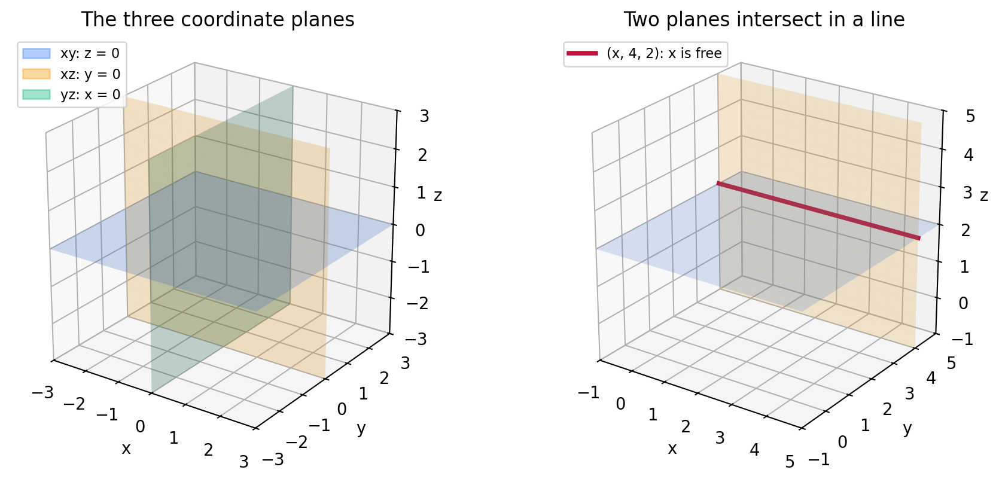

**How to read the figure:** In the left panel, each translucent sheet is the plane where one coordinate is zero. In the right panel, the blue sheet fixes `z=2` and the orange sheet fixes `y=4`; their red intersection leaves only `x` free, so it is a line parallel to the `x`-axis. All sheets and the line extend beyond the plotted window.

### Problem type: determine position or movement

**Recognize it:** A point moves in named coordinate directions, or one point is viewed from another.

**Method:** write the start; translate each move into a signed coordinate change; add coordinatewise; for “up/down,” compare `z` values; for distance to a coordinate plane, inspect its perpendicular coordinate.

**Actual textbook question - Example 5, printed page 696**

**Question:** You start at the origin, go along the `y`-axis a distance of 2 units in the positive direction, and then move vertically upward a distance of 1 unit. What are the coordinates of your final position?

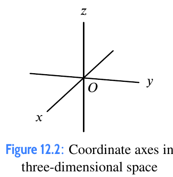

**Worked solution:** Begin at `(0,0,0)`. Positive-`y` displacement gives `(0,2,0)`; moving upward adds 1 to `z`, giving `(0,2,1)`. The `x` coordinate stays zero.

**Answer:** `(0,2,1)`.

**Actual textbook question - Example 9, printed page 698**

**Question:** You are standing at the point `(4,5,2)`, looking at the point `(0.5,0,3)`. Are you looking up or down?

**Worked solution:** Compare vertical coordinates: the target has `z=3`, above your `z=2`.

**Answer:** Up, because `3>2`. Horizontal coordinates do not determine up or down.

**Complete final answer:** Give the point and account for each coordinate, or state up/down with the compared `z` values.

**Common mistakes:** treating “left” or “behind” as universal without the stated orientation; changing an unrelated coordinate; confusing plane and axis.

---

## 6. Equations and Inequalities as Sets of Points

> **Status: Core material**

The graph is the set of **all** satisfying points.

- `z=3`, `z=0`, `z=-1`: horizontal planes parallel to the `xy`-plane.
- `x=-3`: plane parallel to the `yz`-plane.
- `y=1`: plane parallel to the `xz`-plane.
- `y=4` and `z=2`: `(x,4,2)`, a line parallel to the `x`-axis.
- `x<0`: half-space on the negative-`x` side of the `yz`-plane.


**How to read the figure:** Every point on one coloured sheet has the same `z`-coordinate while `x` and `y` are free. Therefore each equation describes an entire horizontal plane. The three planes never meet because a point cannot have two different `z`-coordinates. The rectangles are only viewing windows; the planes extend infinitely in all horizontal directions.

In the lecture’s blackboard model, positive `x` points into the classroom, so “behind the blackboard” is `x<0`. The sign depends on the specified orientation.

### Problem type: translate a verbal description

**Recognize it:** A point lies in a plane, above/below it, or on a line with coordinates fixed.

**Method:** turn a coordinate plane into one zero coordinate; translate side/distance into a signed coordinate or inequality; combine conditions; identify free coordinates to classify the result.

**Actual lecture question - slide PDF page 39**

**Question:** You are 2 units below the `xy`-plane and in the `yz`-plane. What are your coordinates?

For the geometric interpretation, also identify the free variable and the set of all possible positions.

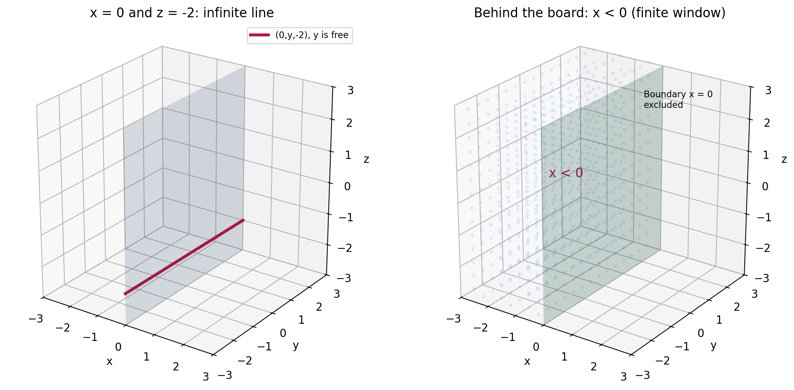

**Worked solution:** Two units below the `xy`-plane means `z=-2`. Membership in the `yz`-plane means `x=0`. No condition restricts `y`, so every `(0,y,-2)` works. Repeating these points for all real `y` produces the line in the left panel.

**Answer:** `x=0` and `z=-2`, or `(0,y,-2)` for `y∈ℝ`: an infinite line parallel to the `y`-axis, passing through `(0,0,-2)`.

The right panel illustrates the separate blackboard example: with positive `x` pointing into the classroom, `x<0` is the open half-space behind the board. The boundary plane `x=0` is excluded. An inequality gives a region, not just its boundary surface.

**Actual lecture question - slide PDF page 41**

**Question:** What is behind the blackboard? Imagine that the `yz`-plane is our blackboard. Describe the region behind the blackboard algebraically.

**Necessary work:** Positive `x` points into the classroom in the lecture's convention. Behind the board is the opposite side of `x=0`, as shown in the right panel above.

**Answer:** `x<0`, with `y,z∈ℝ`. The boundary board is not included.

**Complete final answer:** Include equations, free-variable description, and geometric object.

**Common mistakes:** answering `(0,0,-2)`; using `z=2` for “below”; assuming a missing variable equals zero.

### Problem type: test a point in an equation

**Recognize it:** Candidate points and an equation are given.

**Method:** substitute each point and compare both sides.

**Teaching example**

**Question:** Let `A=(1,2,-3)` and `B=(2,2,7)`. (a) Does `A` lie on the graph of `x+y+z=0`? (b) Does `B` lie on the graph of `x-y=0`? (c) Describe all points on `x-y=0` and explain whether `z` is restricted.

**Worked solution:** (a) Substituting `A` gives `1+2-3=0`, so the equation holds. (b) Substituting `B` gives `2-2=0`. (c) The equation requires `x=y` but contains no `z`; write `x=y=a` and allow any real `a,z`.

**Answer:** (a) Yes. (b) Yes. (c) All `(a,a,z)` for `a,z∈ℝ`; `z` is unrestricted. This is a vertical plane through the `z`-axis.

**Complete final answer:** State which labelled points work and show decisive substitutions.

**Common mistakes:** checking one term only; treating an absent variable as zero; giving no verification.

---

## 7. Distance in 3-Space

> **Status: Core material**

For `P=(x₁,y₁,z₁)` and `Q=(x₂,y₂,z₂)`,

```text
d(P, Q) = √((x₂ - x₁)² + (y₂ - y₁)² + (z₂ - z₁)²)
```

The formula applies the Pythagorean theorem first in `x,y` and then with the perpendicular `z` displacement.

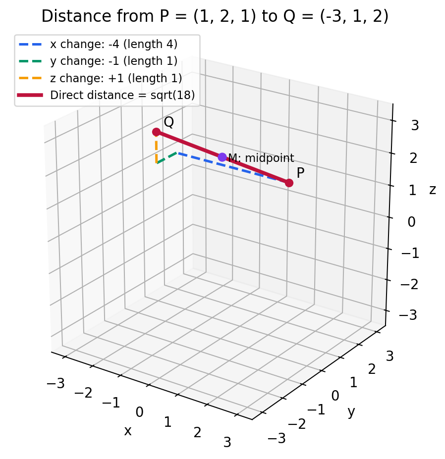

**How to read the figure:** The red segment is the direct Euclidean distance between the two points. The dashed segments separate the displacement into perpendicular `x`, `y`, and `z` changes. Their squared lengths add; their ordinary lengths should not be added to obtain the direct distance.

### Problem type: find or compare distances

**Recognize it:** The question asks for distance, closest point, or distance to the origin.

**Method:** subtract corresponding coordinates; square and add; take the square root. For comparisons, squared distances are sufficient.

**Teaching example**

**Question:** Find the exact distance between `P=(1,2,1)` and `Q=(-3,1,2)`. Explain how the three coordinate displacements determine that distance.


**Worked solution:** The signed coordinate changes are `-4,-1,1`. Squaring removes their signs; perpendicular displacements combine by the Pythagorean theorem:

```text
d((1, 2, 1), (-3, 1, 2)) = √((-4)² + (-1)² + 1²) = √18 = 3√2
```

**Answer:** `d(P,Q)=3√2` units, approximately 4.24 units.

**Complete answer requirement:** Give an exact simplified distance and units when specified. For comparisons, show which squared distance is smallest.

**Common mistakes:** adding absolute changes; omitting a coordinate; failing to square negatives; rounding early.

Also, `d((x,y,z),(0,0,0))=√(x²+y²+z²)`, and distances to the `xy`, `xz`, `yz` planes are `|z|`, `|y|`, `|x|`.

### 7.1 Supplementary midpoint skill

> **Status: Supplementary skill appearing in unassigned Section 12.1 exercise 7; not additional assigned work**

The midpoint of `P=(x₁,y₁,z₁)` and `Q=(x₂,y₂,z₂)` is `M=((x₁+x₂)/2,(y₁+y₂)/2,(z₁+z₂)/2)`. It averages coordinates, not distances.

### Problem type: find the midpoint of a segment

**Recognize it:** The question asks for the point halfway along a straight segment between two given points.

**Method:** Average each corresponding coordinate. Verify that the two displacement vectors from the midpoint have equal lengths and opposite directions.

**Teaching example**

**Question:** Find the midpoint of the segment from `P=(1,2,1)` to `Q=(-3,1,2)` in the distance graph above, and verify it is halfway along the segment.


**Worked solution:** `M=((1-3)/2,(2+1)/2,(1+2)/2)=(-1,1.5,1.5)`. The displacement `M-P=(-2,-0.5,0.5)` is one half of `Q-P=(-4,-1,1)`; `Q-M` has the same components.

**Answer:** `M=(-1,1.5,1.5)`, with `PM=MQ=3√2/2` units.

**Common mistakes:** Averaging all six numbers into one value; omitting `z`; confusing midpoint with a perpendicular projection.

---

## 8. Spheres, Balls, and Intersections

> **Status: Core material**

The sphere with centre `(a,b,c)` and radius `r>0` is

```text
(x - a)² + (y - b)² + (z - c)² = r²
```

Equality describes the surface; `≤ r²` describes the solid ball including its boundary; `<r²` describes only its interior.

### Problem type: write or read a sphere equation

**Recognize it:** A centre/radius is given, or the equation is a sum of three squared coordinate differences.

**Method:** insert the centre into the squared differences; put `r²` on the right; select equality/inequality; reverse signs inside parentheses when reading a centre.

**Teaching example**

**Question:** A sphere has centre `(1,-2,3)` and radius 4 units. (a) Write its equation. (b) Write the inequality for the solid ball including the boundary. (c) Describe the section through its centre in the plane `z=3`.

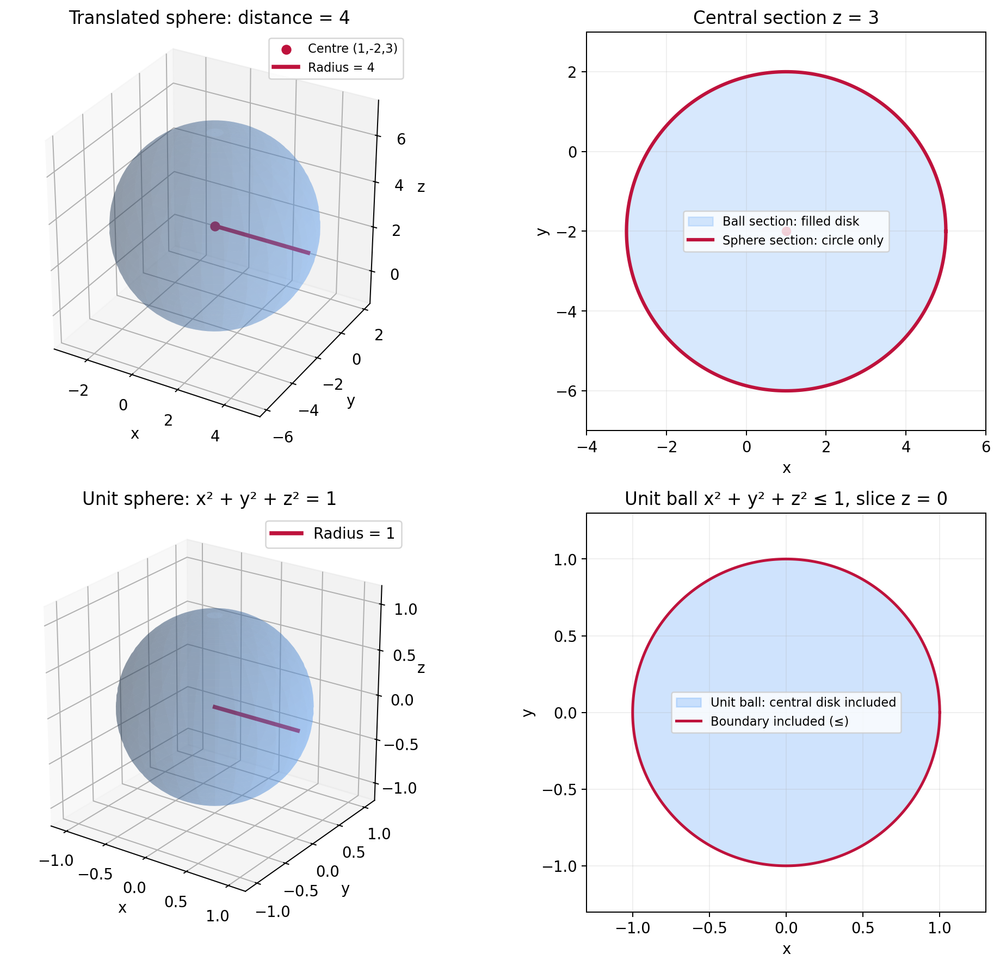

**Worked solution:** (a) Use coordinate differences from the centre, and square the radius:

```text
(x - 1)² + (y + 2)² + (z - 3)² = 16
```

(b) Points in the ball have distance at most 4 from the centre, so replace `=` by `≤`. (c) Substitute `z=3` to get `(x-1)²+(y+2)²=16`; include `z=3` to locate the circle in 3-space. The ball's corresponding section is a filled disk.

**Answer:** (a) `(x-1)²+(y+2)²+(z-3)²=16`. (b) `(x-1)²+(y+2)²+(z-3)²≤16`. (c) A circle of radius 4 centred at `(1,-2,3)` in the plane `z=3` for the sphere; a disk including its boundary for the ball.

**Complete answer requirement:** Distinguish surface from solid region, square the radius, and give the centre with correct signs.

**Common mistakes:** writing 4 instead of 16; reading centre `y=2` from `(y+2)²`; calling a solid ball a sphere.

### Problem type: sphere-plane intersection

**Recognize it:** A sphere and a condition such as `z=k` hold simultaneously.

**Method:** substitute the fixed coordinate; simplify to a circle; identify centre/radius; keep the plane condition.

**Teaching example**

**Question:** Find and describe the intersection of the sphere `x²+y²+z²=5` with the plane `z=2`. Give equations, its centre and radius, and a labelled sketch.

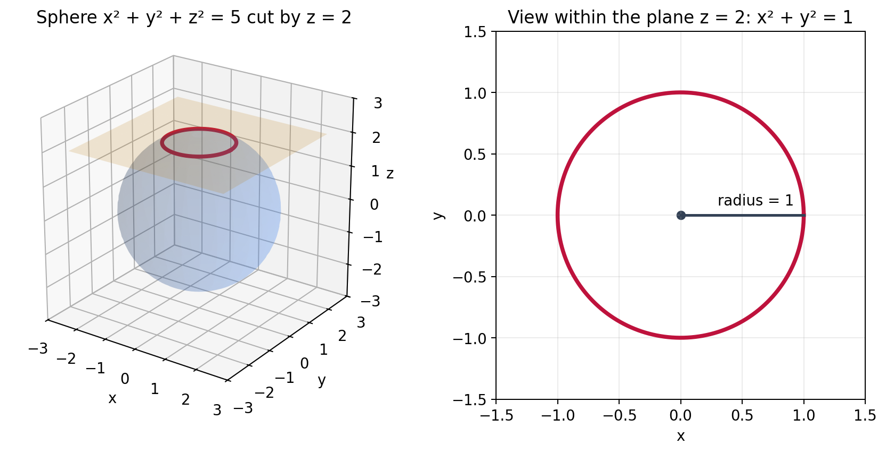

**How to read the figure:** The left panel shows the horizontal plane cutting the sphere. Perspective makes the red intersection appear elliptical. The right panel looks within `z=2`, revealing the true radius-1 circle. The intersection is the circumference only, not the filled disk.

**Worked solution:** Substitute `z=2` into the sphere equation: `x²+y²+4=5`, hence `x²+y²=1`. Keep `z=2` to locate the section. In that plane, the circle's centre has `x=y=0` and radius `√1=1`.

**Answer:** `x²+y²=1`, `z=2`: a radius-1 circle centred at `(0,0,2)` in the plane `z=2`.

More generally, cutting `(x-a)²+(y-b)²+(z-c)²=r²` with `z=k` gives squared section radius `r²-(k-c)²`. If this is positive the intersection is a circle; if zero it is the single tangent point `(a,b,k)`; if negative there is no real intersection.

**Complete final answer:** Give the circle equation, plane, centre, and radius.

**Common mistakes:** describing a disk; forgetting `z=2`; mishandling the fixed-coordinate square.

---

## 9. Plane Graph

> **Status: Supplementary worksheet and preview material**

The worksheet asks you to describe and sketch `z = 1 + x - y`.

Because the equation is linear,

```text
z = 1 + x - y    ⇔    x - y - z = -1
```

its graph is an infinite plane. A normal vector is a vector perpendicular to a plane; `(1,-1,-1)` is a normal here, obtained from the coefficients in the linear equation. This vector description is optional preview notation. The plane rises with `x` (holding `y` fixed) and falls with `y` (holding `x` fixed).

### Problem type: sketch a plane from its equation

**Recognize it:** `x,y,z` occur only to the first power in one linear equation.

**Method:** Find non-collinear reference points (often axis intercepts), identify linear traces, and extend the plane through them. If an intercept does not exist or the intercepts do not determine the plane, use other points or fixed-coordinate traces.

**Actual worksheet question - September 10 notes, PDF page 11**

**Question:** Describe the graph of `f(x,y)=1+x-y`.

The graph means `z=f(x,y)=1+x-y`, where the two inputs are `x,y` and the output is the height `z`.

For a complete description, include the surface, all three intercepts, coordinate-plane traces, orientation, and extent. The labelled figure below supplies the sketch.


**Worked solution:**

1. Set `y=z=0`: `x=-1`, so the `x`-intercept is `(-1,0,0)`.
2. Set `x=z=0`: `y=1`, so the `y`-intercept is `(0,1,0)`.
3. Set `x=y=0`: `z=1`, so the `z`-intercept is `(0,0,1)`.
4. Draw the plane through those three points.
5. Check sections: `y=0⇒ z=1+x`; `x=0⇒ z=1-y`; `z=0⇒ y=1+x`.
6. Extend the patch to show no finite boundary.

**How to read the figure:** The 3D panel marks the intercepts. The other three panels show the traces in their own coordinate planes. At fixed `y`, every trace `z=1-y+x` has slope 1 in an `x`-`z` view; increasing `y` shifts it downward. At fixed `x`, `z=1+x-y` has slope -1 in a `y`-`z` view.

**Answer:** The graph is the infinite plane `x-y-z=-1`, passing through `(-1,0,0)`, `(0,1,0)`, and `(0,0,1)`. At fixed `y`, increasing `x` by 1 increases `z` by 1; at fixed `x`, increasing `y` by 1 decreases `z` by 1. Its traces are `y=1+x` in `z=0`, `z=1-y` in `x=0`, and `z=1+x` in `y=0`. Its input domain is all `ℝ²`, and it is unbounded; the displayed patch is not its boundary.

**Complete answer requirement:** Include the object, reference points, trace equations and containing planes, directional changes, infinite extent, and a labelled sketch.

**Common mistakes:** calling it a line; using two intercepts only; drawing a bounded triangle; giving the wrong sign for the `x`-intercept.

---

## 10. Circular Cylinder Graph

> **Status: Supplementary worksheet and preview material**

The worksheet asks you to describe and sketch `x² + y² = 1` in 3-space.

The equation is a unit circle in `x,y` and has no `z`, so `z` is free. The result is an infinite circular cylinder surface of radius 1 about the `z`-axis.

### Problem type: identify a missing-variable cylinder

**Recognize it:** Two variables form a circle equation and the third variable is absent.

**Method:** sketch the circle at one value of the missing variable; repeat at other values; connect parallel to the missing-variable axis; show unbounded extent.

Useful sections: `z=k` gives a unit circle; `x=0` gives `y=±1` (two vertical lines); `y=0` gives `x=±1`.

**Actual worksheet question - September 10 notes, PDF page 12**

**Question:** Graph the equation `x²+y²=1` in 3-space.

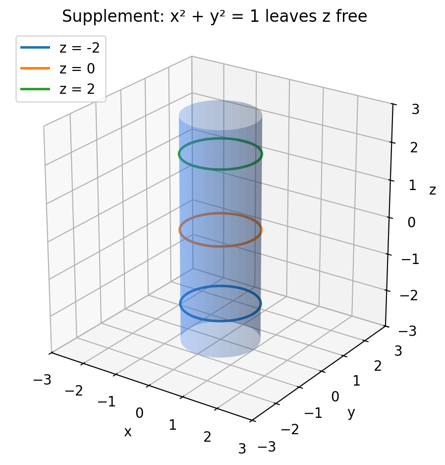

**How to read the figure:** The three coloured curves are identical unit circles at different `z` values. Because the equation allows every real `z`, these circles stack continuously to form the cylinder surface. The top and bottom shown are cropping boundaries, not end caps.

**Worked solution:** At any fixed height `z=k`, the equation is a unit circle centred at `(0,0,k)`. No restriction on `z` prevents repeating that circle at every height. The equation therefore describes a surface around the `z`-axis, not a single circle or a filled solid. Its axis intercepts are `(±1,0,0)` and `(0,±1,0)`; it has no `z`-axis intercept because `x=y=0` would give `0=1`.

**Answer:** An infinite circular cylinder surface of radius 1 about the `z`-axis, extending to `z=±∞`, with the cross-sections and intercepts above.

**Complete answer requirement:** Name the surface, radius, axis, free variable, useful sections, and unbounded extent.

**Common mistakes:** answering circle; drawing a solid cylinder or end caps; choosing the wrong axis.

---

## 11. Coordinate Cross-Sections

> **Status: Supplementary worksheet and preview material**

The worksheet asks for cross-sections of `z = y³ + xy`.

### Problem type: coordinate cross-sections

**Recognize it:** A surface `z=f(x,y)` is given and `x` or `y` must be fixed.

**Method:** substitute the fixed value; simplify to a one-variable equation; state its containing plane; sketch with remaining input horizontally and `z` vertically.

**Actual worksheet question - September 10 notes, PDF page 13, Question 19**

**Question:** Consider the function `f` given by `f(x,y)=y³+xy`. Draw graphs of cross-sections with:

- (a) `x` fixed at `x=-1`, `x=0`, and `x=1`.
- (b) `y` fixed at `y=-1`, `y=0`, and `y=1`.

Here `x,y` are real inputs and `z` is the height. Each fixed coordinate defines a different vertical slicing plane.

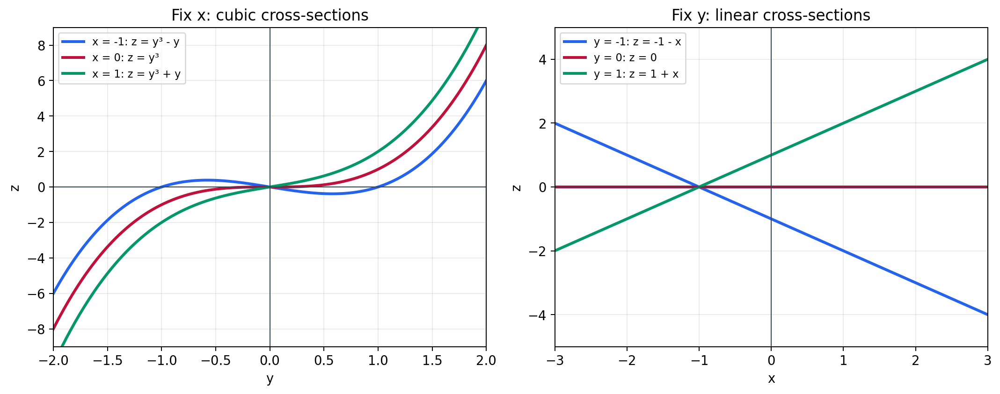

**Worked solution:** For part (a), substitute the fixed `x` into the coefficient of `y`. At `x=-1`, for example:

```text
z = y³ + (-1)y = y³ - y = y(y - 1)(y + 1)
```

This curve lies in `x=-1` and crosses `z=0` at `y=-1,0,1`. The other substitutions give `y³` and `y³+y`. For part (b), substitute the fixed `y` into both occurrences: `y=-1` gives `z=(-1)³+x(-1)=-1-x`; `y=0` gives `z=0`; `y=1` gives `z=1+x`.

**Answer:** The six section equations, planes, and shapes are:

| Fixed value | Equation | Plane | Features |
|---|---|---|---|
| `x=-1` | `z=y³-y` | `x=-1` | cubic; zeros `-1,0,1` |
| `x=0` | `z=y³` | `x=0` | standard cubic |
| `x=1` | `z=y³+y` | `x=1` | increasing cubic |
| `y=-1` | `z=-1-x` | `y=-1` | line of slope `-1` |
| `y=0` | `z=0` | `y=0` | `x`-axis |
| `y=1` | `z=1+x` | `y=1` | line of slope 1 |

**How to read the figure:** Fixing `x` leaves `y` as the horizontal input and produces the three cubic curves on the left. Fixing `y` leaves `x` as the horizontal input and produces the three lines on the right. The legend states both the fixed coordinate and the resulting one-variable equation.

**Complete final answer:** List every substituted equation, identify its plane, and provide labelled sketches. Example: “At `x=-1`, the section is `z=y³-y` in the plane `x=-1`, with zeros `-1,0,1`.”

**Common mistakes:** using the fixed coordinate on the horizontal axis; forgetting the containing plane; placing all sections in one physical plane; substituting into only one occurrence.

---

## 12. Complete Assigned Textbook Exercises

Questions are transcribed from textbook Section 12.1 (8th edition). Each entry gives the source data, necessary work, and answer. Use the linked knowledge section for the detailed method.

### Exercise 1

**Knowledge:** [Distance comparisons](#7-distance-in-3-space).

> **Question:** Which of the points `P=(1,2,1)` and `Q=(2,0,0)` is closest to the origin?

**Necessary work:**

`OP²=1²+2²+1²=6`; `OQ²=2²+0²+0²=4`. Compare `4<6`.

**Answer:** “`Q=(2,0,0)` is closest to the origin because `OQ²=4<6=OP²`.”

### Exercise 3

**Knowledge:** [Distance comparisons](#7-distance-in-3-space).

> **Question:** Which of the points `P₁=(-3,2,15)`, `P₂=(0,-10,0)`, `P₃=(-6,5,3)` and `P₄=(-4,2,7)` is closest to `P=(6,0,4)`?

**Necessary work:**

| Candidate | Coordinate differences from `P` | Squared distance |
|---|---|---:|
| `P₁` | `(-9,2,11)` | `81+4+121=206` |
| `P₂` | `(-6,-10,-4)` | `36+100+16=152` |
| `P₃` | `(-12,5,-1)` | `144+25+1=170` |
| `P₄` | `(-10,2,3)` | `100+4+9=113` |

The smallest squared distance is 113.

**Answer:** “`P₄=(-4,2,7)` is closest to `P=(6,0,4)` because its squared distance, 113, is the smallest.”

### Exercise 5

**Knowledge:** [Coordinate directions and movement](#5-coordinates-axes-and-planes-in-3-space).

> **Question:** You are at the point `(3,1,1)`, standing upright and facing the `yz`-plane. You walk 2 units forward, turn left, and walk another 2 units. What is your final position? From the point of view of an observer looking at the coordinate system in Figure 12.2 on page 696, are you in front of or behind the `yz`-plane? To the left or to the right of the `xz`-plane? Above or below the `xy`-plane?

**Variables and diagram:** The `yz`-plane is `x=0`, the `xz`-plane is `y=0`, and the `xy`-plane is `z=0`. Standing upright means positive `z` is up. Facing the `yz`-plane from `x=3` means facing in the negative `x` direction.


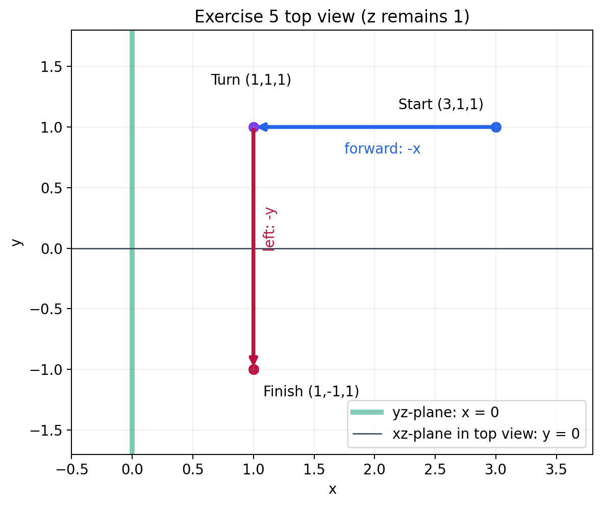

**How to read the diagram:** The first arrow moves toward `x=0`, changing only `x`. After facing negative `x`, a left turn points toward negative `y`; the second arrow changes only `y`. The title records that `z` remains 1.

**Necessary work:**

`(3,1,1) → (1,1,1) → (1,-1,1)`: forward is negative `x`; after turning left, motion is negative `y`. In the source viewpoint, `x>0` means front, `y<0` means left, and `z>0` means above.

**Answer:** “The final position is `(1,-1,1)`. It is in front of the `yz`-plane, to the left of the `xz`-plane, and above the `xy`-plane.”

### Exercise 9

**Knowledge:** [Testing an equation](#6-equations-and-inequalities-as-sets-of-points).

> **Question:** In Exercises 8-11, which of (I)-(IV) lie on the graph of the equation?
>
> I. `(2,2,4)`  
> II. `(-1,1,0)`  
> III. `(-3,-2,-1)`  
> IV. `(-2,-2,4)`
>
> **9.** `x+y+z=0`

**Necessary work:**

| Candidate | Substitution | On the graph? |
|---|---:|:---:|
| I | `2+2+4=8` | No |
| II | `-1+1+0=0` | Yes |
| III | `-3-2-1=-6` | No |
| IV | `-2-2+4=0` | Yes |

**Answer:** Points II and IV lie on `x+y+z=0`; the other two do not.

### Exercise 11

**Knowledge:** [Testing an equation and free coordinates](#6-equations-and-inequalities-as-sets-of-points).

> **Question:** In Exercises 8-11, which of (I)-(IV) lie on the graph of the equation?
>
> I. `(2,2,4)`  
> II. `(-1,1,0)`  
> III. `(-3,-2,-1)`  
> IV. `(-2,-2,4)`
>
> **11.** `x-y=0`

**Necessary work:**

| Candidate | Substitution | On the graph? |
|---|---:|:---:|
| I | `2-2=0` | Yes |
| II | `-1-1=-2` | No |
| III | `-3-(-2)=-1` | No |
| IV | `-2-(-2)=0` | Yes |

**Answer:** “Points I and IV lie on `x-y=0` because each has `x=y`. Their different `z` values are allowed because `z` does not appear in the equation.”

### Exercise 13

**Knowledge:** [Constant-coordinate planes](#6-equations-and-inequalities-as-sets-of-points).

> **Question:** In Exercises 12-15 sketch graphs of the equations in 3-space. **13.** `x=-3`

**Variables and graph:** `x` is fixed at `-3`; `y` and `z` are free.

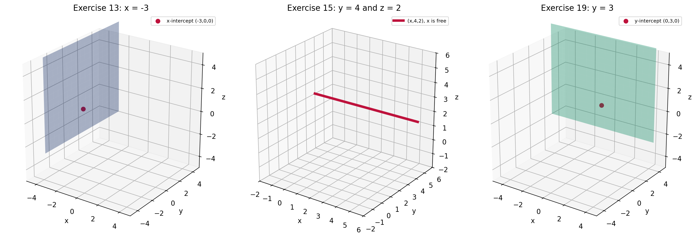

**How to read the graph:** Exercise 13 is the left panel. The blue sheet has fixed coordinate `x=-3`; movement within the sheet changes only `y` and `z`. The red point marks its only coordinate-axis intercept.

**Necessary work:**

`x=-3` fixes only `x`; `y,z∈ℝ`. Sections at `y=k` and `z=k` are `(−3,k,z)` and `(−3,y,k)`, respectively.

**Answer:** The left-panel graph is the infinite vertical plane `x=-3`, parallel to the `yz`-plane and crossing the `x`-axis at `(-3,0,0)`. It extends without bound in `y` and `z`.

### Exercise 15

**Knowledge:** [Intersections of fixed-coordinate planes](#6-equations-and-inequalities-as-sets-of-points).

> **Question:** In Exercises 12-15 sketch graphs of the equations in 3-space. **15.** `z=2` and `y=4`

**Variables and graph:** Both equations must hold. `y` and `z` are fixed; `x` is free.


**How to read the graph:** The middle panel shows a red line whose `y` and `z` coordinates remain fixed while `x` varies. Its apparent endpoints are only the edges of the viewing window.

**Necessary work:**

Both equations hold simultaneously, so the intersection is `(x,4,2)`, `x∈ℝ`. It meets the `yz`-plane at `(0,4,2)` and has no coordinate-axis intercept.

**Answer:** “The graph is the infinite line `(x,4,2)`, `x∈ℝ`, parallel to the `x`-axis. It is the intersection of the planes `y=4` and `z=2`.”

### Exercise 17

**Knowledge:** [Sphere equations](#8-spheres-balls-and-intersections).

> **Question:** Find an equation of the sphere with radius 5 centered at the origin.

**Necessary work:**

Substitute centre `(0,0,0)` and radius `r=5` into the sphere formula:

```text
x²+y²+z²=25
```

**Answer:** “The sphere is `x²+y²+z²=25`; it is the surface of radius 5 centred at the origin.”

### Exercise 19

**Knowledge:** [Constant-coordinate planes](#6-equations-and-inequalities-as-sets-of-points).

> **Question:** Find the equation of the vertical plane perpendicular to the `y`-axis and through the point `(2,3,4)`.

**Variables and graph:** A plane perpendicular to the `y`-axis has constant `y`. Passing through `(2,3,4)` forces that constant to be 3.


**How to read the graph:** The right panel shows a vertical plane at the constant value `y=3`. The marked point `(0,3,0)` is its `y`-axis intercept. The rectangular patch represents part of an infinite plane.

**Necessary work:**

Perpendicular to the `y`-axis gives `y=c`; the point `(2,3,4)` gives `c=3`. Its intercept is `(0,3,0)`; sections at `z=k` and `x=k` are `(x,3,k)` and `(k,3,z)`.

**Answer:** “The equation is `y=3`. It is an infinite vertical plane parallel to the `xz`-plane and contains `(2,3,4)`.”

### Exercise 23

**Knowledge:** [BMI table and row interpretation](#23-bmi-table-from-the-textbook).

> **Question:** For Exercises 23-25, refer to Table 12.1 on page 695 where `w` is a person’s weight (in lbs) and `h` their height (in inches). **23.** Compute a table of values of BMI, with `h` fixed at 60 inches and `w` between 120 and 200 lbs at intervals of 20.

**Source table:** The function is `BMI=f(h,w)`. Rows are height `h` in inches; columns are weight `w` in pounds.

| Height `h` (in) ↓ / weight `w` (lb) → | 120 | 140 | 160 | 180 | 200 |
|---:|---:|---:|---:|---:|---:|
| 60 | 23.4 | 27.3 | 31.2 | 35.2 | 39.1 |
| 63 | 21.3 | 24.8 | 28.3 | 31.9 | 35.4 |
| 66 | 19.4 | 22.6 | 25.8 | 29.0 | 32.3 |
| 69 | 17.7 | 20.7 | 23.6 | 26.6 | 29.5 |
| 72 | 16.3 | 19.0 | 21.7 | 24.4 | 27.1 |
| 75 | 15.0 | 17.5 | 20.0 | 22.5 | 25.0 |

**Necessary work:** Fix `h=60`, read across the `h=60` row, and pair each requested weight with its BMI.

| Weight `w` (lb) | 120 | 140 | 160 | 180 | 200 |
|---:|---:|---:|---:|---:|---:|
| `BMI=f(60,w)` | 23.4 | 27.3 | 31.2 | 35.2 | 39.1 |

**Answer:** The requested values are in the two-row table above. At height 60 inches, BMI increases from 23.4 to 39.1 as weight increases from 120 to 200 lb.

### Exercise 25

**Knowledge:** [BMI units and estimation](#23-bmi-table-from-the-textbook).

> **Question:** For Exercises 23-25, refer to Table 12.1 on page 695 where `w` is a person’s weight (in lbs) and `h` their height (in inches). **25.** Estimate the BMI of a man who weighs 90 kilograms and is 1.9 meters tall.

**Source table:** Convert the inputs before using this inches-and-pounds table.

| Height `h` (in) ↓ / weight `w` (lb) → | 120 | 140 | 160 | 180 | 200 |
|---:|---:|---:|---:|---:|---:|
| 60 | 23.4 | 27.3 | 31.2 | 35.2 | 39.1 |
| 63 | 21.3 | 24.8 | 28.3 | 31.9 | 35.4 |
| 66 | 19.4 | 22.6 | 25.8 | 29.0 | 32.3 |
| 69 | 17.7 | 20.7 | 23.6 | 26.6 | 29.5 |
| 72 | 16.3 | 19.0 | 21.7 | 24.4 | 27.1 |
| 75 | 15.0 | 17.5 | 20.0 | 22.5 | 25.0 |

**Necessary work:**

`90 kg ×2.205≈198 lb`; `1.9 m ×39.37≈74.8 in`. The nearest entry is row `h=75`, column `w=200`, giving 25.0.

**Answer:** “A 90 kg, 1.9 m man has an estimated BMI of approximately 25.0.”

### Exercise 29

**Knowledge:** [Fixed-input table trends](#25-beef-consumption-table-for-exercises-29-and-31).

> **Full source description:** For Problems 29-31, refer to Table 12.3, which contains values of beef consumption `C` (in pounds per week per household) as a function of household income, `I` (in thousands of dollars per year), and the price of beef, `p` (in dollars per pound). Values of `p` are shown across the top, values of `I` are down the left side, and corresponding values of beef consumption `C=f(I,p)` are given in the table.
>
> **Question:** Give tables for beef consumption as a function of `p`, with `I` fixed at `I=20` and `I=100`. Give tables for beef consumption as a function of `I`, with `p` fixed at `p=3.00` and `p=4.00`. Comment on what you see in the tables.

**Source table: Quantity of beef bought (pounds/household/week)**

| Household income `I` (thousands of dollars/year) ↓ / price `p` (dollars/lb) → | 3.00 | 3.50 | 4.00 | 4.50 |
|---:|---:|---:|---:|---:|
| 20  | 2.65 | 2.59 | 2.51 | 2.43 |
| 40  | 4.14 | 4.05 | 3.94 | 3.88 |
| 60  | 5.11 | 5.00 | 4.97 | 4.84 |
| 80  | 5.35 | 5.29 | 5.19 | 5.07 |
| 100 | 5.79 | 5.77 | 5.60 | 5.53 |

**Necessary work, part 1 - vary `p`, fix `I`:** Read across rows `I=20` and `I=100`.

| `p` (dollars/lb) | 3.00 | 3.50 | 4.00 | 4.50 |
|---:|---:|---:|---:|---:|
| `C=f(20,p)` | 2.65 | 2.59 | 2.51 | 2.43 |
| `C=f(100,p)` | 5.79 | 5.77 | 5.60 | 5.53 |

**Necessary work, part 2 - vary `I`, fix `p`:** Read down columns `p=3.00` and `p=4.00`.

| `I` (thousands of dollars/year) | 20 | 40 | 60 | 80 | 100 |
|---:|---:|---:|---:|---:|---:|
| `C=f(I,3.00)` | 2.65 | 4.14 | 5.11 | 5.35 | 5.79 |
| `C=f(I,4.00)` | 2.51 | 3.94 | 4.97 | 5.19 | 5.60 |

**Answer:** The two derived tables above give all four requested slices. At fixed income, consumption decreases as price increases; at fixed price, consumption increases as income increases. All consumption values are pounds per household per week.

### Exercise 31

**Knowledge:** [Fixed-price column interpretation](#25-beef-consumption-table-for-exercises-29-and-31).

> **Full source description:** For Problems 29-31, refer to Table 12.3, which contains values of beef consumption `C` (in pounds per week per household) as a function of household income, `I` (in thousands of dollars per year), and the price of beef, `p` (in dollars per pound). Values of `p` are shown across the top, values of `I` are down the left side, and corresponding values of beef consumption `C=f(I,p)` are given in the table.
>
> **Question:** How does beef consumption vary as a function of household income if the price of beef is held constant?

**Source table: Quantity of beef bought (pounds/household/week)**

| Household income `I` (thousands of dollars/year) ↓ / price `p` (dollars/lb) → | 3.00 | 3.50 | 4.00 | 4.50 |
|---:|---:|---:|---:|---:|
| 20  | 2.65 | 2.59 | 2.51 | 2.43 |
| 40  | 4.14 | 4.05 | 3.94 | 3.88 |
| 60  | 5.11 | 5.00 | 4.97 | 4.84 |
| 80  | 5.35 | 5.29 | 5.19 | 5.07 |
| 100 | 5.79 | 5.77 | 5.60 | 5.53 |

**Necessary work:**

Read down each fixed-price column of the source table. Every column increases as `I=20,40,60,80,100`.

**Answer:** “For each fixed listed price, household beef consumption increases as household income increases. For example, at `p=4.00` dollars/lb it rises from 2.51 to 5.60 pounds/household/week as income rises from 20 to 100 thousand dollars/year.”

### Exercise 37

**Knowledge:** [Constructing a formula from words](#problem-type-construct-a-formula-from-words).

> **Question:** A cable company charges `$100` for a monthly subscription to its services and `$5` for each special feature movie that a subscriber chooses to watch.
>
> **(a)** Write a formula for the monthly revenue, `R` in dollars, earned by the cable company as a function of `s`, the number of monthly subscribers it serves, and `m`, the total number of special feature movies that its subscribers view.
>
> **(b)** If `R=f(s,m)`, find `f(1000,5000)` and interpret it in terms of revenue.

**(a) Necessary work:** Subscription revenue is `100s`; movie revenue is `5m`.

**(a) Answer:** `R=f(s,m)=100s+5m` dollars per month, with `s` subscribers and `m` total movie views.

**(b) Necessary work:**

```text
f(1000,5000)=100(1000)+5(5000)
               =100,000+25,000
               =125,000
```

**(b) Answer:** `f(1000,5000)=125,000` dollars: the company earns 125,000 dollars in one month from 1000 subscribers who collectively watch 5000 special-feature movies.

---

## 13. Study checklist

- [ ] I can test uniqueness of output and explain the four representations.
- [ ] I can evaluate, interpret, and construct two-variable formulas with units.
- [ ] I can read, invert, estimate, and analyze a two-input table.
- [ ] I can estimate a value from contours.
- [ ] I can sketch plausible fixed-variable curves from a physical situation.
- [ ] I can plot and classify points from their coordinates.
- [ ] I can translate among planes, axes, lines, and half-spaces.
- [ ] I can test whether a point satisfies an equation.
- [ ] I can compute and compare 3D distances.
- [ ] I can write a sphere equation and distinguish sphere from ball.
- [ ] I can find a sphere-plane intersection.
- [ ] I can fully describe and sketch `z=1+x-y` and `x²+y²=1`.
- [ ] I can find all requested sections of `z=y³+xy`.
- [ ] As supplementary practice, I can solve inverse BMI conditions and find a segment's midpoint.

Continue with [Practice and Self-Test](./Practice-and-Self-Test.md), then review the [Coverage Audit](./Coverage-Audit.md).
