# MAT235 Week 2 Answers and Practice
## Solutions, Source Practice, and Self-Test

---

## 1. Problem Type Solutions

This section provides complete worked solutions and final answers for every Problem Type teaching example introduced in `Study-Notes.md`.

---

### Problem Type PT-01: Recognize and Describe a Surface from an Equation
**Question reference.** See PT-01 in `Study-Notes.md`.

**Worked solution.**
1. For `z = 1 + x - y`:
   Rearranging into standard linear form gives `x - y - z = -1`.
   - *Landmarks:* Setting `y = 0, z = 0` gives `x`-intercept `(-1, 0, 0)`; setting `x = 0, z = 0` gives `y`-intercept `(0, 1, 0)`; setting `x = 0, y = 0` gives `z`-intercept `(0, 0, 1)`.
   - *Traces:* In the plane `x = 0`, the trace is the line `z = 1 - y`; in `y = 0`, the line `z = 1 + x`; in `z = 0`, the line `y = 1 + x`.
   - *Function test:* For every `(x, y) ∈ ℝ²`, `z` is uniquely given by `1 + x - y`. Thus, it satisfies the vertical-line test everywhere.
   - *Orientation and extent:* The surface is an infinite, unbounded plane that slopes upward in the direction of increasing `x` and downward in the direction of increasing `y`.
2. For `x² + y² + z² = 4`:
   This matches the standard sphere equation `(x - x₀)² + (y - y₀)² + (z - z₀)² = r²` with center `(0, 0, 0)` and radius `r = 2`.
   - *Landmarks:* Axis intercepts are `(±2, 0, 0)`, `(0, ±2, 0)`, and `(0, 0, ±2)`.
   - *Traces:* Setting `x = 0` gives the circle `y² + z² = 4` in the `yz`-plane; setting `y = 0` gives `x² + z² = 4` in the `xz`-plane; setting `z = 0` gives `x² + y² = 4` in the `xy`-plane.
   - *Function test:* At `(x, y) = (0, 0)`, `z² = 4 ⇒ z = ±2`. The vertical line through the origin intersects the surface at `(0, 0, 2)` and `(0, 0, -2)`. Thus, the full sphere fails the vertical-line test and is not the graph of a single function.
   - *Orientation and extent:* The surface is completely bounded within `[-2, 2] × [-2, 2] × [-2, 2]`. It is the union of two function graphs `z = ±√(4 - x² - y²)` over the closed disk `x² + y² ≤ 4`.

**Answer.**
(a) The equation `z = 1 + x - y` represents an infinite plane with intercepts `(-1, 0, 0)`, `(0, 1, 0)`, and `(0, 0, 1)`; it is the graph of a single-valued function `z = f(x, y)` on all of ℝ².
(b) The equation `x² + y² + z² = 4` represents a bounded sphere of radius `2` centered at the origin; it fails the vertical-line test and cannot be written as a single function `z = f(x, y)`, but decomposes into upper and lower hemispheres over the disk `x² + y² ≤ 4`.

---

### Problem Type PT-02: Test a Surface as a Function z = f(x, y) and Determine Exact Domain
**Question reference.** See PT-02 in `Study-Notes.md`.

**Worked solution.**
1. Evaluate the equation `x² + y² + z² = 1` at `(x, y) = (0, 0)`:
   `0² + 0² + z² = 1 ⇒ z² = 1 ⇒ z = 1 or z = -1`
   The vertical line `x = 0, y = 0` intersects the sphere at two distinct spatial points, `(0, 0, 1)` and `(0, 0, -1)`. By definition, a single-valued function assigns exactly one output to each input pair. Hence, the whole sphere fails the vertical-line test.
2. Solving `x² + y² + z² = 1` for `z` yields:
   `z² = 1 - x² - y² ⇒ z = ±√(1 - x² - y²)`
   This gives two single-valued functions:
   - `f₁(x, y) = +√(1 - x² - y²)` (upper hemisphere, `z ≥ 0`)
   - `f₂(x, y) = -√(1 - x² - y²)` (lower hemisphere, `z ≤ 0`)
3. For the square root to produce real values, the radicand must be non-negative:
   `1 - x² - y² ≥ 0 ⇔ x² + y² ≤ 1`
   In set-builder notation, the exact domain is `D = {(x, y) ∈ ℝ² : x² + y² ≤ 1}`, which is a closed circular disk of radius 1. Specifying `[-1, 1] × [-1, 1]` is incorrect because points in the corners of the square (such as `(1, 1)`) have `x² + y² = 2 > 1`, resulting in a strictly negative radicand `1 - 2 = -1` where the square root is not real.

**Answer.**
(a) The vertical line `x = 0, y = 0` intersects the sphere at `(0, 0, 1)` and `(0, 0, -1)`, failing the vertical-line test.
(b) Upper hemisphere `z = √(1 - x² - y²)`; lower hemisphere `z = -√(1 - x² - y²)`.
(c) The exact domain is the closed unit disk `D = {(x, y) ∈ ℝ² : x² + y² ≤ 1}`.

---

### Problem Type PT-03: Transform a Known Surface Graph via Shifts, Reflections, and Scaling
**Question reference.** See PT-03 in `Study-Notes.md`.

**Worked solution.**
1. `z = (x - 1)² + (y - 2)²`:  
   Replacing `x ↦ x - 1` and `y ↦ y - 2` translates the parent surface `z = x² + y²` horizontally by vector `(+1, +2, 0)`. The base vertex at the origin shifts to `(1, 2, 0)`. The surface is an upward circular paraboloid with vertical axis of symmetry given by the line `x = 1, y = 2`. Since squared terms are non-negative, the range is `[0, ∞)`.
2. `z = 5 - x² - y² = 5 - (x² + y²)`:  
   The parent paraboloid is first reflected vertically across the `xy`-plane (`z ↦ -z`, giving `z = -x² - y²`) and then translated upward by 5 units along the `z`-axis (`z ↦ z + 5`). The surface is a downward-opening circular paraboloid. The vertex is `(0, 0, 5)`, the axis of symmetry is the `z`-axis (`x = 0, y = 0`), and the range is `(-∞, 5]`.
3. `z = exp(-(x² + y²))`:  
   Let `r = √(x² + y²)`. Then `z = exp(-r²)`. Because `z` depends solely on `r`, the graph has circular rotational symmetry around the `z`-axis. Since `r² ≥ 0`, the maximum value is `exp(0) = 1`, attained at `(0, 0, 1)`. For all `(x, y)`, `exp(-r²) > 0`. As distance from the origin `r → ∞`, `z = exp(-r²) → 0`. The graph is an infinite, circularly symmetric Gaussian bell surface with peak `(0, 0, 1)`, asymptotic to the `xy`-plane (`z = 0`), with range `(0, 1]`.

**Answer.**
(a) Upward circular paraboloid translated by `(1, 2, 0)`, vertex `(1, 2, 0)`, axis `x = 1, y = 2`, range `[0, ∞)`.
(b) Downward circular paraboloid reflected across `xy`-plane and raised by 5, vertex `(0, 0, 5)`, axis `x = 0, y = 0`, range `(-∞, 5]`.
(c) Rotationally symmetric Gaussian bell surface, peak `(0, 0, 1)`, horizontal asymptote `z = 0`, range `(0, 1]`.

---

### Problem Type PT-04: Determine and Sketch Parabolic and Hyperbolic Vertical Traces
**Question reference.** See PT-04 in `Study-Notes.md`.

**Worked solution.**
1. In the vertical planes `y = b`, substitute `y = b` into `z = x² - y²`:
   `z = x² - b²`
   This describes an upward-opening parabola in the plane `y = b`. In this plane, coordinates are `x` (horizontal) and `z` (vertical). The vertex occurs at `x = 0`, giving coordinates `(x, y, z) = (0, b, -b²)`.
   - For `y = -1`: trace is `z = x² - 1` in plane `y = -1`, vertex `(0, -1, -1)`.
   - For `y = 0`: trace is `z = x²` in plane `y = 0`, vertex `(0, 0, 0)`.
   - For `y = 1`: trace is `z = x² - 1` in plane `y = 1`, vertex `(0, 1, -1)`.
2. In the vertical planes `x = a`, substitute `x = a` into `z = x² - y²`:
   `z = a² - y²`
   This describes a downward-opening parabola in the plane `x = a`. In this plane, coordinates are `y` (horizontal) and `z` (vertical). The vertex occurs at `y = 0`, giving coordinates `(x, y, z) = (a, 0, a²)`.
   - For `x = -1`: trace is `z = 1 - y²` in plane `x = -1`, vertex `(-1, 0, 1)`.
   - For `x = 0`: trace is `z = -y²` in plane `x = 0`, vertex `(0, 0, 0)`.
   - For `x = 1`: trace is `z = 1 - y²` in plane `x = 1`, vertex `(1, 0, 1)`.
3. The cross-sections parallel to the `xz`-plane (`y = b`) are all upward parabolas, so moving away from the origin along the `x`-axis causes the surface to curve upward. Conversely, the cross-sections parallel to the `yz`-plane (`x = a`) are all downward parabolas, so moving away from the origin along the `y`-axis causes the surface to curve downward. At the origin `(0, 0, 0)`, the surface attains a local minimum along the `x`-direction and a local maximum along the `y`-direction. This combination of opposing curvatures defines a classic saddle point.

**Answer.**
(a) Upward parabolas in planes `y = -1, 0, 1` with equations `z = x² - 1, x², x² - 1` and vertices `(0, -1, -1), (0, 0, 0), (0, 1, -1)`.
(b) Downward parabolas in planes `x = -1, 0, 1` with equations `z = 1 - y², -y², 1 - y²` and vertices `(-1, 0, 1), (0, 0, 0), (1, 0, 1)`.
(c) Orthogonal upward and downward parabolic curvatures identify the origin as a saddle point on a hyperbolic paraboloid.

---

### Problem Type PT-05: Sketch and Analyze Multi-Curve Families of Vertical Cross-Sections
**Question reference.** See PT-05 in `Study-Notes.md`.

**Worked solution.**
1. Holding `x` constant gives vertical planes parallel to the `yz`-plane. Coordinates: horizontal `y`, vertical `z`.
   Substituting `x = -1, 0, 1` into `f(x, y) = y³ + xy`:
   - `x = -1`: `z = y³ - y = y(y - 1)(y + 1)`. Roots at `y = -1, 0, 1`. Derivative `dz/dy = 3y² - 1 = 0 ⇒ y = ±1/√3`. Local maximum at `(-1/√3, 2/(3√3))`; local minimum at `(1/√3, -2/(3√3))`.
   - `x = 0`: `z = y³`. Root at `y = 0`. Strictly increasing cubic curve with inflection point at the origin.
   - `x = 1`: `z = y³ + y = y(y² + 1)`. Single real root at `y = 0`. Derivative `dz/dy = 3y² + 1 ≥ 1 > 0`, strictly increasing with no turning points.
2. Holding `y` constant gives vertical planes parallel to the `xz`-plane. Coordinates: horizontal `x`, vertical `z`.
   Substituting `y = -1, 0, 1` into `f(x, y) = y³ + xy`:
   - `y = -1`: `z = (-1)³ + x(-1) = -1 - x`. Straight line with slope `-1` and `z`-intercept `-1`.
   - `y = 0`: `z = 0³ + x(0) = 0`. Horizontal line along the `x`-axis (`z = 0`).
   - `y = 1`: `z = 1³ + x(1) = 1 + x`. Straight line with slope `+1` and `z`-intercept `+1`.
3. Along slices of constant `y`, the height varies linearly with `x` with slope `∂z/∂x = y`. When `y < 0`, the slices slope downward; when `y = 0`, the slice is flat; when `y > 0`, the slices slope upward. Thus, moving along the `y`-axis causes the surface to twist continuously from negative slope to positive slope.

**Answer.**
(a) On `yz`-axes: cubics `z = y³ - y` (roots `-1, 0, 1`), `z = y³` (inflection at origin), and `z = y³ + y` (strictly increasing).
(b) On `xz`-axes: straight lines `z = -1 - x` (slope `-1`), `z = 0` (slope `0`), and `z = 1 + x` (slope `+1`).
(c) The slope of the `y`-fixed slices is `m = y`, causing the surface to twist about the origin.

---

### Problem Type PT-06: Identify and Sketch Cylinders from Missing Variables in ℝ³
**Question reference.** See PT-06 in `Study-Notes.md`.

**Worked solution.**
1. In ℝ², `x² + y² = 1` is a one-dimensional curve: the unit circle centered at the origin. In ℝ³, the variable `z` is absent (free). Any point `(x, y, z)` satisfying `x² + y² = 1` is a solution regardless of `z`. Translating the unit circle parallel to the `z`-axis generates a right circular cylinder of radius 1 centered on the `z`-axis. At any point on the unit circle (e.g., `(1, 0)`), all points `(1, 0, z)` for `z ∈ ℝ` lie on the surface; thus, vertical lines intersect it at infinitely many points, failing the vertical-line test for `z = f(x, y)`.
2. In ℝ³, `z = x²` lacks the variable `y`. In the coordinate plane `y = 0` (`xz`-plane), the generating curve is the standard parabola `z = x²`. Translating this parabola along the `y`-axis produces a parabolic cylinder. For every pair `(x, y) ∈ ℝ²`, the height `z = x²` is uniquely determined. Hence, `z = x²` **is** the graph of a valid function `z = f(x, y)` on ℝ².
3. In ℝ³, `y = x²` lacks the variable `z`. In the coordinate plane `z = 0` (`xy`-plane), the generating curve is the parabola `y = x²`. Translating this parabola parallel to the `z`-axis produces a parabolic cylinder extruded vertically. Over any point `(x₀, x₀²)` on the parabola, `z` can take any real value. Thus, it completely fails the vertical-line test and cannot be written as `z = f(x, y)`.

**Answer.**
(a) Circle in ℝ²; vertical circular cylinder of radius 1 around the `z`-axis in ℝ³ (fails `z`-function test).
(b) Parabolic cylinder parallel to the `y`-axis with generating curve `z = x²`; represents a valid function `z = f(x, y)` on ℝ².
(c) Parabolic cylinder parallel to the `z`-axis with generating curve `y = x²`; fails the `z`-function test.

---

### Problem Type PT-07: Distinguish Vertical Cross-Sections from Horizontal Level Curves
**Question reference.** See PT-07 in `Study-Notes.md`.

**Worked solution.**
1. For `f(x, y) = x² + y²`, setting `x = 1` gives the cross-section:
   `x = 1,   z = 1 + y²`
   This curve lies in the vertical plane `x = 1`. The variable `x` is held fixed at 1, while `y` varies over ℝ and `z` varies over `[1, ∞)`. It is plotted on `yz`-coordinate axes as an upward-opening parabola with vertex `(y, z) = (0, 1)`.
2. Setting `z = 4` gives the contour curve:
   `z = 4,   x² + y² = 4`
   In 3D space, this curve lies in the horizontal plane `z = 4`. On the contour diagram, it is projected vertically into the `xy`-domain plane as a circle of radius `r = √4 = 2` centered at the origin `(0, 0)`. The height `z` is strictly fixed at 4 along the entire curve.
3. Two fundamental mathematical differences:
   - *Fixed quantity and spatial plane:* A vertical cross-section fixes an **input** variable (`x` or `y`) and lies in a vertical plane perpendicular to the domain; a contour fixes the **output** variable (`z`) and lies in a horizontal plane parallel to the domain.
   - *Height behavior:* Along a vertical cross-section, the output height `z` varies; along a contour curve, the output height `z` is strictly constant.

**Answer.**
(a) Vertical parabola `z = 1 + y²` in the plane `x = 1`, viewed on `yz`-axes.
(b) Horizontal circle `x² + y² = 4` at height `z = 4`, projected onto `xy`-axes as a radius-2 circle.
(c) Cross-sections fix inputs and vary in height; contours fix output height and map domain curves where `z` is constant.

---

### Problem Type PT-08: Find Algebraic Contours and Interpret Spacing and Steepness
**Question reference.** See PT-08 in `Study-Notes.md`.

**Worked solution.**
1. For `f(x, y) = x² + y²`:
   Setting `x² + y² = c` requires `c ≥ 0` since a sum of squares cannot be negative.
   - For `c < 0`: empty set `∅`.
   - For `c = 0`: `x² + y² = 0 ⇒ (x, y) = (0, 0)` (single degenerate point, radius 0).
   - For `c > 0`: circles centered at `(0, 0)` of radius `r = √c`.
   - Levels: `c = 0 ⇒ r = 0`; `c = 2 ⇒ r = √2 ≈ 1.414`; `c = 4 ⇒ r = 2`; `c = 6 ⇒ r = √6 ≈ 2.449`; `c = 8 ⇒ r = √8 = 2√2 ≈ 2.828`.
2. For `g(x, y) = √(x² + y²)`:
   Setting `√(x² + y²) = c` requires `c ≥ 0` since principal square roots are non-negative.
   - For `c < 0`: empty set `∅`.
   - For `c = 0`: `(x, y) = (0, 0)`, radius `r = 0`.
   - For `c > 0`: circles of radius `r = c`.
   - Levels: `c = 0 ⇒ r = 0`; `c = 1 ⇒ r = 1`; `c = 2 ⇒ r = 2`; `c = 3 ⇒ r = 3`.
3. Radial spacing analysis:
   - For `f(x, y)`: output increment is `Δc = 2`. Successive radial gaps are:
     `Δr₁ = √2 - 0 ≈ 1.414`,
     `Δr₂ = 2 - √2 ≈ 0.586`,
     `Δr₃ = √6 - 2 ≈ 0.449`,
     `Δr₄ = √8 - √6 ≈ 0.379`.
     The radial distance between adjacent contours shrinks outward (`Δr → 0`). Because equal rises in height occur over progressively smaller horizontal distances, the paraboloid becomes steeper outward.
   - For `g(x, y)`: output increment is `Δc = 1`. Successive radial gaps are:
     `Δr = 1 - 0 = 2 - 1 = 3 - 2 = 1.0` (constant).
     The contours are equally spaced, which means that height changes at a strictly constant rate with respect to horizontal distance; the graph of `g` is a circular cone with constant slope.

**Answer.**
(a) Concentric circles with radii `0, √2, 2, √6, 2√2` for `c = 0, 2, 4, 6, 8`; empty for `c < 0`.
(b) Concentric circles with radii `0, 1, 2, 3` for `c = 0, 1, 2, 3`; empty for `c < 0`.
(c) For `f`, shrinking radial gaps demonstrate increasing steepness (parabolic bowl); for `g`, uniform radial gaps demonstrate constant slope (cone).

---

### Problem Type PT-09: Plot and Interpret Contours of Linear Functions
**Question reference.** See PT-09 in `Study-Notes.md`.

**Worked solution.**
1. Set `z = 2y - x = c` and solve for `y`:
   `2y = x + c ⇒ y = (1/2)x + c/2`
   Substituting `c = 0, 2, 4, 6`:
   - `z = 0: y = (1/2)x`
   - `z = 2: y = (1/2)x + 1`
   - `z = 4: y = (1/2)x + 2`
   - `z = 6: y = (1/2)x + 3`
2. All lines have common slope `m = 1/2`. The `y`-intercepts (where `x = 0`) are `(0, 0)`, `(0, 1)`, `(0, 2)`, and `(0, 3)`, respectively.
3. For `z = -x + 2y`, the change in height is `Δz = -Δx + 2Δy`.
   To increase `z`, we need `-Δx + 2Δy > 0`. Moving in the direction of the vector `v = (-1, 2)` yields:
   `Δz = -(-1) + 2(2) = 1 + 4 = 5 > 0`
   Thus, `z` increases most rapidly toward the upper-left (increasing `y`, decreasing `x`).
   Moving along the line's direction vector `u = (2, 1)` yields:
   `Δz = -(2) + 2(1) = 0`
   This confirms that moving along a contour line produces zero change in `z`.

**Answer.**
(a) Four parallel lines: `y = (1/2)x`, `y = (1/2)x + 1`, `y = (1/2)x + 2`, `y = (1/2)x + 3`.
(b) Common slope is `1/2`; `y`-intercepts are `0, 1, 2, 3`.
(c) Vector direction of increasing `z` is `(-1, 2)`; along the vector `(2, 1)` the change `Δz = 0`.

---

### Problem Type PT-10: Read a Labelled Contour Map and Bracket / Interpolate Values
**Question reference.** See PT-10 in `Study-Notes.md`.

**Worked solution.**
1. Point `A = (1.5, 0)` lies on the positive `x`-axis at distance `r = 1.5` from the origin.
   The surrounding drawn contours for `q(x, y) = 12 - x² - y²` are:
   - `q = 10 ⇒ x² + y² = 12 - 10 = 2 ⇒ r = √2 ≈ 1.414`.
   - `q = 8 ⇒ x² + y² = 12 - 8 = 4 ⇒ r = 2.0`.
   Since `1.414 < 1.5 < 2.0`, point `A` lies strictly between the `q = 10` and `q = 8` contours. Therefore, the height is rigorously bounded by:
   `8 < q(1.5, 0) < 10`
2. *Assumption:* Assume that `q` varies approximately linearly with respect to radial distance `r` across the narrow interval `[√2, 2]`.
   The fraction of the distance from `r = √2` to `r = 2` is:
   `t = (1.5 - √2) / (2 - √2) ≈ (1.5 - 1.4142) / (2 - 1.4142) = 0.0858 / 0.5858 ≈ 0.1465`
   Since `q` decreases from 10 to 8 as `r` increases, the linearly interpolated value is:
   `q_est ≈ 10 - t(10 - 8) = 10 - 0.1465(2) = 10 - 0.293 = 9.707 ≈ 9.71`
3. Exact evaluation:
   `q(1.5, 0) = 12 - (1.5)² - 0² = 12 - 2.25 = 9.75`
   The slight difference (`9.71` vs `9.75`) occurs because the true profile `q(r) = 12 - r²` is concave downward (`q''(r) = -2 < 0`), so the secant line used in linear interpolation lies strictly below the true quadratic curve.

**Answer.**
(a) Enclosing levels are `10` and `8`; bounding inequality is `8 < q(1.5, 0) < 10`.
(b) Linear radial interpolation yields `q(1.5, 0) ≈ 9.71`.
(c) Exact formula evaluation gives `q(1.5, 0) = 9.75`. The interpolation is an estimate due to downward curvature.

---

### Problem Type PT-11: Construct and Interpolate Contours from Numerical Data Tables
**Question reference.** See PT-11 in `Study-Notes.md`.

**Worked solution.**
1. Locate where `f(x, y) = 6` crosses each horizontal row of the table:
   - *Row `y = 0`:* Entries are `f(0, 0) = 12`, `f(2, 0) = 8`, `f(4, 0) = 4`. The value 6 lies between `x = 2` (value 8) and `x = 4` (value 4). By linear interpolation:
     `x = 2 + [(6 - 8) / (4 - 8)](4 - 2) = 2 + [(-2) / (-4)](2) = 2 + 1 = 3 ⇒ (3, 0)`
   - *Row `y = 2`:* Entries are `f(0, 2) = 10`, `f(2, 2) = 6`, `f(4, 2) = 2`. The value 6 occurs exactly at the grid point `x = 2` `⇒ (2, 2)`.
   - *Row `y = 4`:* Entries are `f(0, 4) = 8`, `f(2, 4) = 4`, `f(4, 4) = 0`. The value 6 lies between `x = 0` (value 8) and `x = 2` (value 4). By linear interpolation:
     `x = 0 + [(6 - 8) / (4 - 8)](2 - 0) = 0 + [(-2) / (-4)](2) = 1 ⇒ (1, 4)`
2. The points `(3, 0)`, `(2, 2)`, and `(1, 4)` are plotted in the `xy`-plane. They lie along a single straight line segment connecting the bottom edge `(3, 0)` to the top edge `(1, 4)` of the square domain `[0, 4] × [0, 4]`.
3. The slope of the line in the `xy`-plane is:
   `m = (2 - 0) / (2 - 3) = 2 / (-1) = -2`
   Using point-slope form with `(3, 0)`:
   `y - 0 = -2(x - 3) ⇒ y = -2x + 6 ⇒ 2x + y = 6`
   *Modeling limit:* This equation represents a consistent linear model that matches the interpolated points on this discrete grid. However, a finite table cannot prove that `f(x, y) = 12 - 2x - y` everywhere, as nonlinear functions could share identical values at the sampled grid points.

**Answer.**
(a) Interpolated points are `(3, 0)`, `(2, 2)`, and `(1, 4)`.
(b) The contour is a straight line segment across the sampled square.
(c) The fitted contour equation is `2x + y = 6`; it is an empirical linear approximation valid within `[0, 4]²`.

---

### Problem Type PT-12: Analyze Saddle Contours, Hyperbolic Branches, and Intersecting Zero Levels
**Question reference.** See PT-12 in `Study-Notes.md`.

**Worked solution.**
1. From the 7 × 7 table for `f(x, y) = x² - y²`, the entries equal to 0 occur at:
   `(-3, -3), (-2, -2), (-1, -1), (0, 0), (1, 1), (2, 2), (3, 3) ⇒ y = x`
   `(-3, 3), (-2, 2), (-1, 1), (0, 0), (1, -1), (2, -2), (3, -3) ⇒ y = -x`
   Algebraically, `x² - y² = 0 ⇔ (x - y)(x + y) = 0 ⇔ y = x or y = -x`. These are two perpendicular straight lines intersecting at the origin.
2. Conic classification by level `c`:
   - For `c = 4`: `x² - y² = 4`, a hyperbola opening along the `x`-axis (left and right) with vertices at `(±2, 0)` (two disconnected branches).
   - For `c = 2`: `x² - y² = 2`, a hyperbola opening along the `x`-axis with vertices at `(±√2, 0)` (two disconnected branches).
   - For `c = 0`: the two intersecting lines `y = ±x` dividing the plane into four quadrants (one connected geometric set).
   - For `c = -2`: `x² - y² = -2 ⇔ y² - x² = 2`, a hyperbola opening along the `y`-axis (top and bottom) with vertices at `(0, ±√2)` (two disconnected branches).
   - For `c = -4`: `x² - y² = -4 ⇔ y² - x² = 4`, a hyperbola opening along the `y`-axis with vertices at `(0, ±2)` (two disconnected branches).
3. The non-intersecting rule states that two contour lines corresponding to *different* heights (`c₁ ≠ c₂`) can never intersect. At the origin, both lines `y = x` and `y = -x` belong to the **same** level set `c = 0`. The function evaluates to `f(0, 0) = 0`, so single-valuedness is fully preserved.

**Answer.**
(a) Zero entries lie along the two diagonal lines `y = x` and `y = -x`.
(b) For `c = 2, 4`, horizontal hyperbolas (vertices on `x`-axis); for `c = -2, -4`, vertical hyperbolas (vertices on `y`-axis); for `c = 0`, two intersecting diagonals.
(c) The intersection at `(0, 0)` involves curves of the same value (`c = 0`), which does not violate the function definition.

---

### Problem Type PT-13: Model a Finite-Domain Surface, Bounded Contours, and 3D Distances
**Question reference.** See PT-13 in `Study-Notes.md`.

**Worked solution.**
1. The base spans `0 ≤ x ≤ 2` and `0 ≤ y ≤ 3`. The ridge connects `(1, 0, 4)` and `(1, 3, 4)` at height 4.
   - On `0 ≤ x ≤ 1`: height rises from 0 at `x = 0` to 4 at `x = 1` independent of `y`. Slope is `(4 - 0)/(1 - 0) = 4 ⇒ h(x, y) = 4x`.
   - On `1 ≤ x ≤ 2`: height falls from 4 at `x = 1` to 0 at `x = 2` independent of `y`. Slope is `(0 - 4)/(2 - 1) = -4 ⇒ h(x, y) = 4 - 4(x - 1) = 8 - 4x`.
   Thus, the complete piecewise height function is:
   ```
   h(x, y) = 4x       for 0 ≤ x ≤ 1, 0 ≤ y ≤ 3
   h(x, y) = 8 - 4x   for 1 ≤ x ≤ 2, 0 ≤ y ≤ 3
   ```
2. Solving `h(x, y) = c` for `0 < c < 4`:
   `4x = c ⇒ x = c/4`, and `8 - 4x = c ⇒ x = 2 - c/4`
   Each contour consists of two vertical line segments parallel to the `y`-axis:
   - `c = 0`: `x = 0` and `x = 2` (`0 ≤ y ≤ 3`) (ground edges).
   - `c = 1`: `x = 1/4` and `x = 7/4` (`0 ≤ y ≤ 3`).
   - `c = 2`: `x = 1/2` and `x = 3/2` (`0 ≤ y ≤ 3`).
   - `c = 3`: `x = 3/4` and `x = 5/4` (`0 ≤ y ≤ 3`).
   - `c = 4`: `x = 1` (`0 ≤ y ≤ 3`) (ridge line).
3. Shoes are at `S = (0, 1, 0)`. Bug is at `(1/2, 1, h(1/2, 1))`.
   Height of bug: `h(1/2, 1) = 4(1/2) = 2` m. Thus, bug coordinates are `B = (1/2, 1, 2)`.
   The 3D Euclidean distance is:
   `d(S, B) = √((1/2 - 0)² + (1 - 1)² + (2 - 0)²) = √(1/4 + 0 + 4) = √(17/4) = √17 / 2 m ≈ 2.062 m`

**Answer.**
(a) `h(x, y) = 4x` on `0 ≤ x ≤ 1` and `h(x, y) = 8 - 4x` on `1 ≤ x ≤ 2` with `0 ≤ y ≤ 3`.
(b) Pairs of vertical segments at `x = c/4` and `x = 2 - c/4` with `0 ≤ y ≤ 3` for `c ∈ (0, 4)`; single segment `x = 1` for `c = 4`.
(c) Distance between shoes and bug is `√17 / 2` m (`≈ 2.062` m).

---

### Problem Type PT-14: Analyze Multivariable Economic Models and Trade-offs along Contours
**Question reference.** See PT-14 in `Study-Notes.md`.

**Worked solution.**
1. Set `P(N, V) = √(NV) = 4`.
   Squaring both sides yields:
   `NV = 16 ⇒ V = 16 / N   (N > 0)`
   This is a rectangular hyperbola in the first quadrant of the `NV`-plane.
2. If `N = 0`, then `P(0, V) = √(0 · V) = 0 ≠ 4`. Similarly, if `V = 0`, `P(N, 0) = √(N · 0) = 0 ≠ 4`.
   Economically, both labor and capital are indispensable inputs; without either input, production drops to zero. As `N → 0⁺`, `V = 16/N → ∞`; as `N → ∞`, `V → 0⁺`. Thus, the isoquant is asymptotic to both axes but never touches or intersects them.
3. Let the initial production point be `(N₀, V₀)` with `N₀ V₀ = 16`.
   If labor is doubled to `N_new = 2N₀`, the new capital `V_new` must satisfy:
   `(2N₀) V_new = 16 ⇒ V_new = 16 / (2N₀) = (1/2)(16 / N₀) = (1/2)V₀`
   Therefore, capital must be halved to maintain the exact same production output of 4.

**Answer.**
(a) The isoquant equation is `V = 16 / N` for `N > 0`.
(b) Intersecting an axis requires `N = 0` or `V = 0`, yielding `P = 0 ≠ 4`; hence, contours never meet the axes.
(c) Capital must be halved (`V ↦ V / 2`).

---

### Problem Type PT-15: Describe and Visualize Level Surfaces of Three-Variable Functions
**Question reference.** See PT-15 in `Study-Notes.md`.

**Worked solution.**
1. For a three-variable function `w = T(x, y, z)`, a graph consists of points `(x, y, z, w) ∈ ℝ⁴`, which requires four mutually perpendicular spatial dimensions and cannot be drawn in 3D space.
   A level surface `T(x, y, z) = c` fixes the output value to a constant `c`. It forms a two-dimensional geometric surface embedded in physical 3D space where the temperature is uniform.
2. For `T(x, y, z) = (1/4)(x² + y² + z²) = c ⇒ x² + y² + z² = 4c`:
   - For `T = 1°C`: `x² + y² + z² = 4(1) = 4 = 2²`. A sphere of radius `r = 2` m centered at `(0, 0, 0)`.
   - For `T = 5°C`: `x² + y² + z² = 4(5) = 20 = (√20)²`. A sphere of radius `r = 2√5 ≈ 4.47` m centered at `(0, 0, 0)`.
   - For `T = 9°C`: `x² + y² + z² = 4(9) = 36 = 6²`. A sphere of radius `r = 6` m centered at `(0, 0, 0)`.
3. Level surfaces for additional functions:
   - (i) `F(x, y, z) = exp(-(x² + y²)) = c`:
     Requires `0 < c ≤ 1`. Taking natural logarithms: `-(x² + y²) = ln(c) ⇒ x² + y² = -ln(c) = ln(1/c)`.
     Since `z` is absent (free), for each `c ∈ (0, 1)` this is a circular cylinder of radius `√(ln(1/c))` parallel to the `z`-axis. For `c = 1`, `-ln(1) = 0`, giving the `z`-axis (`x = 0, y = 0`). For `c ≤ 0` or `c > 1`, the level set is empty.
   - (ii) `G(x, y, z) = z - y = c ⇒ z = y + c`:
     Linear equation in three variables where `x` is free. For each `c ∈ ℝ`, this is a flat infinite plane parallel to the `x`-axis, inclined at an angle of 45° to the `y`- and `z`-axes.
   - (iii) `H(x, y, z) = ln(x² + y² + z²) = c ⇒ x² + y² + z² = exp(c)`:
     For any real `c ∈ ℝ`, `exp(c) > 0`. The level surface is a sphere centered at `(0, 0, 0)` with radius `r = exp(c/2)`. The origin `(0, 0, 0)` is excluded from the domain of `H`.

**Answer.**
(a) The 4D graph is not visualizable; level surfaces are 2D surfaces in 3D space where temperature is constant.
(b) Spheres centered at origin with radii `2` m, `2√5` m, and `6` m.
(c) (i) Circular cylinders parallel to the `z`-axis for `0 < c < 1`; (ii) Parallel planes inclined at 45° to the `yz`-axes; (iii) Concentric spheres of radius `exp(c/2)`.

---

## 2. Actual Weekly Questions and Solutions

### 2.1 Week2.pdf, Page 1 — Describing a Plane
**Question.** Describe the graph of `f(x, y) = 1 + x - y`. Work with cross-sections first; use them to predict the full surface. Fill the `x = a` and `y = b` cross-section equations and the directions of change.

**Relevant method.** PT-01: Recognize and Describe a Surface from an Equation; PT-04: Vertical Traces.

**Necessary work.**
Fix `x = a`: `z = 1 + a - y`, a straight line in the plane `x = a` with slope `-1` in `y`, decreasing as `y` increases.  
Fix `y = b`: `z = 1 + x - b`, a straight line in the plane `y = b` with slope `+1` in `x`, increasing as `x` increases.

**Answer.**
The graph is an infinite plane sloping downward in the positive `y`-direction and upward in the positive `x`-direction, passing through `(0, 0, 1)` with normal vector `(-1, 1, 1)`.

---

### 2.2 Week2.pdf, Page 2 — Common Surfaces and Ambient Space
**Question.** For each equation, name the surface and decide whether the whole surface is the graph of a function `z = f(x, y)`:
`z = 2 - x + 3y`, `z = x² + y²`, `x² + y² + z² = 4`, `z = x²`.  
Graph `x² + y² = 1` first in ℝ², then in ℝ³; use the missing-variable cylinder test.

**Relevant method.** PT-01: Recognize and Describe a Surface; PT-06: Cylinders.

**Necessary work.**

| Equation | Surface Type | z = f(x, y)? |
| :--- | :--- | :---: |
| `z = 2 - x + 3y` | Plane | Yes |
| `z = x² + y²` | Circular paraboloid | Yes |
| `x² + y² + z² = 4` | Sphere (radius 2) | No |
| `z = x²` | Parabolic cylinder (parallel to y) | Yes |

For `x² + y² = 1`: in ℝ², it is a 1D unit circle; in ℝ³, `z` is free, extruding the circle vertically into a circular cylinder, which fails the vertical-line test for `z = f(x, y)`.

**Answer.**
Classification as in table. `x² + y² = 1` is a circle in ℝ² and a circular cylinder parallel to `z` in ℝ³ (not a `z`-function).

---

### 2.3 Week2.pdf, Page 3 — Six Cross-Sections
**Question.** Let `f(x, y) = y³ + xy`. Find the indicated equations, then draw graphs of each family of cross-sections on the same plane: (a) fix `x = -1, 0, 1`; (b) fix `y = -1, 0, 1`.

**Relevant method.** PT-05: Multi-Curve Families of Vertical Cross-Sections.

**Necessary work.**
(a) Fixed `x`: curves on `yz`-axes.
- `x = -1 ⇒ z = y³ - y`
- `x = 0 ⇒ z = y³`
- `x = 1 ⇒ z = y³ + y`

(b) Fixed `y`: curves on `xz`-axes.
- `y = -1 ⇒ z = -1 - x`
- `y = 0 ⇒ z = 0`
- `y = 1 ⇒ z = 1 + x`

**Answer.**
(a) Three cubic curves on `yz`-axes: `z = y³ - y`, `z = y³`, `z = y³ + y`.
(b) Three straight lines on `xz`-axes: `z = -1 - x`, `z = 0`, `z = 1 + x`.


---

### 2.4 Week2.pdf, Pages 4–5 — Paraboloid and Cone Contours
**Question.** Find equations for the contours of `f(x, y) = x² + y²`, draw a diagram for `c = 0, 2, 4, 6, 8`, and relate spacing to the graph. Then draw contours of `g(x, y) = √(x² + y²)` for `c = 0, 1, 2, 3` and compare the cone with the paraboloid.

**Relevant method.** PT-08: Find Algebraic Contours and Spacing.

**Necessary work.**
- `f(x, y) = c ⇒ x² + y² = c ⇒ r = √c` for `c ≥ 0`. Radii are `0, √2, 2, √6, 2√2`.
- `g(x, y) = c ⇒ r = c` for `c ≥ 0`. Radii are `0, 1, 2, 3`.

**Answer.**
Paraboloid contours are circles with radii `√c` whose spacing shrinks outward, reflecting a bowl that steepens with distance. Cone contours are circles with radii `c` with uniform spacing, reflecting constant slope.


---

### 2.5 Week2.pdf, Page 6 — Contour Exercise for z = 2y - x
**Question.** Make a contour plot for `z = 2y - x` with at least three different contours. Label each contour with its value of `z`. The worksheet lists `c = 0, 2, 4, 6`. Which direction in the `xy`-plane gives increasing values of `z`?

**Relevant method.** PT-09: Contours of Linear Functions.

**Necessary work.**
`2y - x = c ⇒ y = (1/2)x + c/2`. Slopes are `1/2`. Intercepts are `(0, c/2)`. Vector `(-1, 2)` gives `Δz = -(-1) + 2(2) = 5 > 0`.

**Answer.**
Parallel lines `y = (1/2)x + c/2` for `c = 0, 2, 4, 6`. Height increases toward the upper-left (direction of `(-1, 2)`).


---

### 2.6 Week2.pdf, Pages 7–8 — Numerical Saddle Table
**Question.** Relate the table for `f(x, y) = x² - y²` to its contour diagram. (1) Locate zero entries and algebraically solve `x² - y² = 0`. (2) Mark positive and negative regions and symmetries. On the grid draw and label `z = -4, -2, 0, 2, 4`. Use the table to decide where each branch lies; relate the contours to the saddle graph.

**Relevant method.** PT-12: Analyze Saddle Contours and Tables.

**Necessary work.**
Zero entries satisfy `x² - y² = 0 ⇒ y = ±x`. `f > 0` when `|x| > |y|`; `f < 0` when `|y| > |x|`. For `c > 0`, hyperbolas open along `x`; for `c < 0`, hyperbolas open along `y`.

**Answer.**
Zero level is the pair of intersecting lines `y = ±x`. Positive levels (`2, 4`) are hyperbolas opening left/right; negative levels (`-2, -4`) are hyperbolas opening top/bottom.

---

### 2.7 Week2.pdf, Pages 9–10 — Fall 2025 Term-Test Tent
**Question.** The four corners of the tent are `A = (0, 0, 0)`, `B = (2, 0, 0)`, `C = (2, 3, 0)`, `D = (0, 3, 0)`, and the ridge endpoints are `P = (1, 0, 4)`, `Q = (1, 3, 4)`. Let `h(x, y)` be the height, in metres, of the tent at position `(x, y)`; the ground has height 0. Find a formula for the roof height and for `0 < c < 4` solve `h(x, y) = c`.
1. Sketch at least three contours of `h`, with heights labelled.
2. Shoes are at `(0, 1, 0)` and a bug is at `(1/2, 1, h(1/2, 1))`; find their Euclidean distance.

**Relevant method.** PT-13: Model Finite-Domain Roof and Distances.

**Necessary work.**
Piecewise formula: `h(x, y) = 4x` on `0 ≤ x ≤ 1`, `h(x, y) = 8 - 4x` on `1 ≤ x ≤ 2`, with `0 ≤ y ≤ 3`.  
Levels: `x = c/4` and `x = 2 - c/4` on `0 ≤ y ≤ 3`.  
Bug position: `(1/2, 1, h(1/2, 1)) = (1/2, 1, 2)`. Shoes: `(0, 1, 0)`.  
Distance: `d = √((1/2)² + 0² + 2²) = √17 / 2` m.

**Answer.**
(a) Pairs of vertical segments `x = c/4` and `x = 2 - c/4` on `0 ≤ y ≤ 3`.
(b) `d = √17 / 2` m.


---

### 2.8 sep+14.pdf, Pages 1–4 — Function Test, Shifts, and Saddle Slices
**Question.** Can a vertical line parallel to the `z`-axis intersect the graph `z = x² + y²` twice? Can the sphere `x² + y² + z² = 1` be seen as a graph of one function? Express it as two graphs. Describe the transformations `z = x² + y² ↦ z = (x - 1)² + (y - 2)²`, `z = x + y ↦ z = x + y + 1`, and reflection of the upper hemisphere. For the paraboloid `z = x² + y²`, take a slice `y = a`. Get slices for `z = x² - y²`.

**Relevant method.** PT-02: Test Function and Domain; PT-03: Transformations; PT-04: Parabolic Traces.

**Necessary work.**
Paraboloid passes vertical-line test since `z` is unique. Sphere fails at `(0, 0, ±1)`; splits into `z = ±√(1 - x² - y²)` on `x² + y² ≤ 1`. Shift by `(1, 2, 0)`; plane raised by 1; hemisphere reflection is `z = -√(1 - x² - y²)`. Paraboloid slice `y = a` is `z = x² + a²` (upward parabola). Saddle slice `y = a` is `z = x² - a²` (upward parabola); slice `x = a` is `z = a² - y²` (downward parabola).

**Answer.**
Paraboloid passes; sphere fails and splits into two hemispheres on `x² + y² ≤ 1`. Transformations translate and reflect as stated. Traces are 2D parabolas in designated vertical planes.

---

### 2.9 sep+16.pdf, Pages 1–4 — Cylinders and Downward Bowl Contours
**Question.** For `z = x²`, what happens when `x` is fixed and `y` moves? Compare `z = x²` with `x² + y² = 4`. For `f = 9 - x² - y²`, take horizontal slices `z = a`, including `a = 8, 5`, and say what happens for `a > 9`. Interpret equal levels `9, 8, 7, 6, ...`.

**Relevant method.** PT-06: Cylinders; PT-08: Contours and Spacing.

**Necessary work.**
On `z = x²`, holding `x = x₀` keeps `z = x₀²` constant for all `y ∈ ℝ`, forming horizontal ruling lines along `y` (parabolic cylinder parallel to `y`). The surface `x² + y² = 4` is a circular cylinder parallel to `z`.  
For `9 - x² - y² = a ⇒ x² + y² = 9 - a`: radius is `r = √(9 - a)`. For `a = 8, r = 1`; for `a = 5, r = 2`; for `a = 9, r = 0` (peak point); for `a > 9`, empty set. Successive outward circles become closer, showing the bowl falls faster outward.

**Answer.**
`z = x²` is a parabolic cylinder parallel to `y`; `x² + y² = 4` is a circular cylinder parallel to `z`. Bowl contours are circles of radius `√(9 - a)`; for `a > 9` empty; spacing shrinks outward indicating increasing steepness.

---

### 2.10 sep+18.pdf, Pages 1–4 — Numerical Contour Interpolation and Comparison
**Question.** Given `f` at `x = 0, 2, 4` and `y = 0, 2, 4`, sketch an approximate `f = 6` contour by estimating where it crosses the sampled rows. The note also contrasts `f = x + 2y`, `f = x² + y²`, and `f = x² - y²`.

**Relevant method.** PT-11: Contours from Tables; PT-12: Saddle Contours.

**Necessary work.**
Row interpolation across `y = 0, 2, 4` yields crossing points `(3, 0)`, `(2, 2)`, and `(1, 4)`, connecting along `2x + y = 6`.  
Contrasts: `x + 2y = c` yields parallel straight lines of slope `-1/2`; `x² + y² = c` yields concentric circles; `x² - y² = c` yields hyperbolas with asymptotes `y = ±x`.

**Answer.**
Interpolated contour segment is `2x + y = 6` on `[0, 4]²`. Level geometries are parallel lines, concentric circles, and hyperbolas, respectively.

---

### 2.11 MAT235H-5201-Sept-16.pdf, Pages 2–4 — Review and Cylinder Volume
**Question.** Contrast one-input and two-input functions using the sample table `x ∈ {1, 2, 3.14}` with outputs `{1, 0, 2}`. Describe the cylinder-volume function `V(r, h) = π · r² · h`. Locate a point `P = (x₀, y₀, z₀)` in 3D Cartesian space.

**Relevant method.** PT-01: Surface Description; PT-06: Cylinders.

**Necessary work.**
A single-variable function maps `x ↦ y`; the given table assigns single values to isolated points. The cylinder-volume function `V: [0, ∞) × [0, ∞) → [0, ∞)` requires two independent inputs: radius `r` (length) and height `h` (length), producing volume (length³). Point `P` is located by moving `x₀` along the `x`-axis, `y₀` parallel to the `y`-axis, and `z₀` parallel to the `z`-axis.

**Answer.**
One-variable functions map `ℝ → ℝ`; `V(r, h) = π · r² · h` maps `ℝ² → ℝ`, requiring two inputs. Cartesian coordinates locate points uniquely via orthogonal displacements from the origin.

---

### 2.12 MAT235H-5201-Sept-16.pdf, Page 7 — Wind-Chill Table
**Question.** Let `C = f(w, T)` be wind chill in °F, with wind speed `w` in mph and temperature `T` in °F.

| w \ T | 35 | 30 | 25 | 20 | 15 | 10 | 5 | 0 |
| :---: | :-: | :-: | :-: | :-: | :-: | :-: | :-: | :-: |
| **5** | 31 | 25 | 19 | 13 | 7 | 1 | -5 | -11 |
| **10** | 27 | 21 | 15 | 9 | 3 | -4 | -10 | -16 |
| **15** | 25 | 19 | 13 | 6 | 0 | -7 | -13 | -19 |
| **20** | 24 | 17 | 11 | 4 | -2 | -9 | -15 | -22 |
| **25** | 23 | 16 | 9 | 3 | -4 | -11 | -17 | -24 |

Evaluate and interpret `f(20, 5)`. At actual `T = 5°F`, find the wind speed giving a wind chill of `-10°F`.

**Relevant method.** PT-11: Data Tables.

**Necessary work.**
Locate row `w = 20` and column `T = 5`: table entry is `-15`.  
Locate column `T = 5` and search vertically for entry `-10`: corresponds to row `w = 10`.

**Answer.**
`f(20, 5) = -15°F`, meaning air at 5°F with a 20 mph wind feels like `-15°F`. At `T = 5°F`, a wind speed of `w = 10` mph produces a wind chill of `-10°F`.

---

### 2.13 MAT235H-5201-Sept-16.pdf, Pages 5, 6, 9, 11 — Coordinates, Planes, and Heater Traces
**Question.** Plot `P = (0, 0, 2)`, `Q = (3, 4, 0)`, `R = (0, 4, 5)`, `S = (3, 4, 5)`. For `f(x, y) = x² + y²` evaluate at `x, y ∈ {0, 1, -1}` and sketch `g(x, y) = 3`. Which of `A = (1, -1, 0)`, `B = (0, 3, 4)`, `C = (2, 2, 1)`, `D = (0, -4, 0)` is nearest the `xz`-plane, and which lies on the `y`-axis? For room temperature `T = f(d, t)`, where `d` is metres from a heater and `t` is minutes after switching it on, describe and sketch `t` and `d` cross-sections qualitatively.

**Relevant method.** PT-01: Surfaces; PT-04: Cross-sections; PT-05: Trace Families.

**Necessary work.**
- `P` is on the `z`-axis; `Q` is in the `xy`-plane; `R` is in the `yz`-plane; `S` is in the first octant.
- `g(x, y) = 3` is a horizontal plane at height `z = 3`.
- Distance to `xz`-plane (`y = 0`) is `|y|`: `A` has `|-1| = 1`, `B` has `3`, `C` has `2`, `D` has `|-4| = 4`. Thus `A` is closest. `D = (0, -4, 0)` has `x = 0, z = 0`, lying on the `y`-axis.
- For heater: holding `d` fixed, `T` increases with `t` toward an asymptote; holding `t` fixed, `T` decreases as `d` increases.

**Answer.**
Positions as stated; `g = 3` is a horizontal plane. Point `A` is closest to the `xz`-plane; point `D` lies on the `y`-axis. Fixed-`d` cross-sections rise over time; fixed-`t` cross-sections decay with distance.


---

### 2.14 MAT235H-5201-Sept-16.pdf, Pages 13–19 — Cylinders, Spheres, and Hemisphere Slice
**Question.** Sketch `x² + y² = 4`, `x² + z² = 9`, and `y = x²` in 3D. State the general equation of a sphere of radius `r` centered at the origin. For the upper hemisphere `z = √(1 - x² - y²)`, find the cross-section in the plane `x = 1/2` and identify the curve.

**Relevant method.** PT-04: Cross-sections; PT-06: Cylinders.

**Necessary work.**
`x² + y² = 4` is a circular cylinder of radius 2 parallel to `z`; `x² + z² = 9` is a circular cylinder of radius 3 parallel to `y`; `y = x²` is a parabolic cylinder parallel to `z`.  
Sphere equation: `x² + y² + z² = r²`.  
Hemisphere slice at `x = 1/2`: `z = √(1 - 1/4 - y²) = √(3/4 - y²)` for `|y| ≤ √3/2`. In plane `x = 1/2`, this is `y² + z² = 3/4` with `z ≥ 0`.

**Answer.**
Cylinders extruded along missing axes as described. Sphere is `x² + y² + z² = r²`. The slice at `x = 1/2` is an upper semicircle in the plane `x = 1/2` with radius `√3/2` centered at `(1/2, 0, 0)`.


---

### 2.15 MAT235H-5201-Sept-16.pdf, Pages 24–27; Sept-17 Pages 1–3 — Airline Table and Planes
**Question.** From the airline-revenue table, find `R(d, f)` for discount tickets `d` and full fares `f` (revenue in thousands of dollars). Find the plane through `(4, 0, 0), (0, 3, 0), (0, 0, 2)`. Decide which of three given numerical tables (A, B, C) could represent linear functions. Find intercepts for `z = 2 - 2x + y` and `z = 2 - x - 2y`.

| d \ f | 0 | 100 | 200 | 300 |
| :---: | :-: | :-: | :-: | :-: |
| **0** | 0 | 24 | 48 | 72 |
| **100** | 8 | 32 | 56 | 80 |
| **200** | 16 | 40 | 64 | 88 |
| **300** | 24 | 48 | 72 | 96 |

**Relevant method.** PT-01: Planes; PT-11: Data Tables.

**Necessary work.**
- Airline revenue: `ΔR / Δd = 8 / 100 = 0.08`; `ΔR / Δf = 24 / 100 = 0.24`. Formula: `R(d, f) = 0.08d + 0.24f`.
- Intercept plane: `x/4 + y/3 + z/2 = 1 ⇒ z = 2 - x/2 - 2y/3`.
- Table linearity test: Table A has varying differences (nonlinear); Table B has constant `Δz / Δx = 3/2` and `Δz / Δy = -5/3` (linear, `z = 1 + 1.5x - 1.67y`); Table C has alternating rows (nonlinear).
- Intercepts for `z = 2 - 2x + y`: `(1, 0, 0), (0, -2, 0), (0, 0, 2)`.
- Intercepts for `z = 2 - x - 2y`: `(2, 0, 0), (0, 1, 0), (0, 0, 2)`.

**Answer.**
Revenue: `R(d, f) = 0.08d + 0.24f` thousand dollars. Plane: `x/4 + y/3 + z/2 = 1`. Only Table B can represent a linear function. Intercepts are `(1, -2, 2)` and `(2, 1, 2)`, respectively.

---

### 2.16 MAT235H-5201-Sept-17.pdf, Pages 4–5 — Level Surfaces Preview
**Question.** In a block of ice, `T(x, y, z) = (1/4)(x² + y² + z²)` (°C, metres). Why is its full graph beyond ordinary 3D space? Find and explain level surfaces for `T = 1, 5, 9`. Describe level surfaces of (a) `exp(-(x² + y²))`, (b) `z - y`, and (c) `ln(x² + y² + z²)`.

**Relevant method.** PT-15: Level Surfaces.

**Necessary work.**
Graph requires 4D `(x, y, z, T)`.  
`T = c ⇒ x² + y² + z² = 4c`. For `c = 1, 5, 9`, radii are `2, 2√5, 6` m.  
(a) `exp(-(x² + y²)) = c ⇒ x² + y² = -ln(c)`, circular cylinders parallel to `z` for `0 < c < 1`; `z`-axis for `c = 1`.  
(b) `z - y = c ⇒ z = y + c`, parallel planes inclined at 45° to `y`- and `z`-axes.  
(c) `ln(x² + y² + z²) = c ⇒ x² + y² + z² = exp(c)`, concentric spheres of radius `exp(c/2)`.

**Answer.**
Graph requires four dimensions. `T = 1, 5, 9` are concentric spheres of radii `2, 2√5, 6` m. Functions (a), (b), (c) yield circular cylinders, parallel planes, and concentric spheres, respectively.


---

## 3. Assigned Textbook Exercises and Solutions

### 3.1 12.2, Exercise 1: Point Membership on Constant Function
**Question.** Which of (I)–(IV) lie on the graph of the function `z = f(x, y)`, where `f(x, y) = -3`?
`I: (1, 0, 1),   II: (√8, 1, 3),   III: (-3, 7, -3),   IV: (1, 1, 1/2)`

**Relevant method.** PT-01: Recognize and Describe a Surface from an Equation.

**Necessary work.**
The graph is `G_f = {(x, y, z) ∈ ℝ³ : z = -3}`. Any point on the graph must have its third coordinate `z` equal to `-3`. Among the choices, only III has `z = -3`.

**Answer.**
Only **III**, `(-3, 7, -3)`.

---

### 3.2 12.2, Exercise 3: Point Membership on Reciprocal Surface
**Question.** Which of (I)–(IV) lie on the graph of the function `z = f(x, y)`, where `f(x, y) = 1/(x² + y²)`?
`I: (1, 0, 1),   II: (√8, 1, 3),   III: (-3, 7, -3),   IV: (1, 1, 1/2)`

**Relevant method.** PT-01: Recognize and Describe a Surface from an Equation.

**Necessary work.**
Evaluate `f(x, y)` at the `(x, y)` coordinates of each candidate point:
- I: `f(1, 0) = 1/(1² + 0²) = 1`. Matches `z = 1` ⇒ Lies on graph.
- II: `f(√8, 1) = 1/(8 + 1) = 1/9 ≠ 3` ⇒ Does not lie on graph.
- III: `f(-3, 7) = 1/(9 + 49) = 1/58 ≠ -3` ⇒ Does not lie on graph.
- IV: `f(1, 1) = 1/(1 + 1) = 1/2`. Matches `z = 1/2` ⇒ Lies on graph.

**Answer.**
**I and IV**.

---

### 3.3 12.2, Exercise 5: Match Functions with Surfaces
**Question.** Without a calculator or computer, match the functions with their graphs in Figure 12.27:
- (a) `z = 2 + x² + y²`
- (b) `z = 2 - x² - y²`
- (c) `z = 2(x² + y²)`
- (d) `z = 2 + 2x - y`
- (e) `z = 2`

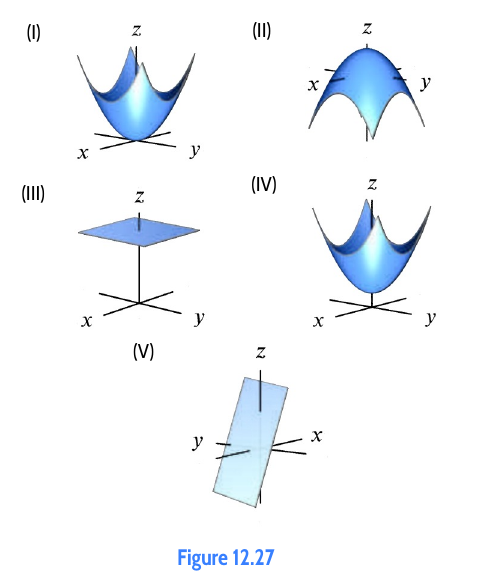

**Relevant method.** PT-01: Surface Description; PT-03: Transformations.

**Necessary work.**
- (a) `z = 2 + x² + y²` is an upward paraboloid with vertex `(0, 0, 2)` ⇒ Graph IV.
- (b) `z = 2 - (x² + y²)` is a downward paraboloid with vertex `(0, 0, 2)` ⇒ Graph II.
- (c) `z = 2(x² + y²)` is an upward paraboloid with vertex at origin `(0, 0, 0)` ⇒ Graph I.
- (d) `z = 2 + 2x - y` is an inclined plane with non-zero slopes ⇒ Graph V.
- (e) `z = 2` is a horizontal plane at height 2 ⇒ Graph III.

**Answer.**
(a) → IV; (b) → II; (c) → I; (d) → V; (e) → III.

---

### 3.4 12.2, Exercise 7: Read Cross-Sections from a Surface Graph
**Question.** Figure 12.29 shows the graph of `z = f(x, y)`.
1. Suppose `y` is fixed and positive. Does `z` increase or decrease as `x` increases? Graph `z` against `x`.
2. Suppose `x` is fixed and positive. Does `z` increase or decrease as `y` increases? Graph `z` against `y`.

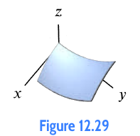

**Relevant method.** PT-05: Multi-Curve Families of Vertical Cross-Sections.

**Necessary work.**
(a) Tracking parallel to the positive `x`-axis at fixed positive `y`, the surface slopes downward. Hence `z` decreases as `x` increases.  
(b) Tracking parallel to the positive `y`-axis at fixed positive `x`, the surface curls upward. Hence `z` increases as `y` increases.

**Answer.**
(a) `z` decreases as `x` increases; the cross-section bends downward.  
(b) `z` increases as `y` increases; the cross-section bends upward.

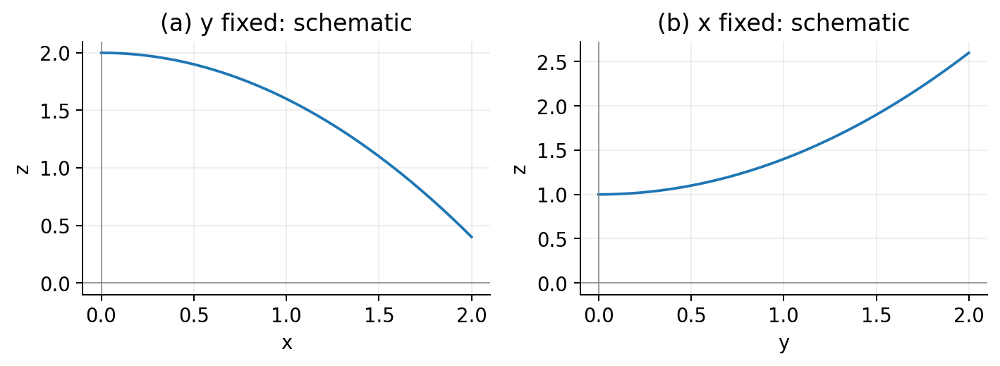

---

### 3.5 12.2, Exercise 9: Sketch and Describe Sphere
**Question.** Sketch a graph of the surface and briefly describe it in words: `x² + y² + z² = 9`.

**Relevant method.** PT-01: Surface Description; PT-02: Function Test.

**Necessary work.**
Standard equation of a sphere `(x - x₀)² + (y - y₀)² + (z - z₀)² = r²` with center `(0, 0, 0)` and `r² = 9 ⇒ r = 3`. Axis intercepts are `(±3, 0, 0)`, `(0, ±3, 0)`, and `(0, 0, ±3)`. Fails vertical line test at `(0, 0, ±3)`.

**Answer.**
A sphere of radius 3 centered at the origin `(0, 0, 0)`. Coordinate traces are circles of radius 3. The surface fails the vertical-line test and is not the graph of a single function. (See multi-panel sketch below Exercise 15).

---

### 3.6 12.2, Exercise 11: Sketch and Describe Downward Paraboloid
**Question.** Sketch a graph of the surface and briefly describe it in words: `z = 5 - x² - y²`.

**Relevant method.** PT-01: Surface Description; PT-03: Transformations.

**Necessary work.**
Rewrite as `z = 5 - (x² + y²)`. Vertex is at `(0, 0, 5)`. Cross-sections with `x = a` or `y = b` are downward parabolas. Horizontal cross-sections with `z = c` (`c ≤ 5`) are circles `x² + y² = 5 - c`. The intersection with the `xy`-plane (`z = 0`) is a circle of radius `√5`.

**Answer.**
A downward-opening circular paraboloid with vertex at `(0, 0, 5)` and vertical axis of symmetry along the `z`-axis, intersecting the `xy`-plane in the circle `x² + y² = 5`.

---

### 3.7 12.2, Exercise 13: Sketch and Describe Plane
**Question.** Sketch a graph of the surface and briefly describe it in words: `2x + 4y + 3z = 12`.

**Relevant method.** PT-01: Surface Description; PT-09: Linear Functions.

**Necessary work.**
Divide by 12 to obtain intercept form: `x/6 + y/3 + z/4 = 1`. Intercepts: `(6, 0, 0)`, `(0, 3, 0)`, `(0, 0, 4)`. Solving for `z`: `z = 4 - (2/3)x - (4/3)y`.

**Answer.**
An infinite plane with axis intercepts `(6, 0, 0)`, `(0, 3, 0)`, and `(0, 0, 4)`, sloping downward in both positive `x` and positive `y` directions.

---

### 3.8 12.2, Exercise 15: Sketch and Describe Cylinder
**Question.** Sketch a graph of the surface and briefly describe it in words: `x² + z² = 4`.

**Relevant method.** PT-06: Cylinders from Missing Variables.

**Necessary work.**
The variable `y` is missing from the equation, meaning `y` is free. In the `xz`-plane (`y = 0`), the curve is a circle of radius 2 centered at the origin: `x² + z² = 4`. Translating this circle parallel to the `y`-axis generates a circular cylinder.

**Answer.**
A right circular cylinder of radius 2 with central axis along the `y`-axis, extending infinitely in both positive and negative `y` directions.

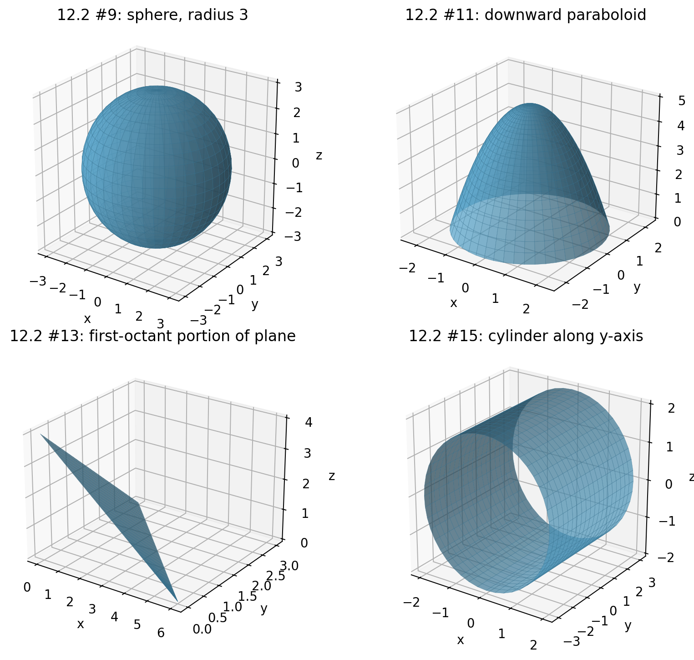

---

### 3.9 12.2, Exercise 17: Equation of Translated Sphere
**Question.** Find the equation of the surface: a sphere of radius 3 centered at `(0, √7, 0)`.

**Relevant method.** PT-01: Surface Description; PT-03: Transformations.

**Necessary work.**
Standard sphere formula: `(x - x₀)² + (y - y₀)² + (z - z₀)² = r²`.  
Substitute `(x₀, y₀, z₀) = (0, √7, 0)` and `r = 3`:
`(x - 0)² + (y - √7)² + (z - 0)² = 3²`

**Answer.**
`x² + (y - √7)² + z² = 9`.

---

### 3.10 12.2, Exercise 21: Drug Concentration Traces
**Question.** The concentration `C`, in mg/liter, of a drug in the blood is a function of `x`, the amount in mg of the drug given, and `t`, the time in hours since injection. For `0 ≤ x ≤ 4` and `t ≥ 0`,
`C = f(x, t) = t · exp(-t(5 - x))`
Graph the following single-variable functions and explain their significance in terms of drug concentration: (a) `f(4, t)`; (b) `f(x, 1)`.

**Relevant method.** PT-04: Cross-sections; PT-05: Multi-Curve Families.

**Necessary work.**
(a) Fix `x = 4`: `f(4, t) = t · exp(-t(5 - 4)) = t · exp(-t)` for `t ≥ 0`. Derivative: `d/dt(t · exp(-t)) = exp(-t)(1 - t) = 0 ⇒ t = 1`. Peak concentration is `1/e ≈ 0.368` mg/liter at `t = 1` hr. As `t → ∞`, `C → 0`.  
(b) Fix `t = 1`: `f(x, 1) = 1 · exp(-1(5 - x)) = exp(x - 5)` for `0 ≤ x ≤ 4`. An increasing exponential curve starting at `exp(-5) ≈ 0.0067` mg/liter at `x = 0` and rising to `exp(-1) ≈ 0.368` mg/liter at `x = 4`.

**Answer.**
(a) `f(4, t) = t · exp(-t)`: tracks drug concentration over time following a 4 mg dose; starts at 0, peaks at `1/e ≈ 0.368` mg/liter at `t = 1` hour, and decays toward 0.  
(b) `f(x, 1) = exp(x - 5)`: shows drug concentration 1 hour after injection as a function of dose; concentration increases exponentially with dose size.

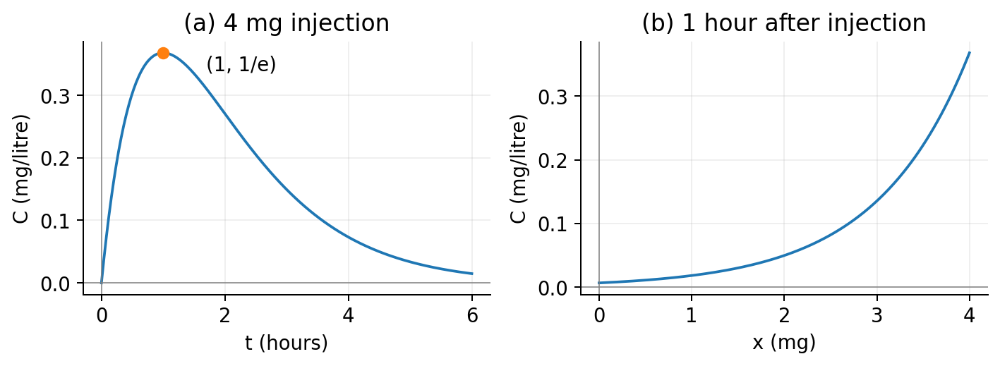

---

### 3.11 12.2, Exercise 27: Identify the Fixed Variable
**Question.** Without a calculator or computer, for `z = x² + 2xy²`, determine which of (I)–(II) in Figure 12.30 are cross-sections with `x` fixed and which are cross-sections with `y` fixed.

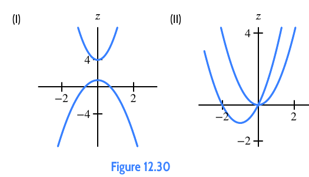

**Relevant method.** PT-05: Multi-Curve Families of Vertical Cross-Sections.

**Necessary work.**
Fix `x = a`: `z = a² + 2ay²`. These are parabolas in `y` symmetric about `y = 0`, opening upward if `a > 0` and downward if `a < 0`, with vertex at `(y, z) = (0, a²)`. This matches Family I.  
Fix `y = b`: `z = x² + 2b²x = (x + b²)² - b⁴`. These are parabolas in `x` all opening upward, all passing through the origin `(x, z) = (0, 0)`, with shifted vertices at `(-b², -b⁴)`. This matches Family II.

**Answer.**
**I** has `x` fixed; **II** has `y` fixed.

---

### 3.12 12.2, Exercise 31: Match Cross-Section Families
**Question.** Without a calculator or computer, match the functions with their cross-sections with `x` fixed in Figure 12.31:
- (a) `z = 1 / (1 + x² + y²)`
- (b) `z = 1 + x + y`
- (c) `z = exp(-x + y)`
- (d) `z = exp(x - y)`
- (e) `z = sin(xy)`
- (f) `z = x²`

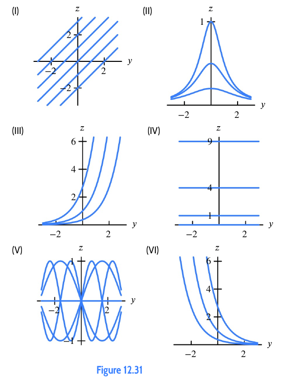

**Relevant method.** PT-05: Multi-Curve Families of Vertical Cross-Sections.

**Necessary work.**
Fix `x = a`:
- (a) `z = 1 / [(1 + a²) + y²]`: symmetric bell-shaped humps centered at `y = 0` ⇒ Family II.
- (b) `z = (1 + a) + y`: parallel straight lines of slope 1 ⇒ Family I.
- (c) `z = exp(-a) · exp(y)`: increasing exponential curves ⇒ Family III.
- (d) `z = exp(a) · exp(-y)`: decreasing exponential curves ⇒ Family VI.
- (e) `z = sin(ay)`: sine waves whose frequency varies with `a` ⇒ Family V.
- (f) `z = a²`: horizontal straight lines independent of `y` ⇒ Family IV.

**Answer.**
(a) → II; (b) → I; (c) → III; (d) → VI; (e) → V; (f) → IV.

---

### 3.13 12.2, Exercise 41: Travelling Wave in Canal
**Question.** A wave travels along a canal. Let `x` be the distance along the canal, `t` be the time, and `z` be the height of the water above the equilibrium level. The graph of `z` as a function of `x` and `t` is in Figure 12.33.
1. Draw the profile of the wave for `t = -1, 0, 1, 2`. (Put the `x`-axis to the right and the `z`-axis vertical.)
2. Is the wave traveling in the direction of increasing or decreasing `x`?
3. Sketch a surface representing a wave traveling in the opposite direction.

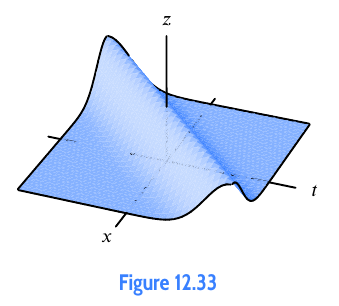

**Relevant method.** PT-05: Multi-Curve Families of Vertical Cross-Sections.

**Necessary work.**
(a) Fixed time `t` gives snapshots of wave profile `z` versus distance `x`.  
(b) In Figure 12.33, as `t` increases, the crest of the wave shifts toward larger values of `x`. Hence, the wave travels in the direction of increasing `x`.  
(c) A wave in the opposite direction has ridges moving toward decreasing `x` as `t` increases (modeled by `z = g(x + vt)`).

**Answer.**
(a) Four hump-shaped curves translating toward larger `x` as `t` increases from `-1` to `2`.
(b) Direction of **increasing `x`**.
(c) Surface with crests sloping in the opposite direction.

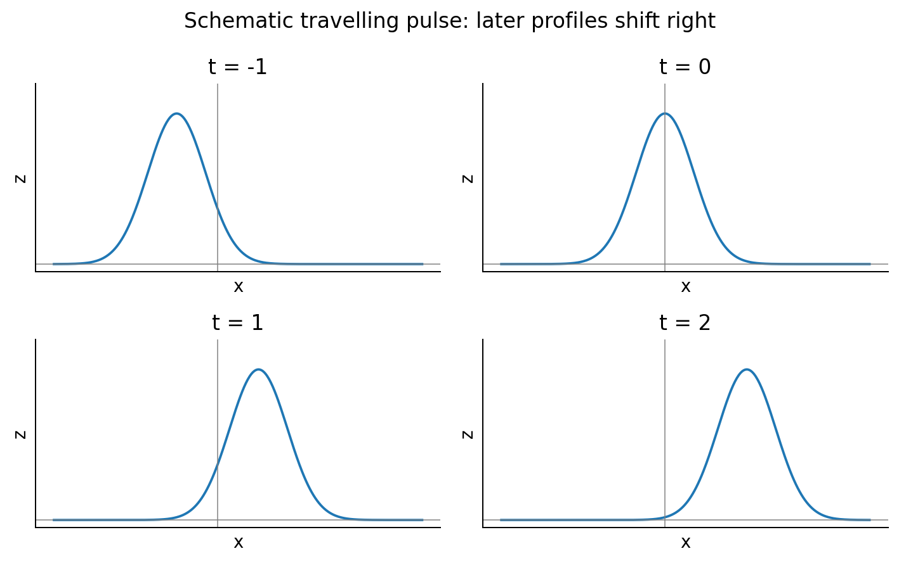
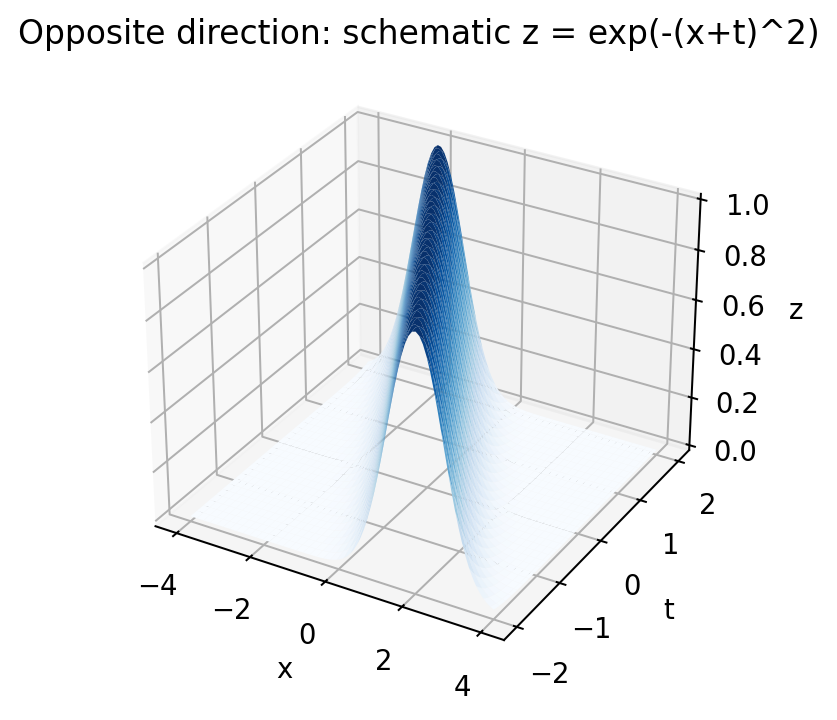

---

### 3.14 12.3, Exercise 1: Surface to Contours (Downward Bowl)
**Question.** Sketch a possible contour diagram for the surface below, marked with reasonable `z`-values. (Note: There are many possible answers.)

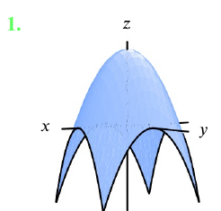

**Relevant method.** PT-08: Algebraic Contours and Spacing.

**Necessary work.**
The surface is a downward-opening radially symmetric bowl with a maximum peak in the center. Horizontal slices are concentric circles. Since the peak is highest in the center, contour labels must decrease from the inside outward. A consistent mathematical model is `z = 4 - x² - y²`.

**Answer.**
Concentric circles with labels decreasing outward (e.g., `c = 3, 2, 1, 0` with central peak 4).

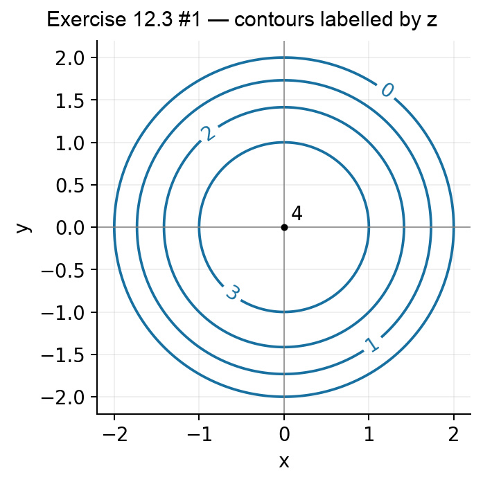

---

### 3.15 12.3, Exercise 3: Surface to Contours (Circular Depression)
**Question.** Sketch a possible contour diagram for the surface below, marked with reasonable `z`-values. (Note: There are many possible answers.)

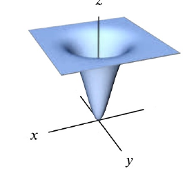

**Relevant method.** PT-08: Algebraic Contours and Spacing.

**Necessary work.**
The surface is a circular depression (crater/basin) with a minimum at the center, rising outward and flattening asymptotically. Horizontal slices are concentric circles whose labels must increase from the center outward. A representative model is `z = 4(1 - exp(-(x² + y²)))`.

**Answer.**
Concentric circles with labels increasing outward from the center (e.g., center 0, followed by `1, 2, 3, 3.5`).

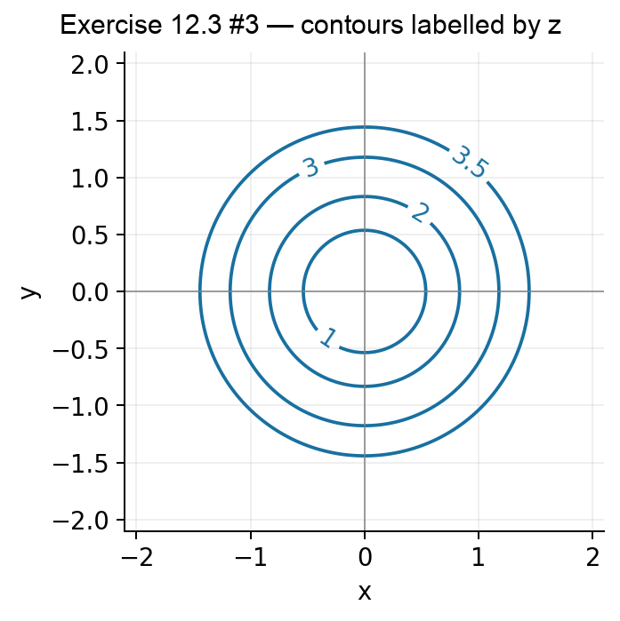

---

### 3.16 12.3, Exercise 5: Read a Contour Value
**Question.** Use the contour diagram of `f(x, y)` given in Figure 12.52 to find `f(1, 3)`.

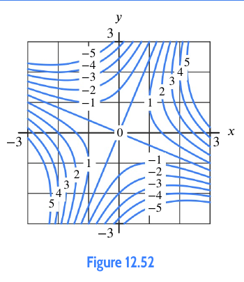

**Relevant method.** PT-10: Read Labelled Contour Map.

**Necessary work.**
Locate coordinate `x = 1` on the horizontal axis and `y = 3` on the vertical axis. The point `(1, 3)` lies directly on the contour line labelled `-1`.

**Answer.**
`f(1, 3) = -1`.

---

### 3.17 12.3, Exercise 7: Find a Point on a Level Set
**Question.** Use the contour diagram of `f(x, y)` given in Figure 12.52 to find a point where `f(x, y) = 0`.

**Relevant method.** PT-10: Read Labelled Contour Map.

**Necessary work.**
Trace the contour line labelled 0. The curve passes through the origin `(0, 0)`. Other points along this zero contour include approximately `(2, 1.5)` and `(-2, -1.5)`.

**Answer.**
`(0, 0)` (any coordinates on the `c = 0` curve are acceptable).

---

### 3.18 12.3, Exercise 9: Contour Through a Specific Point
**Question.** Let `f(x, y) = 3x²y + 7x + 20`. Find an equation for the contour that goes through the point `(5, 10)`.

**Relevant method.** PT-08: Algebraic Contours.

**Necessary work.**
First compute the output value at the point `(5, 10)`:
`c = f(5, 10) = 3(5²)(10) + 7(5) + 20 = 3(25)(10) + 35 + 20 = 750 + 55 = 805`
Set `f(x, y) = c`:
`3x²y + 7x + 20 = 805 ⇒ 3x²y + 7x = 785`

**Answer.**
`3x²y + 7x + 20 = 805` (or equivalently, `y = (785 - 7x) / (3x²)` for `x ≠ 0`).

---

### 3.19 12.3, Exercise 11: Match Surfaces with Contour Diagrams
**Question.** Match the surfaces (a)–(e) in Figure 12.53 with the contour diagrams (I)–(V) in Figure 12.54.

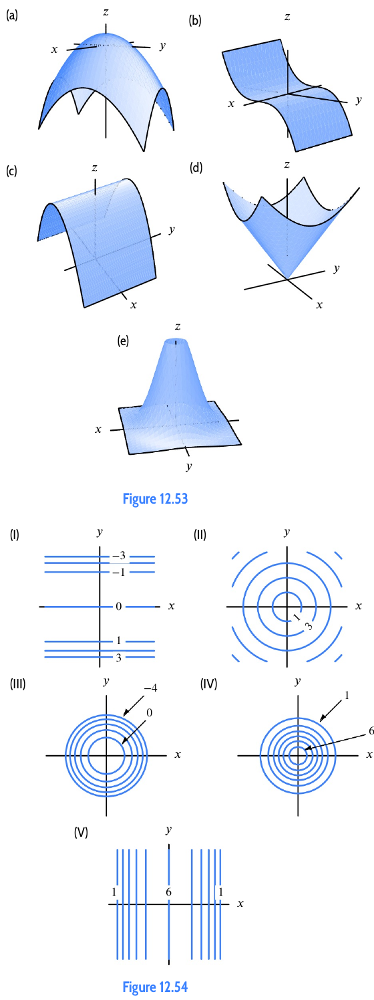

**Relevant method.** PT-08: Contours and Spacing; PT-06: Cylinders.

**Necessary work.**
- Surface (a) is a downward circular bowl ⇒ Concentric circles with values decreasing outward ⇒ Diagram III.
- Surface (b) is a trough parallel to the `x`-axis, minimum along the central line ⇒ Paired horizontal lines with values increasing away from center ⇒ Diagram I.
- Surface (c) is a downward parabolic cylinder parallel to the `y`-axis ⇒ Paired vertical lines with values decreasing away from central ridge ⇒ Diagram V.
- Surface (d) is an upward cone with constant slope ⇒ Equally spaced concentric circles increasing outward ⇒ Diagram II.
- Surface (e) is a high central circular mound ⇒ Concentric circles with highest values in center ⇒ Diagram IV.

**Answer.**
(a) → III; (b) → I; (c) → V; (d) → II; (e) → IV.

---

### 3.20 12.3, Exercise 13: Tables to Contour Diagrams
**Question.** Match Tables 12.6–12.9 with contour diagrams (I)–(IV) in Figure 12.56.

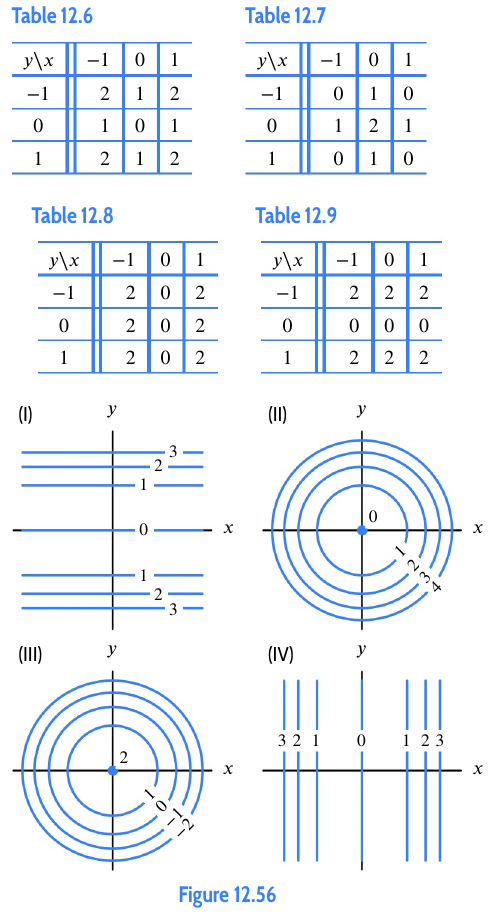

**Relevant method.** PT-11: Data Tables and Contours.

**Necessary work.**
- Table 12.6: Values increase symmetrically away from a central minimum at `(0, 0)` ⇒ Upward bowl ⇒ Diagram II.
- Table 12.7: Values decrease symmetrically away from a central maximum at `(0, 0)` ⇒ Downward bowl ⇒ Diagram III.
- Table 12.8: Entries depend only on `x` (columns constant, rows identical) ⇒ Vertical contour lines ⇒ Diagram IV.
- Table 12.9: Entries depend only on `y` (rows constant, columns identical) ⇒ Horizontal contour lines ⇒ Diagram I.

**Answer.**
Table 12.6 → II; Table 12.7 → III; Table 12.8 → IV; Table 12.9 → I.

---

### 3.21 12.3, Exercise 15: Parallel Line Contours
**Question.** Sketch a contour diagram for `f(x, y) = 3x + 3y` with at least four labeled contours. Describe in words the contours and how they are spaced.

**Relevant method.** PT-09: Contours of Linear Functions.

**Necessary work.**
Set `3x + 3y = c ⇒ y = -x + c/3`.  
Select `c = -6, -3, 0, 3, 6`:  
`y = -x - 2,  -x - 1,  -x,  -x + 1,  -x + 2`  
Perpendicular distance between adjacent lines for `Δc = 3` is `D = |Δc| / √(3² + 3²) = 3 / (3√2) = 1 / √2`.

**Answer.**
Parallel straight lines with slope `-1`, equally spaced for equal increments of `c`.

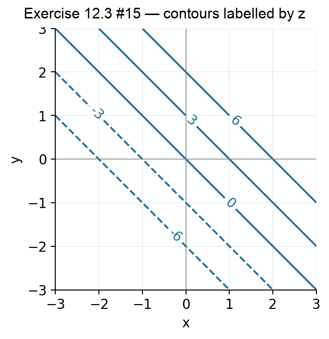

---

### 3.22 12.3, Exercise 17: Downward Bowl Contours
**Question.** Sketch a contour diagram for `f(x, y) = -x² - y² + 1` with at least four labeled contours. Describe in words the contours and how they are spaced.

**Relevant method.** PT-08: Algebraic Contours and Spacing.

**Necessary work.**
Set `1 - x² - y² = c ⇒ x² + y² = 1 - c`. Requires `c ≤ 1`.  
Choose `c = 1, 0, -1, -2, -3`:  
`r = 0,  1,  √2 ≈ 1.41,  √3 ≈ 1.73,  2.0`  
Radial gaps: `1.0, 0.41, 0.32, 0.27`.

**Answer.**
Concentric circles centered at `(0, 0)` with labels decreasing outward. The distance between successive circles for equal `Δc` decreases outward, showing increasing steepness.

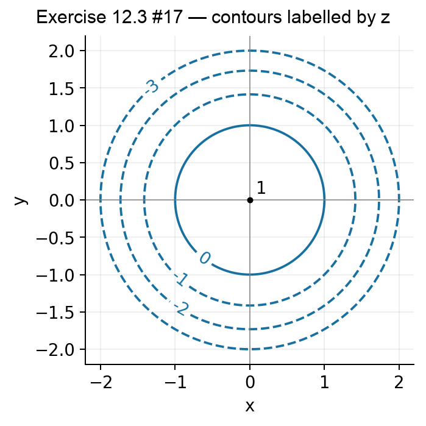

---

### 3.23 12.3, Exercise 19: Parabolic Contours
**Question.** Sketch a contour diagram for `f(x, y) = y - x²` with at least four labeled contours. Describe in words the contours and how they are spaced.

**Relevant method.** PT-08: Algebraic Contours; PT-04: Parabolic Slices.

**Necessary work.**
Set `y - x² = c ⇒ y = x² + c`. Choose `c = -2, -1, 0, 1, 2`.  
Each curve is an upward-opening parabola with vertex `(0, c)`. Along any vertical line `x = x₀`, the vertical spacing `Δy = Δc` is strictly constant.

**Answer.**
Upward-opening parabolas with vertices at `(0, c)`. Vertical spacing between adjacent curves is constant, but perpendicular separation shrinks as `|x|` increases.

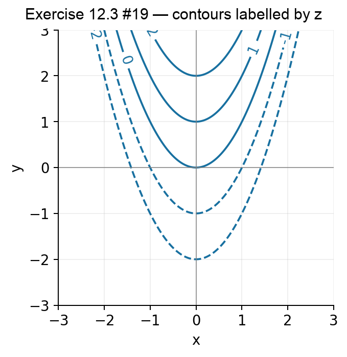

---

### 3.24 12.3, Exercise 25: Interpret Economic Satisfaction Contours
**Question.** Each contour diagram (a)–(c) in Figure 12.59 shows satisfaction with quantities of two items `X` and `Y` combined. Match (a)–(c) with the items in (I)–(III):
- (I) `X`: Income; `Y`: Leisure time.
- (II) `X`: Income; `Y`: Hours worked.
- (III) `X`: Hours worked; `Y`: Time spent commuting.

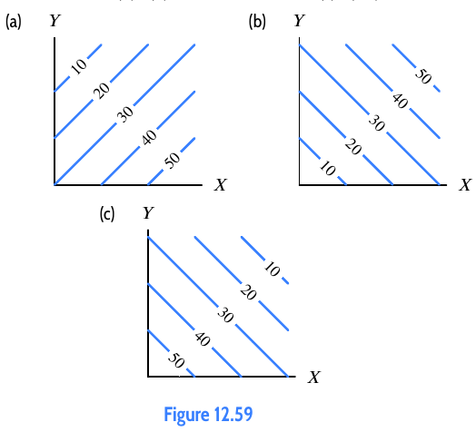

**Relevant method.** PT-10: Read Contour Maps; PT-14: Economic Models.

**Necessary work.**
- In (a), satisfaction increases with `X` (rightward) and decreases with `Y` (upward). Matches II: income is desirable, hours worked is undesirable.
- In (b), satisfaction increases with both `X` (rightward) and `Y` (upward). Matches I: both income and leisure time are desirable.
- In (c), satisfaction decreases with both `X` (rightward) and `Y` (upward). Matches III: both hours worked and commute time are undesirable.

**Answer.**
(a) → II; (b) → I; (c) → III.

---

### 3.25 12.3, Exercise 27: Trade-off Along Dan's Happiness Contour
**Question.** Figure 12.61 shows a contour diagram of Dan's happiness with snacks of different numbers of cherries and grapes. (a) What is the slope of the contours? (b) What does the slope tell you?

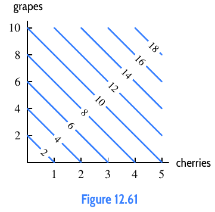

**Relevant method.** PT-14: Economic Trade-offs along Contours.

**Necessary work.**
(a) On any contour line, increasing cherries by 1 unit corresponds to decreasing grapes by 2 units:
`Slope = Δ(grapes) / Δ(cherries) = -2 / 1 = -2`  
(b) Moving along a contour keeps happiness constant. A slope of `-2` means 1 cherry compensates for the loss of 2 grapes.

**Answer.**
(a) Slope is `-2` grapes per cherry.
(b) Dan is equally happy if he trades 2 grapes for 1 cherry; his marginal rate of substitution is 2 grapes per cherry.

---

### 3.26 12.3, Exercise 47: Manufacturer Profit Contours
**Question.** A manufacturer sells two goods, one at a price of $3000 a unit and the other at a price of $12,000 a unit. A quantity `q₁` of the first good and `q₂` of the second good are sold at a total cost of $4000 to the manufacturer.
1. Express the manufacturer's profit, `π`, as a function of `q₁` and `q₂`.
2. Sketch curves of constant profit in the `q₁q₂`-plane for `π = 10,000`, `π = 20,000`, and `π = 30,000`, and the break-even curve `π = 0`.

**Relevant method.** PT-09: Linear Contours; PT-14: Economic Models.

**Necessary work.**
(a) Profit = Revenue - Cost:
`π(q₁, q₂) = 3000 q₁ + 12000 q₂ - 4000   (dollars)`  
(b) Set `π = c`:
`3000 q₁ + 12000 q₂ = c + 4000 ⇒ q₂ = -(1/4)q₁ + (c + 4000) / 12000`  
Since `q₁, q₂ ≥ 0`, contours are parallel lines of slope `-1/4` restricted to the first quadrant.
- `π = 0`: `q₁`-intercept is `4/3 ≈ 1.33`, `q₂`-intercept is `1/3 ≈ 0.33`.
- `π = 10,000`: `q₁`-intercept is `14/3 ≈ 4.67`, `q₂`-intercept is `7/6 ≈ 1.17`.
- `π = 20,000`: `q₁`-intercept is `8`, `q₂`-intercept is `2`.
- `π = 30,000`: `q₁`-intercept is `34/3 ≈ 11.33`, `q₂`-intercept is `17/6 ≈ 2.83`.

**Answer.**
(a) `π(q₁, q₂) = 3000 q₁ + 12000 q₂ - 4000` dollars.
(b) Parallel line segments in the first quadrant of slope `-1/4`, shifting outward as profit increases.

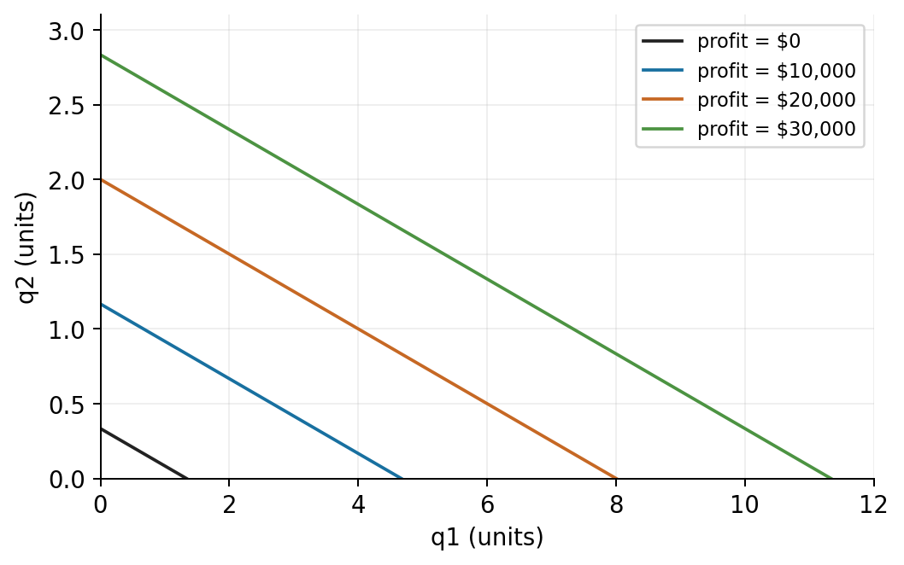

---

## 4. Original Self-Test Questions

Attempt all 15 questions independently before checking answers in Section 5.

**Q1.** A set in ℝ³ is defined by `x² + y² + z² = 9`. Is the entire set the graph of a single function `z = f(x, y)`? Justify using an explicit input point, and state the exact natural domain after splitting the surface into two function branches.

**Q2.** Describe the geometric surface `z = 3 - 2x + y` in ℝ³: name the object, determine all coordinate axis intercepts, state the `x = 0` and `y = 0` vertical traces, specify directions of increase, and state whether it has finite or infinite extent.

**Q3.** For the hyperbolic paraboloid `z = x² - y²`, determine the equations of the cross-sections in the planes `x = 2` and `y = -1`. Identify the geometric shape, opening direction, and containing plane for each curve.

**Q4.** For the function `F(x, y) = y² + 2xy`, write the algebraic equations of the vertical cross-sections for `x = 0`, `x = 1`, `y = 0`, and `y = 2`. State the designated horizontal plotting coordinate for each family.

**Q5.** Describe the surface defined by `y² + z² = 4` in ℝ³. Which coordinate is free? State the axis of extrusion, and evaluate whether the surface is the graph of a single-valued function `z = f(x, y)`.

**Q6.** For `f(x, y) = x² + 4y²`, determine the permissible values of `c`, find the contour equations for `c = 0, 4, 16`, and compute their axis intercepts. What is the 3D shape of the surface?

**Q7.** For the downward cone `g(x, y) = 9 - √(x² + y²)`, determine the radii of the contours corresponding to `g = 8, 7, 6`. Explain whether function values increase toward or away from the origin.

**Q8.** For the linear function `p(x, y) = 3x - y + 2`, write the contour line equations for `p = -1, 2, 5` in slope-intercept form. State their common slope and a vector direction in the `xy`-plane along which `p` increases.

**Q9.** The table below records values of `v(x, y)` in metres on `[0, 2] × [0, 2]`.

| y \ x (m) | 0 | 1 | 2 |
| :---: | :-: | :-: | :-: |
| **0** | 9 | 7 | 5 |
| **1** | 8 | 6 | 4 |
| **2** | 7 | 5 | 3 |

Find `v(2, 1)` exactly. Using linear interpolation along the rows, estimate where the contour `v = 5` crosses `y = 0`, `y = 1`, and `y = 2`. Fit a linear equation to these points.

**Q10.** On the contour map of `q(x, y) = 12 - x² - y²` below, point `A = (1.5, 0)` lies between the contours `q = 10` and `q = 8`. Give a strict bounding bracket for `q(A)`, estimate its value via linear interpolation, and compute its exact value using the formula. What do closely spaced contours signify on this map?


**Q11.** For the saddle function `s(x, y) = x² - y²`, describe the geometric structure of the level sets `s = 0`, `s = 3`, and `s = -3`. How many disconnected branches does each level set possess? Explain why the intersection of contours at `(0, 0)` does not violate the non-intersecting rule.

**Q12.** A triangular camping tent covers the ground rectangle `0 ≤ x ≤ 4` m and `0 ≤ y ≤ 2` m. Its horizontal ridge lies along `x = 2` at height 6 m, and both side ground edges (`x = 0` and `x = 4`) have height 0. Formulate the piecewise roof height `h(x, y)` and determine the equation of the 3 m contour.

**Q13. (Supplementary)** Starting from the standard circular paraboloid `z = x² + y²`, describe the geometric transformations that produce `z = (x + 2)² + (y - 1)² - 3`. Identify its vertex coordinates, opening direction, and range.

**Q14. (Supplementary)** A production process is modeled by `P(N, V) = √(NV)` for labor `N > 0` and capital `V > 0`. Derive the algebraic formula for the isoquant `P = 4`. If labor is doubled, by what factor must capital change to keep production constant?

**Q15. (Preview)** For the three-variable function `H(x, y, z) = x² + y² + z²`, describe the level surfaces corresponding to `H = 0, 1, 4`. For `J(x, y, z) = z - y`, describe the level surface `J = 2`. Identify the geometric classification of each surface.

---

## 5. Self-Test Answers

**A1. Reference: PT-02.**  
No, the entire sphere fails the vertical-line test because the line `x = 0, y = 0` yields `z = ±3`, intersecting at `(0, 0, 3)` and `(0, 0, -3)`. Splitting into two single-valued functions yields `z = +√(9 - x² - y²)` and `z = -√(9 - x² - y²)`, each with natural domain `D = {(x, y) ∈ ℝ² : x² + y² ≤ 9}`.

**A2. Reference: PT-01.**  
Infinite plane. Intercepts are `(3/2, 0, 0)`, `(0, -3, 0)`, and `(0, 0, 3)`. Traces are `z = 3 + y` in the plane `x = 0`, and `z = 3 - 2x` in the plane `y = 0`. Height increases with decreasing `x` and increasing `y`. The surface has infinite, unbounded extent.

**A3. Reference: PT-04.**  
For `x = 2`: `z = 4 - y²` in the vertical plane `x = 2`, a downward-opening parabola with vertex `(2, 0, 4)`. For `y = -1`: `z = x² - 1` in the vertical plane `y = -1`, an upward-opening parabola with vertex `(0, -1, -1)`.

**A4. Reference: PT-05.**  
Cross-sections with `x` fixed (plotted on `yz`-axes): `x = 0 ⇒ z = y²`; `x = 1 ⇒ z = y² + 2y`.  
Cross-sections with `y` fixed (plotted on `xz`-axes): `y = 0 ⇒ z = 0`; `y = 2 ⇒ z = 4 + 4x`.

**A5. Reference: PT-06.**  
Variable `x` is free. The surface is a right circular cylinder of radius 2 centered on the `x`-axis. It fails the vertical-line test because vertical lines through interior points of `|y| < 2` intersect the cylinder twice (`z = ±√(4 - y²)`); hence, it is not a single function `z = f(x, y)`.

**A6. Reference: PT-08.**  
Requires `c ≥ 0`. For `c = 0`: single point `(0, 0)`. For `c = 4`: ellipse `x² + 4y² = 4 ⇒ x²/4 + y² = 1`, intercepts `(±2, 0)` and `(0, ±1)`. For `c = 16`: ellipse `x²/16 + y²/4 = 1`, intercepts `(±4, 0)` and `(0, ±2)`. The 3D surface is an elliptic paraboloid opening upward.

**A7. Reference: PT-08.**  
`9 - r = c ⇒ r = 9 - c`. Radii for `g = 8, 7, 6` are `r = 1, 2, 3`, respectively. Function values increase toward the origin, where the peak value `g(0, 0) = 9` is attained.

**A8. Reference: PT-09.**  
Setting `3x - y + 2 = c ⇒ y = 3x + (2 - c)`.  
For `p = -1`: `y = 3x + 3`.  
For `p = 2`: `y = 3x`.  
For `p = 5`: `y = 3x - 3`.  
Common slope is 3. A vector direction of increasing `p` is `(3, -1)` (or any vector where `3Δx - Δy > 0`).

**A9. Reference: PT-11.**  
Exact lookup: row `y = 1`, column `x = 2` gives `v(2, 1) = 4` m.  
Interpolation for `v = 5`: at `y = 0`, `x = 2` exactly; at `y = 1`, `x = 1 + [(5 - 6)/(4 - 6)](2 - 1) = 1.5`; at `y = 2`, `x = 1` exactly.  
Points are `(2, 0)`, `(1.5, 1)`, and `(1, 2)`. Connecting them yields the line `2x + y = 4` on `[0, 2]²`.

**A10. Reference: PT-10.**  
Bounding bracket: `8 < q(A) < 10`. Linear radial interpolation yields `q_est ≈ 9.71`. Exact substitution: `q(1.5, 0) = 12 - (1.5)² = 9.75`. Closely spaced contours indicate rapid elevation change over short horizontal distance (steep surface).

**A11. Reference: PT-12.**  
`s = 0` consists of two intersecting lines `y = ±x` (one connected set). `s = 3` is a hyperbola opening horizontally along the `x`-axis (two disconnected branches). `s = -3` is a hyperbola opening vertically along the `y`-axis (two disconnected branches). Crossing at `(0, 0)` involves curves of the same height (`c = 0`), which is fully consistent with the single-valued function definition.

**A12. Reference: PT-13.**  
Piecewise height: `h(x, y) = 3x` on `0 ≤ x ≤ 2`, and `h(x, y) = 12 - 3x` on `2 ≤ x ≤ 4`, with `0 ≤ y ≤ 2`. At `h = 3` m: `3x = 3 ⇒ x = 1` m, and `12 - 3x = 3 ⇒ x = 3` m. The contour consists of two vertical line segments `x = 1` and `x = 3` spanning `0 ≤ y ≤ 2`.

**A13. Reference: PT-03.**  
Horizontal translation by `(-2, 1, 0)` followed by vertical translation by `-3`. The surface is an upward circular paraboloid with vertex `(-2, 1, -3)`, axis `x = -2, y = 1`, and range `[-3, ∞)`.

**A14. Reference: PT-14.**  
`√(NV) = 4 ⇒ NV = 16 ⇒ V = 16 / N` (`N > 0`). If labor doubles (`N ↦ 2N`), capital must be halved (`V ↦ V / 2`) to keep production at 4.

**A15. Reference: PT-15.**  
For `H(x, y, z)`: `H = 0` is the single point `(0, 0, 0)`; `H = 1` is a sphere of radius 1 centered at `(0, 0, 0)`; `H = 4` is a sphere of radius 2 centered at `(0, 0, 0)`. For `J(x, y, z)`: `J = 2` is the infinite plane `z = y + 2` parallel to the `x`-axis.

---

## 6. Compact Coverage and Unresolved-Items Appendix

### 6.1 Scope and Provenance
The source materials comprise 54 pages across six weekly PDF documents in `Lec Notes` and Sections 12.2 and 12.3 of *Calculus, Eighth Edition* (printed pp. 702–725). All 26 assigned textbook exercises (13 from Section 12.2 and 13 from Section 12.3) and all weekly lecture problems are solved in full. Supporting graphs were generated via `graphs/generate_graphs.py` or cropped directly from source textbook figures.

### 6.2 Compact Source Coverage Matrix

| Source Document & Pages | Mathematical Topic Covered | Location / PT ID |
| :--- | :--- | :--- |
| `Week2.pdf`, p. 1 | Plane surface and linear cross-sections | PT-01, PT-04, §2.1 |
| `Week2.pdf`, p. 2 | Quadric surface catalog and cylinder test | PT-01, PT-06, §2.2 |
| `Week2.pdf`, p. 3 | Multi-curve cross-sections (`y³ + xy`) | PT-05, §2.3 |
| `Week2.pdf`, pp. 4–5 | Paraboloid and cone contours, spacing | PT-08, §2.4 |
| `Week2.pdf`, p. 6 | Linear contours (`2y - x`) and gradient | PT-09, §2.5 |
| `Week2.pdf`, pp. 7–8 | Saddle table (`x² - y²`) and hyperbolic levels | PT-12, §2.6 |
| `Week2.pdf`, pp. 9–10 | Tent roof, bounded contours, 3D distance | PT-13, §2.7 |
| `sep+14.pdf`, pp. 1–4 | Vertical-line test, shifts, saddle traces | PT-02, PT-03, §2.8 |
| `sep+16.pdf`, pp. 1–4 | Free variables, cylinders, bowl spacing | PT-06, PT-08, §2.9 |
| `sep+18.pdf`, pp. 1–4 | Table interpolation and surface contrasts | PT-11, PT-12, §2.10 |
| `MAT235H-Sept-16`, pp. 2–4 | Functions of 2 variables, cylinder volume | PT-01, PT-06, §2.11 |
| `MAT235H-Sept-16`, p. 7 | Atmospheric wind-chill table lookup | PT-11, §2.12 |
| `MAT235H-Sept-16`, pp. 5, 6, 9, 11 | 3D points, planes, heater cross-sections | PT-01, PT-05, §2.13 |
| `MAT235H-Sept-16`, pp. 13–19 | Cylinders, sphere, hemisphere slice | PT-02, PT-04, §2.14 |
| `MAT235H-Sept-16`, pp. 24–27 | Airline table, plane intercepts, linearity | PT-09, PT-11, §2.15 |
| `MAT235H-Sept-17`, pp. 1–3 | Plane equations and intercept graphing | PT-01, PT-09, §2.15 |
| `MAT235H-Sept-17`, pp. 4–5 | Level surfaces in ℝ³ (ice block, `T = c`) | PT-15, §2.16 |
| Textbook 12.2, pp. 702–707 | Theory: graphs, vertical-line test, traces | PT-01 to PT-06 |
| Textbook 12.2, pp. 707–711 | Exercises 1, 3, 5, 7, 9, 11, 13, 15, 17, 21, 27, 31, 41 | §3 (12.2 Exercises) |
| Textbook 12.3, pp. 711–718 | Theory: contours, steepness, Cobb-Douglas | PT-07 to PT-14 |
| Textbook 12.3, pp. 718–725 | Exercises 1, 3, 5, 7, 9, 11, 13, 15, 17, 19, 25, 27, 47 | §3 (12.3 Exercises) |

### 6.3 Mathematical Corrections, Ambiguities, and Modeling Boundaries
- **Slice Terminology Correction (`sep+14.pdf`, p. 4):** The handwritten lecture notes refer to a vertical slice `y = a` of a circular paraboloid as a "paraboloid." A vertical slice of a paraboloid is a two-dimensional *parabola* contained in the plane `y = a`, not a paraboloid. The plane condition and correct 2D conic classification are maintained throughout these notes.
- **Hemisphere Domain Restriction (`MAT235H-Sept-16.pdf`, p. 17):** The slide notes state `-1 ≤ x ≤ 1, -1 ≤ y ≤ 1` alongside the upper hemisphere formula `z = √(1 - x² - y²)`. A rectangular domain contains points like `(1, 1)` where `1 - x² - y² = -1 < 0`. The exact domain is strictly the circular disk `x² + y² ≤ 1`.
- **Table Interpolation vs Global Identity (`sep+18.pdf`, p. 2):** While the discrete data points in the table are consistent with the affine function `f(x, y) = 12 - 2x - y`, finite grid samples establish an empirical linear interpolation model, not a proven global planar identity. Solutions explicitly state the linear interpolation assumption.
- **Missing Slide Prompt (`MAT235H-Sept-17.pdf`, p. 1):** The opening slide displays the equations `z = 2 - 2x + y` and `z = 2 - x - 2y` without an explicit verbal instruction. These have been interpreted as finding coordinate intercepts and describing the planes, without inventing unstated requirements.
- **Empirical Readings and Estimates:** In Section 12.3 Exercise 21 (corn-yield diagram) and lecture heater sketches, values not lying on a labelled line are presented as justified brackets and estimates rather than exact measurements.
