# MAT235 Week 2 Study Notes
## Graphs, Traces, and Contour Diagrams

- **Section 12.2:** Graphs and Surfaces
- **Section 12.3:** Contour Diagrams
- **Supplementary & Preview:** 3D Coordinates, Production Isoquants, Linear Planes (12.4), and Level Surfaces (12.5)

---

## How to Use This File

This document serves as the primary conceptual and methodological guide for Week 2 of MAT235. It synthesizes all core material from Sections 12.2 and 12.3 of the textbook, supplementary review and extensions from handwritten lecture notes, and preview material found in weekly lecture presentations.

Each distinct mathematical skill is organized into a standardized **Problem Type (PT-01 through PT-15)**. For every Problem Type, this file provides:
- **Meaning and recognition:** Conceptual foundation, physical/geometric intuition, and identification cues.
- **General method:** Systematic, reusable algorithmic steps.
- **Teaching example question:** A complete problem statement with explicit conditions and subparts.
- **A complete answer must include:** An actionable checklist of required components without spoiling the final answer.
- **Common mistakes:** Typical pitfalls, sign errors, and conceptual confusions to avoid.

*Note:* In accordance with active-learning principles, **worked solutions and final answers to all Problem Types are located exclusively in `Answers-and-Practice.md`**. All drawings depicting 3D surfaces illustrate finite viewing windows of typically unbounded objects unless an explicit domain restriction is specified.

---

## 1. Core: 12.2 Graphs and Surfaces

> **Status: Core Material**  
> *Learning Targets:* Define functions of two variables and their graphs in ℝ³; apply the vertical-line test for surfaces; recognize standard quadric surfaces (planes, spheres, paraboloids, saddles); identify domain constraints.

### 1.1 Definitions and Notation
A real-valued function of two real variables is a rule `f: D ⊆ ℝ² → ℝ` that assigns to each ordered pair `(x, y)` in the domain `D` exactly one real number `z = f(x, y)`.
- **Domain (`D`):** The subset of ℝ² on which the formula `f(x, y)` is mathematically defined and real-valued. If no domain is explicitly stated, the natural domain is the largest subset of ℝ² where the expression is well-defined.
- **Graph (`G_f`):** The set of all points `(x, y, z)` in three-dimensional space ℝ³ such that `(x, y) ∈ D` and `z = f(x, y)`:
  `G_f = {(x, y, z) ∈ ℝ³ : (x, y) ∈ D, z = f(x, y)}`
- **Ambient Space:** The graph lies in ℝ³ with standard Cartesian coordinates `(x, y, z)`. The `xy`-plane represents the horizontal domain plane, while the `z`-axis represents the vertical output height.

### 1.2 Geometric Meaning and the Vertical-Line Test
Geometrically, the graph of a continuous function `z = f(x, y)` represents a two-dimensional surface in ℝ³. Because `f` is a function, each input pair `(x₀, y₀) ∈ D` generates exactly one height `z₀ = f(x₀, y₀)`.

**The Vertical-Line Test for Surfaces:**  
A surface `S ⊂ ℝ³` is the graph of a single-valued function `z = f(x, y)` if and only if every vertical line parallel to the `z`-axis (given by parametric equations `x = x₀`, `y = y₀`, `z ∈ ℝ`) intersects the surface `S` at **at most one point**.
- If a vertical line intersects `S` at two or more distinct points, `S` cannot be represented by a single function `z = f(x, y)`.
- *Example:* The sphere `x² + y² + z² = r²` contains `(0, 0, r)` and `(0, 0, -r)`; the vertical line `x = 0, y = 0` intersects it twice. Thus, the full sphere is not the graph of a single function. It must be decomposed into upper and lower hemispheres: `z = +√(r² - x² - y²)` and `z = -√(r² - x² - y²)`.

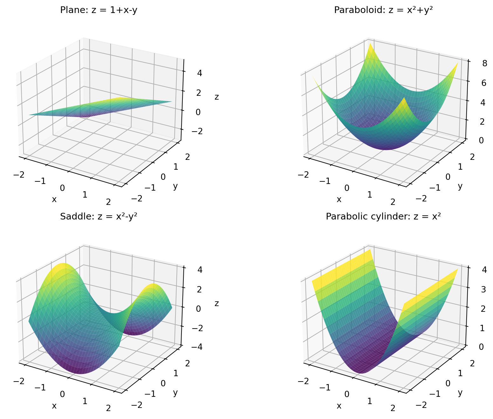

---

### Problem Type PT-01: Recognize and Describe a Surface from an Equation

**Meaning and recognition.**  
A description problem asks for the geometric identity, key features, orientation, and spatial extent of a surface defined by an equation in `x, y, z`. Recognition relies on equation structure:
- Linear equation `Ax + By + Cz = D`: plane.
- Quadratic sum `x² + y² + z² = r²`: sphere of radius `r` centered at the origin.
- Explicit square sum `z = x²/a² + y²/b²`: elliptic/circular paraboloid opening along the positive `z`-axis.
- Explicit difference of squares `z = x²/a² - y²/b²`: hyperbolic paraboloid (saddle).
- Missing coordinate (e.g., `z = x²` or `x² + y² = r²`): cylinder extruded parallel to the missing coordinate's axis.

**General method.**
1. **Identify the surface type:** Classify the algebraic degree and match with standard quadric or planar forms.
2. **Determine key geometric landmarks:** Calculate coordinate axis intercepts (set two variables to 0) and identify vertices, centers, or radii.
3. **Compute primary coordinate traces:** Set `x = 0`, `y = 0`, and `z = 0` to determine cross-sections in the coordinate planes.
4. **Evaluate the vertical-line test:** Determine whether solving for `z` yields a unique value for each `(x, y)`.
5. **Describe orientation and extent:** State whether the surface is bounded (finite) or extends infinitely, and specify the direction of growth or opening.

**Teaching example.**

**Question.**  
Describe the geometric surfaces in ℝ³ defined by the equations (a) `z = 1 + x - y` and (b) `x² + y² + z² = 4`. For each surface:
1. Identify the specific geometric object.
2. Determine all coordinate axis intercepts and primary traces in the coordinate planes.
3. State whether the entire surface is the graph of a single-valued function `z = f(x, y)`, and explain why.
4. Describe the orientation, unbounded or bounded nature, and spatial extent.

**A complete answer must include:**
- [ ] Explicit classification of each equation into its geometric category.
- [ ] Exact coordinates for the `x`-, `y`-, and `z`-intercepts where they exist.
- [ ] The explicit equations and containing planes for the coordinate traces (`x = 0`, `y = 0`, `z = 0`).
- [ ] A clear verdict on whether each surface satisfies the vertical-line test, supported by an explicit algebraic or geometric justification.
- [ ] A precise statement of whether the surface is bounded or infinite, and its domain in ℝ².

**Common mistakes:**
- Confusing the bounded triangular drawing in a first-octant sketch with a finite physical boundary (planes are infinite).
- Claiming the sphere is a function `z = f(x, y)` by discarding the negative square root branch.
- Omitting the containing plane equation when stating a trace (e.g., writing `z = 1 + x` instead of `z = 1 + x` in the plane `y = 0`).

---

### Problem Type PT-02: Test a Surface as a Function z = f(x, y) and Determine Exact Domain

**Meaning and recognition.**  
Given an implicit relation `F(x, y, z) = 0`, one must determine if it can be solved globally as `z = f(x, y)`. When an equation contains `z²` (or higher even powers), solving for `z` generates multiple branches `±√(...)`. Each branch represents a function, but only over its legitimate real domain.

**General method.**
1. **Isolate `z` algebraically:** Solve `F(x, y, z) = 0` for `z`.
2. **Identify multiple outputs:** If `z = ±√(g(x, y))`, exhibit an input `(x₀, y₀)` yielding two distinct real values `z₁ ≠ z₂`, confirming failure of the vertical-line test.
3. **Decompose into single-valued branches:** Split the surface into top/bottom or positive/negative function branches: `z_top = +√(g(x, y))` and `z_bottom = -√(g(x, y))`.
4. **Determine the natural domain:** Enforce the real-radicand condition `g(x, y) ≥ 0` and any denominator restrictions. Express the domain using exact set-builder notation.

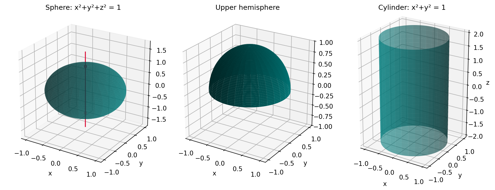

**Teaching example.**

**Question.**  
Consider the unit sphere `x² + y² + z² = 1` in ℝ³.
1. Show that the entire sphere is not the graph of a single function `z = f(x, y)` by applying the vertical-line test at an explicit point.
2. Decompose the sphere into two separate function graphs `z = f₁(x, y)` and `z = f₂(x, y)`.
3. State the exact natural domain `D` for these functions using formal set notation, and explain why specifying `[-1, 1] × [-1, 1]` is incorrect.

**A complete answer must include:**
- [ ] An explicit vertical line exhibiting two distinct intersection points on the sphere.
- [ ] The algebraic formulas for the upper and lower hemispheres with explicit signs.
- [ ] The set definition `D = {(x, y) ∈ ℝ² : x² + y² ≤ 1}`.
- [ ] A clear geometric explanation of why the rectangular bounding box `[-1, 1]²` contains invalid points outside the disk where the radicand becomes negative.

**Common mistakes:**
- Stating the domain as `-1 ≤ x ≤ 1` and `-1 ≤ y ≤ 1` (the unit square has points like `(1, 1)` where `1 - x² - y² = -1 < 0`).
- Forgetting to state the boundary condition `z = 0` where the two hemispheres meet.

---

### Problem Type PT-03: Transform a Known Surface Graph via Shifts, Reflections, and Scaling

**Meaning and recognition.**  
Recognizing how modifying the formula `z = f(x, y)` alters its graph allows immediate visualization without point-by-point plotting:
- `z = f(x - a, y - b) + c`: Horizontal translation by `(a, b)` in the `xy`-plane and vertical translation by `c` along the `z`-axis.
- `z = -f(x, y)`: Vertical reflection across the `xy`-plane (`z ↦ -z`).
- `z = c · f(x, y)` (`c > 0`): Vertical stretching (if `c > 1`) or compression (if `0 < c < 1`).
- `z = f(-x, y)` or `z = f(x, -y)`: Reflection across the `yz`-plane or `xz`-plane, respectively.

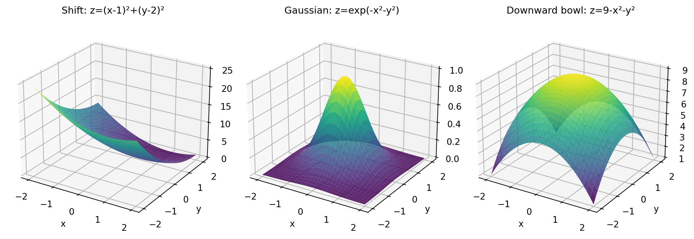

**General method.**
1. **Identify the base surface:** Locate the parent function (e.g., standard circular paraboloid `z = x² + y²`).
2. **Determine shift coordinates:** Identify `(a, b)` from `(x - a)` and `(y - b)`, and `c` from constant terms.
3. **Identify reflections and scaling:** Check signs preceding variables or parenthesized groups.
4. **Track key landmark points:** Compute the new position of the vertex, peak, or saddle point.
5. **State symmetry, range, and asymptotic behavior:** Note circular symmetry around shifted axes or decay toward horizontal planes.

**Teaching example.**

**Question.**  
Starting from the standard circular paraboloid `z = x² + y²`, describe the geometric transformation, resulting surface, vertex coordinates, axis of symmetry, and range for each of the following:
1. `z = (x - 1)² + (y - 2)²`
2. `z = 5 - x² - y²`
3. `z = exp(-(x² + y²))`

**A complete answer must include:**
- [ ] Step-by-step description of each geometric operation (shift vector, reflection plane, vertical translation).
- [ ] Exact 3D coordinates for the vertex or global maximum.
- [ ] The vertical axis of symmetry (e.g., `x = a, y = b`).
- [ ] The exact range of output heights `z` for each surface.
- [ ] Asymptotic behavior for part (3) as distance from the origin `r → ∞`.

**Common mistakes:**
- Inverting shift signs (e.g., claiming `(x - 1)²` translates by `-1` instead of `+1`).
- Claiming that `z = exp(-(x² + y²))` attains the value `z = 0` (it approaches `0` asymptotically, but `z > 0` everywhere).
- Confusing horizontal shifts in the input domain with vertical shifts in height.

---

## 2. Core: Vertical Cross-Sections (Traces)

> **Status: Core Material**  
> *Learning Targets:* Obtain vertical cross-sections by holding one input variable constant; plot cross-section families on specified 2D axes; infer 3D surface geometry from orthogonal trace families.

### 2.1 Definition and Geometric Meaning
A **vertical cross-section** (or vertical trace) of the surface `z = f(x, y)` is the curve formed by intersecting the surface with a vertical plane:
- **Cross-section with `x` held constant (`x = a`):** The intersection of the surface with the vertical plane `x = a`. Points on this curve satisfy:
  `x = a,   z = f(a, y)`
  This is a two-dimensional curve in the vertical plane `x = a`, plotted using horizontal coordinate `y` and vertical coordinate `z`.
- **Cross-section with `y` held constant (`y = b`):** The intersection of the surface with the vertical plane `y = b`. Points on this curve satisfy:
  `y = b,   z = f(x, b)`
  This is a two-dimensional curve in the vertical plane `y = b`, plotted using horizontal coordinate `x` and vertical coordinate `z`.

*Critical distinction:* The equation `z = f(x, b)` alone does not fully define a spatial curve; the plane equation `y = b` is an indispensable part of the mathematical specification.

---

### Problem Type PT-04: Determine and Sketch Parabolic and Hyperbolic Vertical Traces

**Meaning and recognition.**  
When `f(x, y)` involves quadratic terms (`x², y²`), fixing one coordinate reduces the equation to a single-variable quadratic in the other coordinate. Analyzing how the vertex and opening direction change across the family reveals whether the surface is an elliptic bowl (`z = x² + y²`) or a hyperbolic saddle (`z = x² - y²`).

**General method.**
1. **Fix the chosen variable:** Substitute `y = b` (or `x = a`) into the surface equation `z = f(x, y)`.
2. **Formulate the 2D curve equation:** Write the resulting single-variable equation `z = g(x)` (or `z = h(y)`).
3. **State the containing plane:** Explicitly pair the equation with its plane, e.g., `{y = b, z = g(x)}`.
4. **Identify conic/geometric features:** Determine vertex coordinates, concavity (upward vs downward), and axis intercepts in the designated plane.
5. **Synthesize the 3D surface:** Compare the behavior of orthogonal slices to identify the surface geometry.

**Teaching example.**

**Question.**  
For the hyperbolic paraboloid `z = x² - y²`:
1. Find the equations of the cross-sections in the planes `y = -1`, `y = 0`, and `y = 1`. Specify the shape, opening direction, and vertex coordinates of each curve in its vertical plane.
2. Find the equations of the cross-sections in the planes `x = -1`, `x = 0`, and `x = 1`. Specify the shape, opening direction, and vertex coordinates of each curve in its vertical plane.
3. Describe how these two orthogonal families of parabolas explain the saddle shape and behavior near the origin.

**A complete answer must include:**
- [ ] Complete curve specifications including both the single-variable relation and the vertical plane condition.
- [ ] Coordinates of the vertex in 3D space `(x, y, z)` for each of the six requested cross-sections.
- [ ] Explicit statement of concavity (upward along `x`, downward along `y`).
- [ ] Synthesis explaining that the origin is a local minimum along the `x`-axis and a local maximum along the `y`-axis, forming a saddle point.

**Common mistakes:**
- Calling a 1D cross-section a "paraboloid" (a cross-section is a 2D *parabola* residing in a plane).
- Omitting the vertical plane equation and treating `z = x² - b²` as an equation in ℝ³ (which would define a parabolic cylinder).

---

### Problem Type PT-05: Sketch and Analyze Multi-Curve Families of Vertical Cross-Sections

**Meaning and recognition.**  
Many functions exhibit distinct behavior depending on which input is held fixed. Plotting multiple cross-sections on a single set of 2D axes requires identifying the active independent variable and the parameter:
- When `x` is held fixed (`x = a`), the horizontal axis must be `y`, and the vertical axis is `z`. Curves are parametrized by `a`.
- When `y` is held fixed (`y = b`), the horizontal axis must be `x`, and the vertical axis is `z`. Curves are parametrized by `b`.

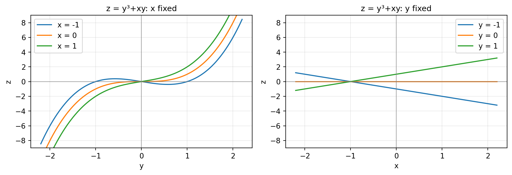

**General method.**
1. **Identify fixed vs free variables:** Determine which variable is constant for each family.
2. **Derive algebraic family equations:** Substitute the constant values to obtain `z` as a function of the free variable.
3. **Determine key curve landmarks:** For each curve, find axis intercepts, local extrema, inflection points, or slopes.
4. **Establish correct plotting axes:** Label horizontal and vertical axes properly (`y` vs `z` for fixed `x`; `x` vs `z` for fixed `y`).
5. **Interpret physical or geometric trends:** Track how the curve shifts, rotates, or deforms as the parameter increases.

**Teaching example.**

**Question.**  
Consider the function `f(x, y) = y³ + xy`.
1. Find the equations of the vertical cross-sections for `x = -1`, `x = 0`, and `x = 1`. Specify the plotting axes, and describe the shapes, roots, and turning points of the three curves.
2. Find the equations of the vertical cross-sections for `y = -1`, `y = 0`, and `y = 1`. Specify the plotting axes, and describe the geometric nature, slopes, and `z`-intercepts of the three curves.
3. Explain what happens to the slope of the `y`-fixed slices as `y` increases from negative to positive values.

**A complete answer must include:**
- [ ] Complete algebraic equations for all six cross-sections.
- [ ] Explicit statement of axis assignments: horizontal `y`, vertical `z` for family (1); horizontal `x`, vertical `z` for family (2).
- [ ] Analysis of cubic features for (1): roots, local maximum/minimum for `x = -1`, inflection points at `y = 0`.
- [ ] Analysis of linear features for (2): identifying each as a straight line with slope `m = y` and intercept `z = y³`.
- [ ] Physical synthesis of how the surface twists as `y` changes sign.

**Common mistakes:**
- Plotting the `x`-fixed family with `x` on the horizontal axis.
- Mistaking the linear family (for fixed `y`) for curved slices due to the presence of `y³`.
- Forgetting to indicate which curve corresponds to which parameter value on multi-curve plots.

---

## 3. Core: Cylinders and Free Variables

> **Status: Core Material**  
> *Learning Targets:* Recognize cylinders in ℝ³ from missing variables; identify the generating curve and the axis of extrusion; distinguish between circular, parabolic, and hyperbolic cylinders; evaluate cylinders against the vertical-line test.

### 3.1 Definition and the Missing Variable Principle
In multivariable calculus, a **cylinder** is defined much more broadly than the familiar circular can of elementary geometry.
- **Geometric Definition:** A cylinder is a surface in ℝ³ generated by taking a plane curve `C` (called the *generating curve*) and translating it along a family of parallel lines (called *rulings* or *generators*) passing through every point of `C`.
- **Missing Variable Rule:** If an equation in ℝ³ involves only two of the three coordinate variables, the missing variable is **free** (completely unrestricted). The solution set consists of the 2D curve defined in the plane of the two present variables, extruded parallel to the axis of the missing variable.
- **Orientation of Extrusion:**
  - Equation `F(x, y) = 0` (missing `z`): extruded parallel to the `z`-axis.
  - Equation `F(x, z) = 0` (missing `y`): extruded parallel to the `y`-axis.
  - Equation `F(y, z) = 0` (missing `x`): extruded parallel to the `x`-axis.

### 3.2 Cylinders vs Functions z = f(x, y)
A cylinder may or may not represent the graph of a function `z = f(x, y)`:
- The parabolic cylinder `z = x²` has `y` free. For any `(x, y)`, `z` is uniquely determined by `x²`. Thus, `z = x²` **is** the graph of a valid function `z = f(x, y)` (independent of `y`).
- The circular cylinder `x² + y² = 1` has `z` free. For any interior input pair `(x, y)` with `x² + y² = 1`, `z` can take *any* real value. Thus, vertical lines intersect it at infinitely many points, completely failing the vertical-line test. It **cannot** be written as `z = f(x, y)`.
- The parabolic cylinder `y = x²` has `z` free, and likewise fails the vertical-line test for `z = f(x, y)`.

---

### Problem Type PT-06: Identify and Sketch Cylinders from Missing Variables in ℝ³

**Meaning and recognition.**  
When presented with an equation containing fewer than three variables in an ambient three-dimensional context, immediately recognize that the missing variable generates an extrusion parallel to its axis.

**General method.**
1. **Identify the missing variable:** Determine which coordinate is absent from the equation.
2. **Analyze the 2D generating trace:** Set the missing variable to 0 (or view in its coordinate plane) and identify the curve (circle, parabola, ellipse, hyperbola, line).
3. **Determine the extrusion direction:** The surface is formed by translating the generating curve parallel to the axis of the missing coordinate.
4. **Test as a function `z = f(x, y)`:** Check if solving for `z` yields a single unique output for each `(x, y)`. If `z` is the missing variable, the surface fails the function test immediately.
5. **Describe extent:** Unless a domain bound is specified, the cylinder extends infinitely along its extrusion axis and along any unbounded directions of the generating curve.

**Teaching example.**

**Question.**  
1. Describe the geometric meaning of the equation `x² + y² = 1` in two-dimensional space ℝ² versus three-dimensional space ℝ³.
2. Describe the surface defined by `z = x²` in ℝ³, specifying its generating curve, extrusion direction, and whether it represents a function `z = f(x, y)`.
3. Describe the surface defined by `y = x²` in ℝ³, specifying its generating curve, extrusion direction, and whether it represents a function `z = f(x, y)`.

**A complete answer must include:**
- [ ] Contrast between 1D curve in ℝ² and 2D cylindrical surface in ℝ³.
- [ ] Identification of the generating cross-section in its respective coordinate plane.
- [ ] Explicit name of the axis of extrusion for each surface.
- [ ] Rigorous vertical-line test assessment for all three cases.
- [ ] Clear statement of spatial extent for each surface.

**Common mistakes:**
- Assuming that "cylinder" exclusively means a circular cylinder.
- Assuming that all cylinders fail to be functions `z = f(x, y)` (failing to recognize that `z = x²` is a valid function).
- Misidentifying the axis of extrusion (e.g., claiming `y = x²` extrudes along `y`).

### 3.3 Supplementary Trace Example: Hemisphere Slice
In lecture notes (`MAT235H-5201-Sept-16.pdf`, p. 17), the upper unit hemisphere `z = √(1 - x² - y²)` is sliced at `x = 1/2`. Setting `x = 1/2` yields:
`z = √(1 - (1/2)² - y²) = √(3/4 - y²),   for |y| ≤ √3/2`
In the vertical plane `x = 1/2`, this curve is the upper semicircle `y² + z² = 3/4` with `z ≥ 0`, having radius `r = √3/2`. It is neither a parabola nor a full circle.

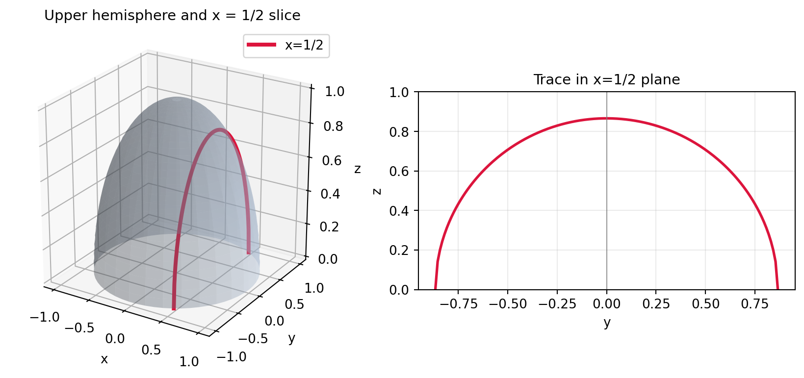

---

## 4. Core: 12.3 Contours and Level Curves

> **Status: Core Material**  
> *Learning Targets:* Define level sets and contours; distinguish contours from vertical cross-sections; calculate algebraic contours; interpret contour spacing and steepness; read and interpolate contour maps; construct contours from data tables.

### 4.1 Definitions and Notation
For a function `f: D ⊆ ℝ² → ℝ` and a real constant `c`, the **level set** (or **contour curve**) of height `c` is the set of all input points `(x, y)` in the domain where the function output equals `c`:
`L_c = {(x, y) ∈ D : f(x, y) = c}`
- **Geometric Meaning:** A contour is the horizontal slice of the 3D graph `z = f(x, y)` formed by intersecting it with the horizontal plane `z = c`, projected vertically downward into the `xy`-domain plane.
- **Contour Diagram (Contour Map):** A collection of several contour lines drawn in the single `xy`-plane, where each curve is clearly labelled with its corresponding output value `c`.
- **The Non-Intersecting Rule:** For a single-valued function `f`, contours corresponding to *different* values `c₁ ≠ c₂` can **never intersect**. If they intersected at `(x₀, y₀)`, the function would evaluate to both `c₁` and `c₂` simultaneously, violating the definition of a function. (However, different branches of the *same* level set can cross, such as at a saddle point where `f(x, y) = 0`).

---

### Problem Type PT-07: Distinguish Vertical Cross-Sections from Horizontal Level Curves

**Meaning and recognition.**  
Students often confuse vertical cross-sections (traces) with horizontal level curves (contours). They represent orthogonal slicing directions:
- A **cross-section** fixes an *input* coordinate (`x = a` or `y = b`), keeps output `z` variable, and lives in a vertical plane in 3D space.
- A **contour** fixes the *output* height (`z = c`), allows inputs `(x, y)` to vary along the curve, and is projected into the 2D domain (`xy`-plane).

**General method.**
1. **Identify the held quantity:** Check whether the constraint fixes an input (`x` or `y`) or the output (`z`).
2. **Specify the 3D containing plane:** Vertical plane `x = a` or `y = b` for cross-sections; horizontal plane `z = c` for level sets.
3. **Identify the viewing projection:** `yz`-view or `xz`-view for cross-sections; `xy`-view for contour maps.
4. **State the output behavior:** Along a cross-section, `z` varies; along a contour, `z` is strictly constant.

**Teaching example.**

**Question.**  
For the paraboloid `f(x, y) = x² + y²`:
1. Find the equation and describe the geometry of the cross-section corresponding to `x = 1`. Specify its containing plane and whether it is viewed in `xz`, `yz`, or `xy` coordinates.
2. Find the equation and describe the geometry of the contour corresponding to `z = 4`. Specify its containing plane and its representation in the `xy`-plane.
3. State two fundamental mathematical differences between a vertical cross-section and a contour.

**A complete answer must include:**
- [ ] Explicit 3D point-set equations for both curves.
- [ ] Geometric classification (parabola vs circle).
- [ ] The exact containing planes (`x = 1` vs `z = 4`) and projection planes (`yz` vs `xy`).
- [ ] Clear comparison of fixed variables, varying quantities, and display conventions.

**Common mistakes:**
- Calling `x² + y² = 4` a "cross-section" without specifying that it is a horizontal cross-section.
- Drawing a contour on a graph with `z` on one of the axes.

---

### Problem Type PT-08: Find Algebraic Contours and Interpret Spacing and Steepness

**Meaning and recognition.**  
Given a formula `z = f(x, y)`, setting `f(x, y) = c` produces algebraic curves. When contours are plotted for **equal increments of the output** `Δc`, the horizontal spacing between successive contour lines reveals the steepness of the surface:
- **Closely spaced contours:** Rapid change in height over short horizontal distance ⇒ **steep surface**.
- **Widely spaced contours:** Gradual change in height over large horizontal distance ⇒ **gentle/flat slope**.
- **Equally spaced contours:** Constant slope (e.g., a cone `z = r` or a plane `z = ax + by`).

*Crucial condition:* Comparing spacing is valid *only* when the contour interval `Δc` between adjacent curves is strictly constant!

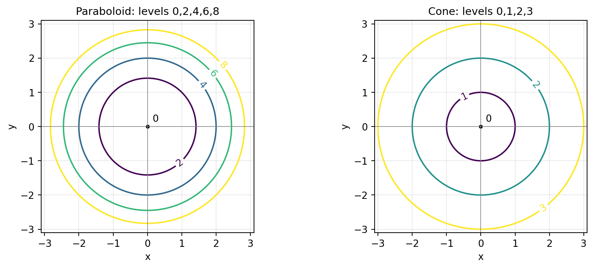

**General method.**
1. **Set `f(x, y) = c`:** Solve for standard 2D relations (circles, ellipses, lines, hyperbolas).
2. **Determine permissible values of `c`:** Identify constraints (e.g., radicands non-negative, squares non-negative). State when levels are empty or degenerate points.
3. **Express geometric dimensions in terms of `c`:** For radial functions, write radius `r(c)` as a function of `c`.
4. **Analyze spacing for equal `Δc`:** Compute `Δr = r(c + Δc) - r(c)` to determine if gaps widen, shrink, or remain constant.
5. **Relate to 3D surface shape:** Deduce whether the surface steepens, flattens, or has constant slope outward.

**Teaching example.**

**Question.**  
Consider the functions `f(x, y) = x² + y²` and `g(x, y) = √(x² + y²)`.
1. For `f(x, y)`, determine the permissible values of `c`, find the contour equations for `c = 0, 2, 4, 6, 8`, and compute the exact radius of each contour.
2. For `g(x, y)`, determine the permissible values of `c`, find the contour equations for `c = 0, 1, 2, 3`, and compute the exact radius of each contour.
3. Compare the radial spacing between successive contours for equal increments of `c` in both functions, and explain what this reveals about the steepness and profile of the paraboloid versus the cone.

**A complete answer must include:**
- [ ] Exact radius formulas: `r = √c` for `f`; `r = c` for `g`.
- [ ] Explicit numerical/symbolic radii for all specified levels.
- [ ] Identification of `c = 0` as a single degenerate point `(0, 0)` and `c < 0` as empty sets.
- [ ] Mathematical comparison of `Δr`: for `f`, `Δr` decreases outward as `c` increases, proving the paraboloid steepens; for `g`, `Δr` is strictly constant, proving the cone has constant slope.

**Common mistakes:**
- Mistaking the radius of `x² + y² = c` for `c` instead of `√c`.
- Drawing a circle of positive radius for `c = 0`.
- Comparing contour spacing without confirming that the label increments `Δc` are identical.

---

### Problem Type PT-09: Plot and Interpret Contours of Linear Functions

**Meaning and recognition.**  
A linear function of two variables has the general form `f(x, y) = ax + by + d`. Its level curves `ax + by + d = c` are **parallel straight lines**:
- **Slope of Contours:** If `b ≠ 0`, rewriting as `y = -(a/b)x + (c - d)/b` shows all contours have identical slope `m = -a/b`.
- **Direction of Increase:** The function increases most rapidly in the direction of the vector `(a, b)` (perpendicular to the contour lines). Moving parallel to the contour lines produces zero change in `f`.
- **Equal Spacing:** For equal steps `Δc`, the perpendicular distance between adjacent contour lines is constant: `D = |Δc| / √(a² + b²)`.

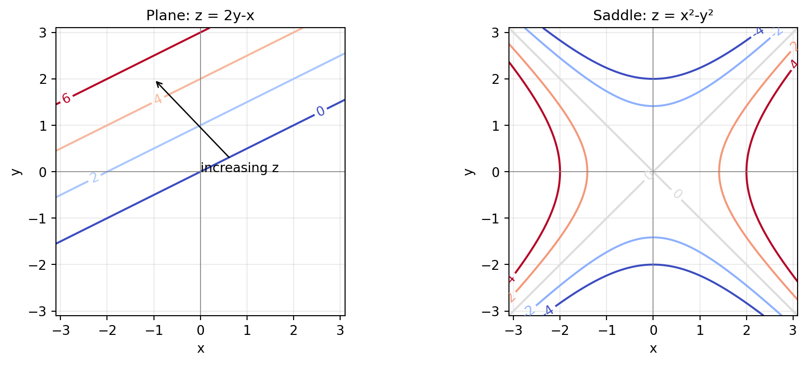

**General method.**
1. **Set `ax + by + d = c`:** Solve for `y` in slope-intercept form `y = mx + k(c)`, or for `x` if `b = 0`.
2. **Calculate specific lines:** Compute intercepts for each requested value of `c`.
3. **Determine spacing:** Calculate the perpendicular separation between parallel lines.
4. **Identify the direction of increasing `z`:** Evaluate the gradient vector `(a, b)` or test point values to determine which side of a line has higher values.
5. **Draw and label:** Plot the parallel lines on `xy`-axes with clear numerical labels and an arrow indicating uphill direction.

**Teaching example.**

**Question.**  
Consider the linear function `z = 2y - x`.
1. Write the algebraic equations in slope-intercept form for the contours corresponding to `z = 0, 2, 4, 6`.
2. State the common slope of these lines and find the `y`-intercept for each contour.
3. Determine a vector in the `xy`-plane pointing in the direction of increasing `z`, and verify that moving along a contour leaves `z` unchanged.

**A complete answer must include:**
- [ ] Four complete equations of the form `y = (1/2)x + c/2`.
- [ ] Explicit numerical values for slope and all four intercepts.
- [ ] The direction of increasing `z` (e.g., `(-1, 2)` or any vector with `Δx < 0` and `Δy > 0`).
- [ ] Proof that moving along the direction `(2, 1)` yields `Δz = 0`.

**Common mistakes:**
- Confusing the slope of the line in the `xy`-plane with the slope of the surface in ℝ³.
- Inverting the sign of `x` when solving for `y` (e.g., writing `y = -x/2`).
- Labeling contour axes with `z`.

---

### Problem Type PT-10: Read a Labelled Contour Map and Bracket / Interpolate Values

**Meaning and recognition.**  
Topographic maps, weather charts (isobars, isotherms), and experimental contour plots require estimating function values at points not lying exactly on a drawn contour line:
- **Bracketing:** An interior point located between contours of values `c₁` and `c₂` is rigorously bracketed: `min(c₁, c₂) < f(x₀, y₀) < max(c₁, c₂)`.
- **Linear Interpolation Assumption:** Assumes the rate of change along the line segment between the two surrounding contours is approximately constant.

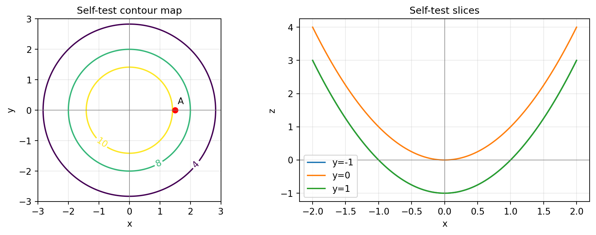

**General method.**
1. **Locate the coordinates:** Pinpoint `(x₀, y₀)` using the map's coordinate axes.
2. **Identify bounding contours:** Find the two adjacent contour lines enclosing the point and record their labels `c₁, c₂`.
3. **State the bracket:** Write the strict inequality `c₁ < f(x₀, y₀) < c₂` (or `c₂ < f < c₁`).
4. **Measure relative distance:** Determine the fraction `t ∈ (0, 1)` of the total distance from the `c₁` contour to the `c₂` contour along the shortest path through the point.
5. **Interpolate linearly:** Compute `f_est ≈ c₁ + t(c₂ - c₁)`.
6. **State caveats:** Clearly state that linear interpolation provides an approximation, not an exact result, unless the function is known to be linear.

**Teaching example.**

**Question.**  
On the labelled contour map of `q(x, y) = 12 - x² - y²` shown above, consider the point `A = (1.5, 0)`.
1. Identify the two drawn contours that enclose point `A`, and state a rigorous bounding inequality for `q(1.5, 0)`.
2. Using radial distances from the origin to the enclosing contours, perform linear interpolation to estimate `q(1.5, 0)`. State the interpolation assumption explicitly.
3. Calculate the exact value of `q(1.5, 0)` using the formula, and explain why the interpolated value differs slightly from the exact value.

**A complete answer must include:**
- [ ] Identification of enclosing levels `c = 10` (radius `√2`) and `c = 8` (radius `2`).
- [ ] Bounding statement `8 < q(1.5, 0) < 10`.
- [ ] Explicit linear interpolation calculation based on relative radial position.
- [ ] Exact evaluation `q(1.5, 0) = 12 - (1.5)² = 9.75`.
- [ ] Explanation that `q(r)` is quadratic, so linear interpolation along `r` incurs a small truncation error.

**Common mistakes:**
- Reporting an interpolated reading as an exact measurement.
- Interpolating along arbitrary non-perpendicular directions.

### 4.2 Supplementary Map Representation: The Corn-Yield Diagram
The textbook (Section 12.3, p. 712) presents an empirical contour map of corn yield `C = f(R, T)`, where rainfall `R` is in inches and temperature `T` is in °F. Yield `C` is expressed as a percentage of normal yield.

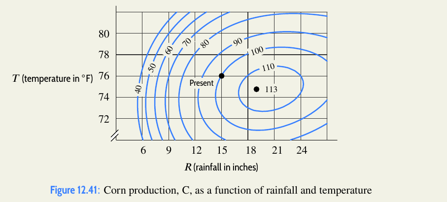

- Point `(R, T) = (18, 78)` lies directly on the contour `C = 100`.
- Point `(12, 76)` lies between `80` and `90`, estimated at approximately `85`.
- Optimal yield occurs in a central elliptical region; both too much and too little rain reduce yield.

---

### Problem Type PT-11: Construct and Interpolate Contours from Numerical Data Tables

**Meaning and recognition.**  
A two-input data table presents values `z = f(x, y)` at a discrete grid of points `(x_i, y_j)`. Estimating a contour line `f(x, y) = c` requires:
- Finding exact grid matches where `f(x_i, y_j) = c`.
- Finding grid edges where adjacent entries straddle `c` (one entry `< c` and the other `> c`).
- Interpolating along each straddled grid segment to locate the crossing point.

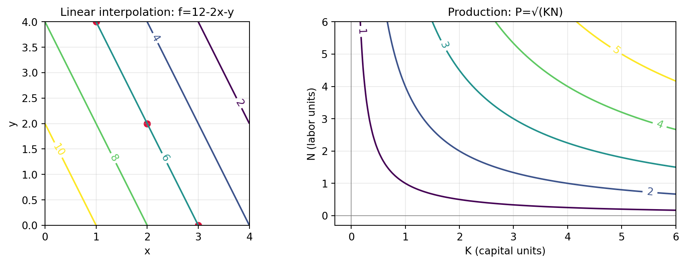

**General method.**
1. **Scan rows and columns:** Locate all adjacent pairs of grid points between which the value `c` falls.
2. **Apply 1D linear interpolation:** Along a grid segment between `(x₁, y)` with value `z₁` and `(x₂, y)` with value `z₂`, solve for `x`:
   `x = x₁ + [(c - z₁) / (z₂ - z₁)](x₂ - x₁)`
3. **Plot crossing points:** Mark all interpolated points on a coordinate grid.
4. **Connect points smoothly:** Draw contour segments consistent with adjacent grid values.
5. **State modeling limits:** A finite table only supports an empirical model within the sampled region; it does not prove global behavior.

**Teaching example.**

**Question.**  
The table below displays values of a function `f(x, y)` on the square `0 ≤ x, y ≤ 4`.

| y \ x | 0 | 2 | 4 |
| :---: | :-: | :-: | :-: |
| **0** | 12 | 8 | 4 |
| **2** | 10 | 6 | 2 |
| **4** | 8 | 4 | 0 |

1. Estimate the coordinates where the contour `f(x, y) = 6` intersects the horizontal grid lines `y = 0`, `y = 2`, and `y = 4` using linear interpolation along rows.
2. Plot these points in the `xy`-plane and describe the resulting contour curve.
3. Find a linear equation `Ax + By = C` that fits these interpolated points, and explain why this formula represents an empirical interpolation rather than a proven global identity.

**A complete answer must include:**
- [ ] Explicit 1D interpolation calculations for rows `y = 0`, `y = 2`, and `y = 4`.
- [ ] Coordinates of the three crossing points: `(3, 0)`, `(2, 2)`, `(1, 4)`.
- [ ] The line equation `2x + y = 6`.
- [ ] A clear statement that the finite grid entries do not rule out nonlinear fluctuations between sampled points.

**Common mistakes:**
- Confusing rows and columns (reading `x` vertically instead of horizontally).
- Extending the interpolated contour line beyond the boundary of the sampled square.

---

### Problem Type PT-12: Analyze Saddle Contours, Hyperbolic Branches, and Intersecting Zero Levels

**Meaning and recognition.**  
For the saddle surface `f(x, y) = x² - y²`:
- The level `f(x, y) = 0` yields `x² - y² = 0 ⇒ (x - y)(x + y) = 0`. This consists of **two perpendicular intersecting lines** `y = x` and `y = -x`.
- This does *not* violate the non-intersecting rule, because both lines belong to the **same level** `c = 0`.
- For `c > 0`, `x² - y² = c` gives hyperbolas opening along the `x`-axis (left and right).
- For `c < 0`, `x² - y² = c ⇒ y² - x² = -c > 0` gives hyperbolas opening along the `y`-axis (top and bottom).

**General method.**
1. **Factor the zero level:** Solve `f(x, y) = 0` algebraically to identify intersecting lines or asymptotes.
2. **Classify sign sectors:** Determine which regions in the domain have `f > 0` (`|x| > |y|`) and `f < 0` (`|y| > |x|`).
3. **Determine hyperbola vertices and axes:** For `c ≠ 0`, find intercepts `(±√c, 0)` for `c > 0`, or `(0, ±√(-c))` for `c < 0`.
4. **Read table symmetries:** Note even symmetries in `x` and `y`, and the sign flip under swapping `x ↔ y`.
5. **Relate to 3D saddle:** Conclude that ridges rise along the `x`-axis while valleys drop along the `y`-axis.

**Teaching example.**

**Question.**  
Consider the 7 × 7 integer evaluation table for `f(x, y) = x² - y²` on `[-3, 3] × [-3, 3]`:

| y \ x | -3 | -2 | -1 | 0 | 1 | 2 | 3 |
| :---: | :-: | :-: | :-: | :-: | :-: | :-: | :-: |
| **3** | 0 | -5 | -8 | -9 | -8 | -5 | 0 |
| **2** | 5 | 0 | -3 | -4 | -3 | 0 | 5 |
| **1** | 8 | 3 | 0 | -1 | 0 | 3 | 8 |
| **0** | 9 | 4 | 1 | 0 | 1 | 4 | 9 |
| **-1** | 8 | 3 | 0 | -1 | 0 | 3 | 8 |
| **-2** | 5 | 0 | -3 | -4 | -3 | 0 | 5 |
| **-3** | 0 | -5 | -8 | -9 | -8 | -5 | 0 |

1. Identify all table entries equal to 0 and show that they correspond to two intersecting straight lines.
2. Describe the geometric shape, number of disconnected branches, and opening direction for the contours `c = 4, 2, 0, -2, -4`.
3. Explain why the intersection of contours at the origin does not violate the rule that contours cannot cross.

**A complete answer must include:**
- [ ] The equations of the zero-level lines `y = x` and `y = -x`.
- [ ] Branch classification: horizontal hyperbolas for `c = 2, 4`; vertical hyperbolas for `c = -2, -4`.
- [ ] Identification of vertices on the coordinate axes for each nonzero level.
- [ ] Rigorous clarification of the non-intersecting rule: contours of *distinct* heights `c₁ ≠ c₂` cannot intersect; branches of the *same* level `c = 0` can and do intersect at stationary points.

**Common mistakes:**
- Asserting that a saddle function is invalid because its contours cross.
- Confusing the orientation of positive and negative hyperbola branches.

---

### Problem Type PT-13: Model a Finite-Domain Surface, Bounded Contours, and 3D Distances

**Meaning and recognition.**  
Physical structures (such as roofs, tents, or bounded plates) have restricted domains. Unrestricted equations would generate infinite surfaces (e.g., infinite cylinders or planes), but boundary conditions restrict the graph and truncate contours into finite line segments. Calculating physical distances requires the 3D Euclidean distance formula:
`d(P₁, P₂) = √((Δx)² + (Δy)² + (Δz)²)`

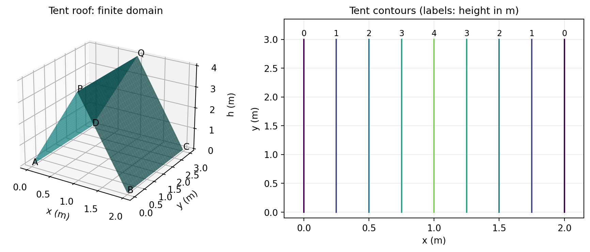
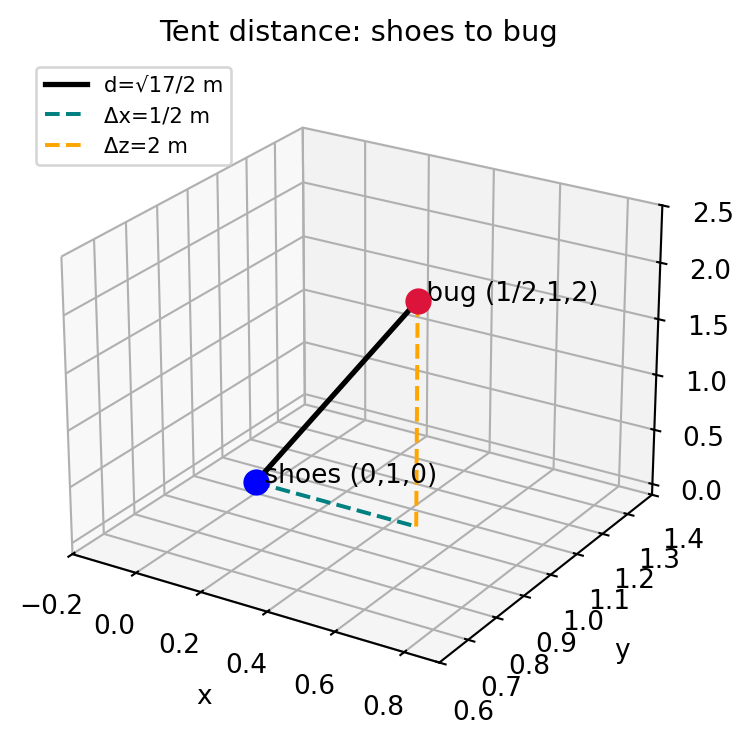

**General method.**
1. **Define piecewise height functions:** Model planar faces by calculating slopes along independent coordinates and specifying domain bounds.
2. **Solve for level sets within bounds:** Set `h(x, y) = c` on each piece and intersect with the piecewise domain.
3. **Plot bounded contours:** Draw contour segments truncated strictly at domain boundaries.
4. **Compute 3D coordinates:** Evaluate `z = h(x, y)` to obtain full 3D coordinates `(x, y, z)` of physical points.
5. **Apply Euclidean distance:** Use the 3D distance formula and attach proper physical units.

**Teaching example.**

**Question.**  
A camping tent has a rectangular base on the ground (`z = 0`) with corners `A = (0, 0, 0)`, `B = (2, 0, 0)`, `C = (2, 3, 0)`, and `D = (0, 3, 0)`, and a horizontal ridge along the line connecting `P = (1, 0, 4)` and `Q = (1, 3, 4)` (all dimensions in metres).
1. Find a piecewise algebraic formula for the roof height `h(x, y)`, specifying its domain.
2. For `0 < c < 4`, solve `h(x, y) = c` and sketch the contours for `c = 0, 1, 2, 3, 4` m.
3. A pair of shoes is located on the ground at `(0, 1, 0)`, and a bug is crawling on the tent roof at `(1/2, 1, h(1/2, 1))`. Calculate the exact 3D straight-line distance between the shoes and the bug.

**A complete answer must include:**
- [ ] Complete piecewise formula `h(x, y)` with explicit domains for both slopes (`0 ≤ x ≤ 1` and `1 ≤ x ≤ 2`) and `0 ≤ y ≤ 3`.
- [ ] Two vertical segment equations `x = c/4` and `x = 2 - c/4` with `0 ≤ y ≤ 3` for each intermediate level.
- [ ] The 3D bug position `(1/2, 1, 2)`.
- [ ] Exact distance calculation showing `Δx, Δy, Δz` steps and final value `√17 / 2` m.

**Common mistakes:**
- Extending the contour lines infinitely across the entire plane without imposing `0 ≤ y ≤ 3`.
- Computing only the 2D horizontal distance `Δx = 1/2` and neglecting the vertical height `Δz = 2`.
- Omitting physical units (metres).

---

## 5. Supplementary: Review, Transformations, and Production

> **Status: Supplementary Material**  
> *Context:* Covers Section 12.1 review concepts present in weekly lecture files (3D coordinate geometry, distance, coordinate planes), qualitative thermal cross-sections, and Cobb-Douglas production functions from Section 12.3.

### 5.1 Review: 3D Coordinates and Distance to Coordinate Planes
In ℝ³, a point `P = (x₀, y₀, z₀)` has orthogonal projections onto the coordinate planes:
- Distance to `xy`-plane (`z = 0`): `|z₀|`.
- Distance to `xz`-plane (`y = 0`): `|y₀|`.
- Distance to `yz`-plane (`x = 0`): `|x₀|`.
- Distance to `y`-axis (`x = 0, z = 0`): `√(x₀² + z₀²)`.

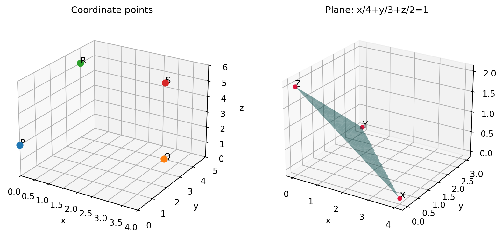

### 5.2 Review: Wind-Chill Table (C = f(w, T))
The September 16 lecture reviews 12.1 using the atmospheric wind-chill function `C = f(w, T)`, where wind speed `w` is in mph, actual temperature `T` is in °F, and wind chill `C` is in °F:
- **Fixed row (fixed `w`):** As `T` increases, `C` increases (warmer air feels warmer).
- **Fixed column (fixed `T`):** As `w` increases, `C` decreases (stronger wind causes greater cooling).

*See `Answers-and-Practice.md` for the full table and lookup solutions.*

### 5.3 Qualitative Thermal Model: Room Heater Cross-Sections
In the lecture question regarding room temperature `T = f(d, t)` (distance `d` from a heater in metres, time `t` in minutes):
- **Holding `d` fixed (`d = d₀`):** Temperature rises over time toward a steady-state asymptote.
- **Holding `t` fixed (`t = t₀`):** Temperature decays monotonically as distance `d` from the heat source increases.

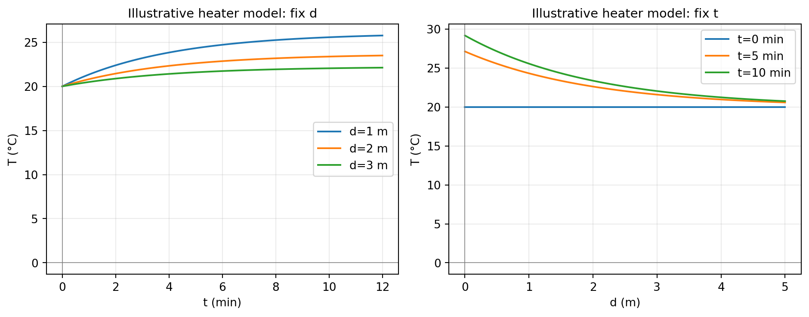

---

### Problem Type PT-14: Analyze Multivariable Economic Models and Trade-offs along Contours

**Meaning and recognition.**  
In economics, production output `P` is modeled as a function of inputs such as labor `N` (or `L`) and capital `V` (or `K`). A standard model is the **Cobb-Douglas production function**:
`P(N, V) = c · N^α · V^β   (c > 0, α > 0, β > 0)`

Contour lines of a production function are called **isoquants** (curves of constant production). Along an isoquant:
- One input can substitute for the other: increasing labor `N` allows capital `V` to decrease while maintaining identical output `P₀`.
- Solving for `V` gives `V = (P₀ / c)^(1/β) · N^(-α/β)`. Since `α/β > 0`, `V` is a decreasing, strictly convex function of `N`.
- Isoquants for `P₀ > 0` **never touch or cross the coordinate axes**, because if `N = 0` or `V = 0`, production collapses to `P = 0`.

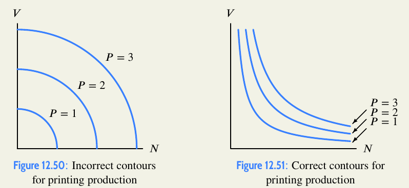

**General method.**
1. **Set `P(N, V) = P₀`:** Fix the output constant.
2. **Solve for one input as a function of the other:** Express `V` explicitly as `V(N)`.
3. **Determine asymptotic behavior:** Examine `N → 0⁺` (`V → ∞`) and `N → ∞` (`V → 0⁺`).
4. **Compute input trade-offs:** Calculate how scaling one input by factor `k` requires scaling the other input to maintain constant production.
5. **Interpret economic meaning:** Explain the marginal rate of technical substitution along the contour.

**Teaching example.**

**Question.**  
Consider the production function `P(N, V) = √(NV)` for labor `N > 0` and capital `V > 0`.
1. Find the algebraic equation for the isoquant (contour curve) corresponding to constant production `P = 4`.
2. Explain why this contour curve never intersects the `N`-axis or the `V`-axis.
3. If the quantity of labor `N` is doubled from `N₀` to `2N₀`, determine what must happen to capital `V` to maintain the same production level `P = 4`.

**A complete answer must include:**
- [ ] Explicit isoquant formula `V = 16 / N` (first-quadrant hyperbola).
- [ ] Mathematical and economic explanation of why `N = 0` or `V = 0` produces `P = 0 ≠ 4`.
- [ ] Exact calculation showing that capital must be halved (`V_new = V₀ / 2`).

**Common mistakes:**
- Drawing production contours that intersect the coordinate axes (like circles).
- Forgetting that economic inputs `N, V` are strictly positive in this model.

---

## 6. Preview: Later-Section Material in Weekly Files

> **Status: Preview Material**  
> *Context:* The weekly lecture slides contain advance previews of Section 12.4 (Linear functions, planes, and tables) and Section 12.5 (Functions of three variables and level surfaces). Covered here for complete weekly source fidelity.

### 6.1 12.4 Preview: Linear Functions and Planes
A function `f(x, y)` is linear if its formula is `f(x, y) = ax + by + c`.
- **Graph in ℝ³:** The graph `z = ax + by + c` is a flat, infinite plane.
- **Intercept Form:** If a plane has non-zero intercepts `(x₀, 0, 0)`, `(0, y₀, 0)`, and `(0, 0, z₀)`, its equation is:
  `x/x₀ + y/y₀ + z/z₀ = 1`
- **Linearity Test for Tables:** A two-input table represents a linear function if and only if:
  - Across every row (fixed `y`), equal steps in `x` produce equal changes `Δz` (constant `Δz / Δx`).
  - Down every column (fixed `x`), equal steps in `y` produce equal changes `Δz` (constant `Δz / Δy`).

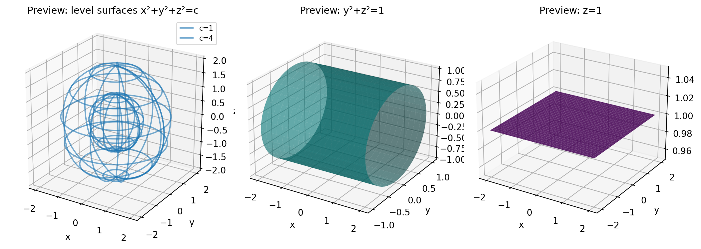

---

### Problem Type PT-15: Describe and Visualize Level Surfaces of Three-Variable Functions

**Meaning and recognition.**  
For a function of three variables `w = F(x, y, z)`:
- **4D Graph:** The graph `G_F = {(x, y, z, w) ∈ ℝ⁴ : w = F(x, y, z)}` requires four spatial dimensions and cannot be visualized directly.
- **Level Surfaces in 3D:** Setting `F(x, y, z) = c` defines a two-dimensional **level surface** embedded directly in ordinary 3D space.
- Points on the surface `F(x, y, z) = c` represent spatial locations where the physical quantity (e.g., temperature, density, potential) is constant.

**General method.**
1. **Set `F(x, y, z) = c`:** Establish the implicit equation for a chosen constant `c`.
2. **Identify permissible values of `c`:** Enforce range constraints on `F`.
3. **Classify the 3D surface:**
   - `x² + y² + z² = r(c)²`: concentric spheres centered at the origin.
   - `x² + y² = r(c)²` (missing `z`): concentric circular cylinders parallel to the `z`-axis.
   - `Ax + By + Cz = c`: parallel planes with normal vector `(A, B, C)`.
4. **Describe orientation and geometric parameters:** State center, radius, or normal vector as functions of `c`.

**Teaching example.**

**Question.**  
In a solid block of ice, temperature is modeled by `T(x, y, z) = (1/4)(x² + y² + z²)` in °C, with coordinates `x, y, z` measured in metres.
1. Explain why the graph of `T` cannot be drawn in ordinary 3D space, and define what a level surface represents physically.
2. Describe the level surfaces of `T` corresponding to temperatures `T = 1°C`, `5°C`, and `9°C`, specifying their geometric type, center, and exact radii.
3. Describe the geometric nature of the level surfaces for the three functions:
   (i) `F(x, y, z) = exp(-(x² + y²))`
   (ii) `G(x, y, z) = z - y`
   (iii) `H(x, y, z) = ln(x² + y² + z²)`

**A complete answer must include:**
- [ ] Explanation that graphing `w = T(x, y, z)` requires 4 dimensions `(x, y, z, w)`, whereas level surfaces live in 3D.
- [ ] Exact classification of `T = c` as concentric spheres `x² + y² + z² = 4c` with radii `2` m, `2√5` m, and `6` m.
- [ ] Identification of (i) as circular cylinders parallel to `z` for `0 < c < 1` (and the `z`-axis for `c = 1`); (ii) as parallel planes inclined at 45° to the `y`- and `z`-axes and parallel to the `x`-axis; (iii) as concentric spheres of radii `e^(c/2)` for all `c ∈ ℝ`, with the origin excluded.

**Common mistakes:**
- Confusing a 2D contour in the `xy`-plane of a 2-variable function with a 2D level surface in 3D space of a 3-variable function.
- Forgetting to square-root the radius term (e.g., writing radius is `4c` instead of `√4c`).
- Claiming `exp(-(x² + y²)) = c` has level surfaces for `c ≤ 0` or `c > 1`.
